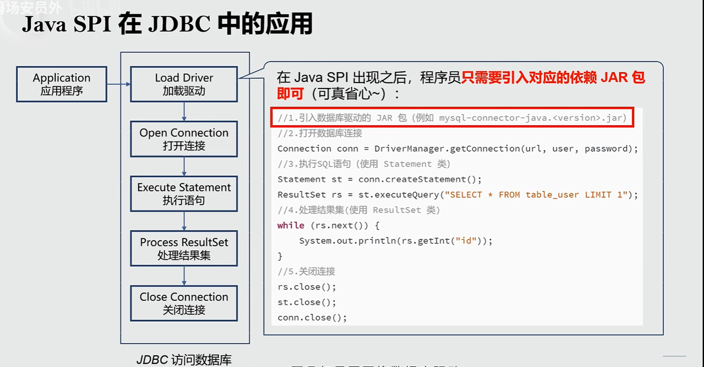
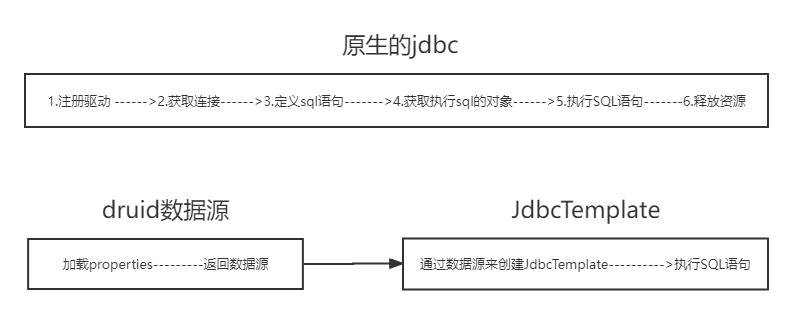

# java数据库连接基础知识

## JDBC

JDBC **Java 数据库连接（Java DataBase Connectivity）**就是Java规定的接口，各种关系型数据库来实现这个接口，就叫做驱动。如mysql驱动

jdbcTemplate会自动释放连接。

### 1.连接数据库的步骤

```java
public class Jdbcdemo {
    public static void main(String[] args) throws ClassNotFoundException, SQLException {
        /*1.注册驱动*/
        Class.forName("com.mysql.jdbc.Driver");//可写可不写
        
        /* 2.获取连接*/
        Connection connection = DriverManager.getConnection("jdbc:mysql://localhost:3306/mybatis?&serverTimezone=UTC", "root", "123456");
        
        /* 2.定义sql语句*/
        String sql= "update mybatis.user set pwd=356789 where id = 2 " ;

        /* 3.获取执行sql的对象*/
        Statement statement = connection.createStatement();

        /* 4.执行SQL语句，增删改用executeUpdate,查询用户用executeQuery*/
        int sql1 = statement.executeUpdate(sql);
        System.out.println(sql1);

        /* 5.释放资源*/
        statement.close();
        connection.close();

    }
}
```

-  Class.forName("com.mysql.jdbc.Driver")为什么可以注册驱动

  - 因为Driver中有个注册驱动的静态代码块

    ```java
    static {
        try {
            DriverManager.registerDriver(new Driver());
        } catch (SQLException var1) {
            throw new RuntimeException("Can't register driver!");
        }
    }
    ```

- DriverManager 获取连接

- connection数据库链接对象

  - 1.获取执行sql的对象
    - connection.createStatement();

  -  2.管理事务
    *    打开事务 setAutoConmit( boolean )  ture开启，false关闭
    *    提交事务 commit( )
    *    回滚 rollback( )

- statement:执行sql语句的对象
  *        1.功能执行sql语句
  *        2.方法：增删改用executeUpdate,返回int，受影响的行数；查询用户用executeQuery，返回一个结果集resultSet。

- resultSet

  - boolean next( )：将光标从当前位置向前移动一行，并判断是否为有效行
    - true 当前行有数据，有效行
    - false 当前行没有数据，无效行

  - xxx  getXxx( )：
    - xxx 数据类型，例如getInt( ),getString( ),要获取数据库中该列为xxx数据类型，就getXxx( )。
    - 参数为想要获取的列的列名。

- prepareStatement

  - 预编译SQL

  - 防止SQL注入

  - ```java
    PreparedStatement preparedStatement = connection.prepareStatement("select * from user");
    preparedStatement.executeQuery();
    ```




## Druid数据源

```properties
driverClassName=com.mysql.jdbc.Driver
url=jdbc:mysql://82.156.13.174:3306/history?useUnicode=true&characterEncoding=UTF-8&serverTimezone=Asia/Shanghai&rewriteBatchedStatements=true
username=root
password=Xs123456.
# 初始化连接数量
initialSize=10
minIdle=10
maxActive=20
# 最大等待时间
```

使用druid数据源

```java
public class DruidDataSource {
    public static void main(String[] args) {
        //第一步导jar包
        //2.定义配置文件
        Properties properties = new Properties();
        //3.使用Properti对象集合对象把文件流数据，加载进集合
        //InputStream resource = DruidDataSource.class.getClassLoader().getResourceAsStream("druid.properties");
         properties.load(new FileInputStream("src/druid.properties"));
        try {
            //4.创建Druid数据库链接池的核心对象；
            DataSource dataSource = DruidDataSourceFactory.createDataSource(properties);

            //5.获取连接池里的连接对象
            Connection connection = dataSource.getConnection();
            System.out.println(connection);
            //System.getProperty("user.dir")获取当前项目地址
            System.out.println(System.getProperty("user.dir"));

        } catch (IOException e) {
            e.printStackTrace();
        } catch (Exception e) {
            e.printStackTrace();
        }
    }
```


## JdbcTemplate

jdbcTemplate是属于spring自带的。

https://blog.csdn.net/weixin_40001125/article/details/88538576 基本使用。


>
>


## Druid + JdbcTemplate对比原生jdbc

