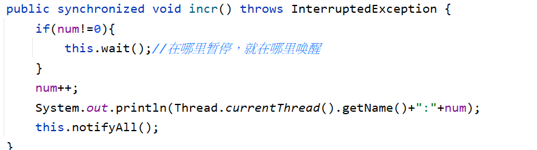
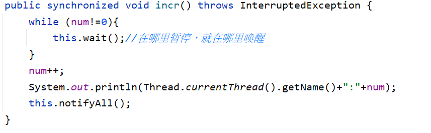
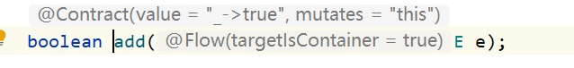
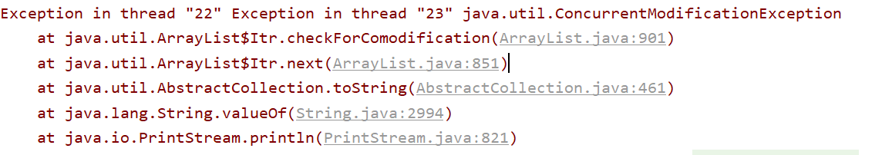
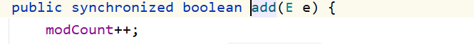
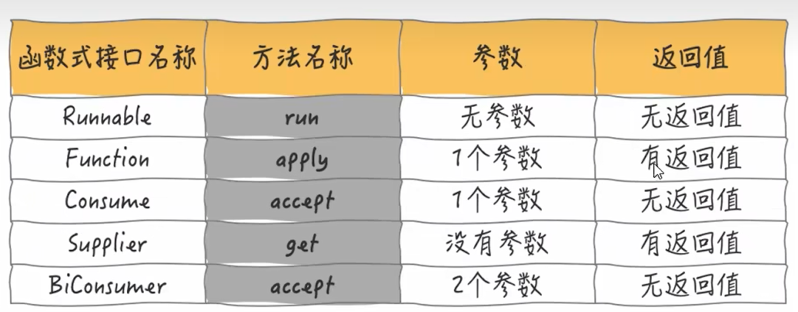

# JUC

## 线程和进程

### 线程定义

线程是进程的基本执行单元，一个进程的所有任务都在线程中执行

进程要想执行任务，必须得有线程，进程至少要有一条线程

程序启动会默认开启一条线程，这条线程被称为主线程或 UI 线程

### 进程定义

进程是指在系统中正在运行的一个应用程序

每个进程之间是独立的，每个进程均运行在其专用的且受保护的内存

**通俗来讲进程就是一个运行的程序，类如火绒，线程就是火绒正在执行杀毒。**

## 并发和并行

**并发就是多个线程抢夺一个资源：类似电商秒杀，春运抢票**

**并行就是多个任务同时进行互不干扰**


## 用户线程和守护线程

### 用户线程

在 Java 语言中，线程分为两类：用户线程和守护线程，默认情况下我们创建的线程或线程池都是用户线程，所以用户线程也被称之为普通线程。main是用户线程

可以通过 **thread.isDaemon()** 方法来判断，如果返回的结果是 true 则为守护线程，反之则为用户线程。daemon:守护线程 /ˈdiːmən /

### 守护线程

守护线程(Daemon Thread)也被称之为后台线程或服务线程，**守护线程是为用户线程服务的**，当程序中的用户线程全部执行结束之后，守护线程也会跟随结束。守护线程的角色就像“服务员”，而用户线程的角色就像“顾客”，当“顾客”全部走了之后(全部执行结束)，那“服务员”(守护线程)也就没有了存在的意义，==**所以当一个程序中的全部用户线程都结束执行之后，那么无论守护线程是否还在工作都会随着用户线程一块结束，整个程序也会随之结束运行。**==
可以用 **thread.setDaemon(true)** 方法将线程设置为守护线程

fork join 是守护线程

## 虚假唤醒问题

https://www.bilibili.com/video/BV1Kw411Z7dF?p=10

wait( )方法的特点在哪里等待，就在哪里唤醒。



**假如某一个线程在，上图中的 this.wait( )处等待，如果该线程再次抢到了锁，因为已经判断过了 ，所以就会从wait( )处继续向下执行，就会导致虚假唤醒问题。**

**解决方法**

- 把if( ) 换成 while( ) 

   

即使在wait( )处唤醒，也会再次判断。

## ArrayList的线程不安全问题

arrayList的方法都没有**synchronized** 关键字，所以是线程不安全的



在高并发的场景下，多个线程修改arraylist会有线程的**并发修改异常**



### 解决方法一：Vector （基本不用）

Vector也是实现了List接口的类，但是方法上加了 **synchronized** 关键字

```java
List<String> list = new Vector<>();
```



### 解决方法二：Collections工具类

使用工具类Collections.synchronizedList(  ) 也可以生成一个线程安全的list

```java
List<String> list = Collections.synchronizedList(new ArrayList());
```


### 解决方法三：CopyOnWriteArrayList

采用写时复制算法

```java
List<Object> list = new CopyOnWriteArrayList<>();
```


## 集合的线程安全问题

set和map**在多线程的情况下也会发生并发读写问题**

set的线程安全问题解决方案：CopyOnWriteHashSet

```java
 Set<Object> set = new CopyOnWriteArraySet<>();
```

map的线程安全问题解决方案：ConcurrentHashMap

```java
Map<String,Object> set = new ConcurrentHashMap<>();
```

## 阻塞队列

​		多线程环境中，通过队列可以很容易实现数据共享，比如经典的“生产者”和“消费者”模型中，通过队列可以很便利地实现两者之间的数据共享。假设我们有若干生产者线程，另外又有若干个消费者线程。如果生产者线程需要把准备好的数据共享给消费者线程，利用队列的方式来传递数据，就可以很方便地解决他们之间的数据共享问题。但如果生产者和消费者在某个时间段内，万一发生数据处理速度不匹配的情况呢？理想情况下，如果生产者产出数据的速度大于消费者消费的速度，并且当生产出来的数据累积到一定程度的时候，那么生产者必须暂停等待一下（阻塞生产者线程），以便等待消费者线程把累积的数据处理完毕，反之亦然。然而，在concurrent包发布以前，在多线程环境下，我们每个程序员都必须去自己控制这些细节，尤其还要兼顾效率和线程安全，而这会给我们的程序带来不小的复杂度。好在此时，强大的concurrent包横空出世了，而他也给我们带来了强大的BlockingQueue。（在多线程领域：所谓阻塞，在某些情况下会挂起线程（即阻塞），一旦条件满足，被挂起的线程又会自动被唤醒），下面两幅图演示了BlockingQueue的两个常见阻塞场景：
　　　

　***如上图所示：当队列中没有数据的情况下，消费者端的所有线程都会被自动阻塞（挂起），直到有数据放入队列。***


***如上图所示：当队列中填满数据的情况下，生产者端的所有线程都会被自动阻塞（挂起），直到队列中有空的位置，线程被自动唤醒。\****

　　这也是我们在多线程环境下，为什么需要BlockingQueue的原因。作为BlockingQueue的使用者，我们再也不需要关心什么时候需要阻塞线程，什么时候需要唤醒线程，因为这一切BlockingQueue都给你一手包办了。既然BlockingQueue如此神通广大，让我们一起来见识下它的常用方法：

 **BlockingQueue的核心方法**：

　　1.放入数据

　　　　（1）offer(anObject):表示如果可能的话,将anObject加到BlockingQueue里,即如果BlockingQueue可以容纳,则返回true,否则返						回false.（本方法不阻塞当前执行方法的线程）；　　　　　　 
   　		（2）offer(E o, long timeout, TimeUnit unit)：可以设定等待的时间，如果在指定的时间内，还不能往队列中加入  						BlockingQueue，则返回失败。

　　　　（3）put(anObject):把anObject加到BlockingQueue里,如果BlockQueue没有空间,则调用此方法的线程被阻断直到						BlockingQueue里面有空间再继续.

　　2. 获取数据

　　　　（1）poll(time):取走BlockingQueue里排在首位的对象,若不能立即取出,则可以等time参数规定的时间,取不到时返回null;

　　　　（2）poll(long timeout, TimeUnit unit)：从BlockingQueue取出一个队首的对象，如果在指定时间内，队列一旦有数据可取，						则立即返回队列中的数据。否则知道时间超时还没有数据可取，返回失败。

　　　　（3）take():取走BlockingQueue里排在首位的对象,若BlockingQueue为空,阻断进入等待状态直到BlockingQueue有新的数据被						加入; 

　　　　（4）drainTo():一次性从BlockingQueue获取所有可用的数据对象（还可以指定获取数据的个数），通过该方法，可以提升获取						数据效率；不需要多次分批加锁或释放锁。

**常见BlockingQueue**

　　在了解了BlockingQueue的基本功能后，让我们来看看BlockingQueue家庭大致有哪些成员？


　　1. **ArrayBlockingQueue**

　　基于数组的阻塞队列实现，在ArrayBlockingQueue内部，维护了一个定长数组，以便缓存队列中的数据对象，这是一个常用的阻塞队列，除了一个定长数组外，ArrayBlockingQueue内部还保存着两个整形变量，分别标识着队列的头部和尾部在数组中的位置。

　　ArrayBlockingQueue在生产者放入数据和消费者获取数据，都是共用同一个锁对象，由此也意味着两者无法真正并行运行，这点尤其不同于LinkedBlockingQueue；按照实现原理来分析，ArrayBlockingQueue完全可以采用分离锁，从而实现生产者和消费者操作的完全并行运行。Doug Lea之所以没这样去做，也许是因为ArrayBlockingQueue的数据写入和获取操作已经足够轻巧，以至于引入独立的锁机制，除了给代码带来额外的复杂性外，其在性能上完全占不到任何便宜。 ArrayBlockingQueue和LinkedBlockingQueue间还有一个明显的不同之处在于，前者在插入或删除元素时不会产生或销毁任何额外的对象实例，而后者则会生成一个额外的Node对象。这在长时间内需要高效并发地处理大批量数据的系统中，其对于GC的影响还是存在一定的区别。而在创建ArrayBlockingQueue时，我们还可以控制对象的内部锁是否采用公平锁，默认采用非公平锁。

　　2.**LinkedBlockingQueue**

　　基于链表的阻塞队列，同ArrayListBlockingQueue类似，其内部也维持着一个数据缓冲队列（该队列由一个链表构成），当生产者往队列中放入一个数据时，队列会从生产者手中获取数据，并缓存在队列内部，而生产者立即返回；只有当队列缓冲区达到最大值缓存容量时（LinkedBlockingQueue可以通过构造函数指定该值），才会阻塞生产者队列，直到消费者从队列中消费掉一份数据，生产者线程会被唤醒，反之对于消费者这端的处理也基于同样的原理。而LinkedBlockingQueue之所以能够高效的处理并发数据，还因为其对于生产者端和消费者端分别采用了独立的锁来控制数据同步，这也意味着在高并发的情况下生产者和消费者可以并行地操作队列中的数据，以此来提高整个队列的并发性能。

　　作为开发者，我们需要注意的是，如果构造一个LinkedBlockingQueue对象，而没有指定其容量大小，LinkedBlockingQueue会默认一个类似无限大小的容量（Integer.MAX_VALUE），这样的话，如果生产者的速度一旦大于消费者的速度，也许还没有等到队列满阻塞产生，系统内存就有可能已被消耗殆尽了。

　　ArrayBlockingQueue和LinkedBlockingQueue是两个最普通也是最常用的阻塞队列，一般情况下，在处理多线程间的生产者消费者问题，使用这两个类足以。

## Java的函数式编程的各种函数接口



## CompletableFuture

### 1.CompletableFuture的创建

`CompletableFuture` 在创建时，如果传入线程池，那么会去指定的线程池工作。如果没传入，那么回去默认的 `ForkJoinPool`
`ForkJoinPool`的优势在于，可以充分利用多`cpu`，多核`cpu`的优势，把一个任务拆分成多个`小任务`，把多个`小任务`放到多个处理器核心上并行执行；当多个`小任务`执行完成之后，再将这些执行结果合并起来即可。

`ForkJoinPool`是`ExecutorService`的实现类，因此是一种特殊的线程池。
使用方法：创建了`ForkJoinPool`实例之后，就可以调用`ForkJoinPool`的`submit(ForkJoinTask<T> task)` 或`invoke(ForkJoinTask<T> task)`方法来执行指定任务了。
其中`ForkJoinTask`代表一个可以并行、合并的任务。`ForkJoinTask`是一个抽象类，它还有两个抽象子类：`RecusiveAction和RecusiveTask`。其中`RecusiveTask`代表有返回值的任务，而`RecusiveAction`代表没有返回值的任务

#### 1.2 构造函数创建

最简单的方式就是通过构造函数创建一个`CompletableFuture`实例。如下代码所示。由于新创建的`CompletableFuture`还没有任何计算结果，这时调用`join`，当前==线程会一直阻塞在这里==。

```java
CompletableFuture<String> future = new CompletableFuture();
String result = future.join();
System.out.println(result);
```

此时，如果在另外一个线程中，主动设置该`CompletableFuture`的值，则上面线程中的结果就能返回。

```java
future.complete("test");
```

#### 1.3 supplyAsync创建

`CompletableFuture.supplyAsync()`也可以用来创建`CompletableFuture`实例。通过该函数创建的`CompletableFuture`实例会异步执行当前传入的计算任务。在调用端，则可以通过`get或join`获取最终计算结果。

`supplyAsync`有两种签名：

```java
public static <U> CompletableFuture<U> supplyAsync(Supplier<U> supplier) 
public static <U> CompletableFuture<U> supplyAsync(Supplier<U> supplier, Executor executor)
```

第一种只需传入一个`Supplier`实例（一般使用`lamda`表达式），此时框架会默认使用`ForkJoin`线程池来执行被提交的任务。
第二种可以指定自定义的线程池，然后将任务提交给该线程池执行。
下面为使用`supplyAsync`创建`CompletableFuture`的示例：

```java
CompletableFuture<String> future 
	= CompletableFuture.supplyAsync(()->{
      System.out.println("compute test");
      return "test";
});
 
String result = future.join();
System.out.println("get result: " + result);//get result: test
```

在示例中，异步任务中会打印出`compute test`，并返回`test`作为最终计算结果。所以，最终的打印信息为`get result: test`

https://jingzh.blog.csdn.net/article/details/124469978?spm=1001.2014.3001.5506


#### thenRunAsync、thenAcceptAsync、thenApplyAsync

​		**使用 thenRunAsync、thenAcceptAsync、thenApplyAsync 都会开辟另一条线程执行任务（ ForkJoinPool），如果传入线程池参数，则会在参数线程池中使用一条线程，而thenRun、thenAccept、thenApply会使用前一个任务的线程**

## Java的中断机制

Java中对于线程的中断机制是分不同的情况的，如果当前线程处理运行RUNNABLE状态下，那么调用它的interrupt中断方法并不会影响线程的执行，也不会抛出异常，它只会将线程中标志中断状态的Boolean值变更为true；

而如果线程因为slee或者wait方法进入阻塞或者等待状态下的话，调用interrupt方法，此时线程会修改中断状态然后抛出中断异常。值得一提，如果线程是因为LockSupport.park方法进入阻塞状态，那此时调用interrupt方法依旧只会改变线程的中断状态为true，而不会抛出异常。不论是先调用interrupt 再 调用 sleep , wait , 还是先调用sleep，wait再调用 interrupt 都对直接从等待状态（WAITING）变成 （RUNNABLE）

 如果我们要监控一个正在运行的线程的中断状态，可以调用isInterrupt方法去获取线程的中断状态，如果调用静态方法方法则可返回中断状态值并修改线程中断状态为false。

```java
Thread t1 = new Thread(()-{});

t1.isInterrupt(); //实例方法
Thread.interrupted(); //静态方法
//在两个方法用法差不多,底层都是调用同一个native方法；只不过isInterrupt()不该变标注位，interrupted()会
```

具体来说，当一个线程，调用interrupt( ) 时

- **如果线程处于正常活动状态，那么会将该线程的中断标志位设为true，并不影响该线程的执行，所以interrupt并不能使线程中断，而是一种协商机制。**

- **如果线程处于被阻塞的状态（例如处于 wait，sleep，join等状态），在别的线程中调用该线程的 interrupt( ) 方法那么线程会直接退出阻塞状态，继续向下执行任务，并且抛出一个InterruptedException异常，并且清除中断状态,也就是说interrupt方法不起作用，使用`可以在catch中继续设置中断标志位，设置中断标志位为true结束线程`**

  ```java
  Thread t1 = new Thread(() -> {
              while (true){
                  if(Thread.currentThread().isInterrupted()){
                      System.out.println(
                              Thread.currentThread().getId()+" | "+Thread.currentThread().getName()+" 线程中断！");
                      break;
                  }
                  try {
                      Thread.sleep(300);
                  } catch (InterruptedException e) {
                      Thread.currentThread().interrupt(); //可以在catch中继续设置中断标志位，设置中断标志位为true结束线程
                      e.printStackTrace();
                  }
                  System.out.println("t1的中断标志位"+Thread.currentThread().isInterrupted());
                  System.out.println(
                          Thread.currentThread().getId()+" | "+Thread.currentThread().getName()+" 线程在执行任务！");
              }
              System.out.println("t1的中断标志位"+Thread.currentThread().isInterrupted());
          },"t1");
          t1.start();
          try {
              TimeUnit.SECONDS.sleep(1);
          } catch (InterruptedException e) {
              e.printStackTrace();
          }
          new Thread(() -> {
              t1.interrupt();
          }).start();
  ```

  发现一个有意思的地方，如果使用Junit的@Test注解下测试，不会产生死循环，Junit会自己结束死循环，(应该是) 自适应循环轮数。

- **如果线程是因为LockSupport.park方法进入阻塞状态，那此时调用interrupt方法依旧只会改变线程的中断状态为true，而不会抛出异常。**

  ```java
  Thread t1 = new Thread(() -> {
              while (true){
                  if(Thread.currentThread().isInterrupted()){
                      System.out.println(
                              Thread.currentThread().getId()+" | "+Thread.currentThread().getName()+" 线程中断！");
                      break;
                  }
                  LockSupport.park();	//线程被 LockSupport.park()阻塞，执行interrupt方法，依旧会改变线程的中断状态，并且不会抛出异常
                  System.out.println("t1的中断标志位"+Thread.currentThread().isInterrupted());
                  System.out.println(
                          Thread.currentThread().getId()+" | "+Thread.currentThread().getName()+" 线程在执行任务！");
              }
              System.out.println("t1的中断标志位"+Thread.currentThread().isInterrupted());
          },"t1");
          t1.start();
          try {
              TimeUnit.SECONDS.sleep(1);
          } catch (InterruptedException e) {
              e.printStackTrace();
          }
          new Thread(() -> {
              t1.interrupt();
          }).start();
  ```

  

- **一旦线程结束，中断标志位会被重新设置为false；interrupt( )方法不会对不适用的线程生效**

## ThreadLocal

#### ThreadLocal内存泄露问题

 内存泄露问题：指程序中动态分配的堆内存由于某种原因没有被释放或者无法释放，造成系统内存的浪费，导致程序运行速度减慢或者系统奔溃等严重后果。内存泄露堆积将会导致内存溢出。

 ThreadLocal的内存泄露问题一般考虑和Entry对象有关，在上面的Entry定义可以看出ThreadLocal::Entry被弱引用所修饰。**JVM会将弱引用修饰的对象在下次垃圾回收中清除掉。**这样就可以实现ThreadLocal的生命周期和线程的生命周期解绑。但实际上并不是使用了弱引用就A会发生内存泄露问题，考虑下面几个过程：

使用强引用


 当ThreadLocal Ref被回收了，由于在Entry使用的是强引用，在Current Thread还存在的情况下就存在着到达Entry的引用链，无法清除掉ThreadLocal的内容，同时Entry的value也同样会被保留；也就是说就算使用了强引用仍然会出现内存泄露问题。

使用弱引用

 

 当ThreadLocal Ref被回收了，由于在Entry使用的是弱引用，因此在下次垃圾回收的时候就会将ThreadLocal对象清除，这个时候Entry中的KEY=null。但是由于ThreadLocalMap中任然存在Current Thread Ref这个强引用，因此Entry中value的值任然无法清除。还是存在内存泄露的问题。

 由此可以发现，使用ThreadLocal造成内存泄露的问题是因为：ThreadLocalMap的生命周期与Thread一致，如果不手动清除掉Entry对象的话就可能会造成内存泄露问题。因此，需要我们在每次在使用完之后需要手动的remove掉Entry对象。

那么为什么使用弱引用？

 避免内存泄露的两种方式：使用完ThreadLocal，调用其remove方法删除对应的Entry或者使用完ThreadLocal，当前Thread也随之运行结束。第二种方法在使用线程池技术时是不可以实现的。

 所以一般都是自己手动调用remove方法，调用remove方法弱引用和强引用都不会产生内存泄露问题，使用弱引用的原因如下：

在ThreadLocalMap的set/getEntry中，会对key进行判断，如果key为null，那么value也会被设置为null，这样即使在忘记调用了remove方法，当ThreadLocal被销毁时，对应value的内容也会被清空。多一层保障！

总结：存在内存泄露的有两个地方：ThreadLocal和Entry中Value；最保险还是要注意要自己及时调用remove方法！！！

#### 三、ThreadLocal的应用场景

> 场景一：在重入方法中替代参数的显式传递

 假如在我们的业务方法中需要调用其他方法，同时其他方法都需要用到同一个对象时，可以使用ThreadLocal替代参数的传递或者static静态全局变量。这是因为使用参数传递造成代码的耦合度高，使用静态全局变量在多线程环境下不安全。当该对象用ThreadLocal包装过后，就可以保证在该线程中独此一份，同时和其他线程隔离。

 例如在Spring的@Transaction事务声明的注解中就使用ThreadLocal保存了当前的Connection对象，避免在本次调用的不同方法中使用不同的Connection对象。

> 场景二：全局存储用户信息

 可以尝试使用ThreadLocal替代Session的使用，当用户要访问需要授权的接口的时候，可以现在拦截器中将用户的Token存入ThreadLocal中；之后在本次访问中任何需要用户用户信息的都可以直接冲ThreadLocal中拿取数据。例如自定义获取用户信息的类

```java
AuthHolder：

public class AuthNHolder {
    private static final ThreadLocal<Map<String,String>> threadLocal = new ThreadLocal<>();
    public static void map(Map<String,String> map){
        threadLocal.set(map);
    }
    // 获取用户id
    public static String userId(){
        return get("userId");
    }
    // 根据键值获取对应的信息
    public static String get(String key){
        Map<String,String> map = getMap();
        return map.get(key);
    }
    // 用完清空ThreadLocal
    public static void clear(){
        threadLocal.remove();
    }
}
```


备注：参考博文https://cloud.tencent.com/developer/article/1636025。ThreadLocal里面封装的value只是一个例子，根据具体业务需求改就行了。

> 场景三：解决线程安全问题

 依赖于ThreadLocal本身的特性，对于需要进行线程隔离的变量可以使用ThreadLocal进行封装。

四、总结
ThreadLocal更像是对其他类型变量的一层包装，通过ThreadLocal的包装使得该变量可以在线程之间隔离和当前线程全局共享。

线程的隔离性和变量的线程全局共享性得益于在每个Thread类中的threadlocals字段。（从类实例对象的角度抽象的去看Java中的线程！！！）

ThreadLocalMap中Entry的Key不管是否使用弱引用都有内存泄露的可能。引起内存泄露主要在于ThreadLocal对象和Entry中的Value对象，因此要确保每次使用完之后都remove掉Entry！

## AQS核心方法

```java
final boolean acquireQueued(final Node node, int arg) {
        boolean failed = true;
        try {
            boolean interrupted = false;
            for (;;) {
                //获得当前节点的前节点
                final Node p = node.predecessor();
                /*
                * 判断当前节点的前一个是否为头节点，如果是，尝试获取锁,
                * 如果获取锁成功则设置当前节点为头节点head
                */
                if (p == head && tryAcquire(arg)) {
                    setHead(node);
                    p.next = null; // help GC
                    failed = false;
                    return interrupted;
                }
                /* 如果不是，则先查看前一个节点的线程是否应该挂起，
               	 * 如果为true,则要执行parkAndCheckInterrupt，使线程挂起	
                 */
                if (shouldParkAfterFailedAcquire(p, node) &&
                    parkAndCheckInterrupt())
                    interrupted = true;
            }
        } finally {
            if (failed)
                cancelAcquire(node);
        }
    }

//pred为node节点的前置节点，该方法主要是检查pred节点是否应该挂起，true:需要被挂起，false:不需要
private static boolean shouldParkAfterFailedAcquire(Node pred, Node node) {
        int ws = pred.waitStatus;
    	/*
    	 * 如果pred节点的等待状态处于SIGNAL，代表pred节点正在请求锁，直接返回true
         * 代表node可以被挂起 
         */
        if (ws == Node.SIGNAL)
            return true;
    	/*
    	 * ws大于0，pred的等待状态只能是CANCELLED，要删除节点
    	 * 这两分支都会返回false,让上层进入下一轮的自旋
    	 */
        if (ws > 0) {
            /*
             * 从后向前遍历节点，直到遇到一个等待状态小于0的节点
             */
            do {
                node.prev = pred = pred.prev;
            } while (pred.waitStatus > 0);
            pred.next = node;
        } else {
            /*
             * 到此分支回调函数要么是0 or PROPAGATE,
             * 设置pred的等待标志位为SIGNAL
             * 这里改成SIGNAL之后，上层的下一次自选就可以进入if (ws == Node.SIGNAL)分支返回true
             */
            compareAndSetWaitStatus(pred, ws, Node.SIGNAL);
        }
        return false;
    }

//该方法挂起线程
private final boolean parkAndCheckInterrupt() {
        LockSupport.park(this);
        return Thread.interrupted();
    }
```

