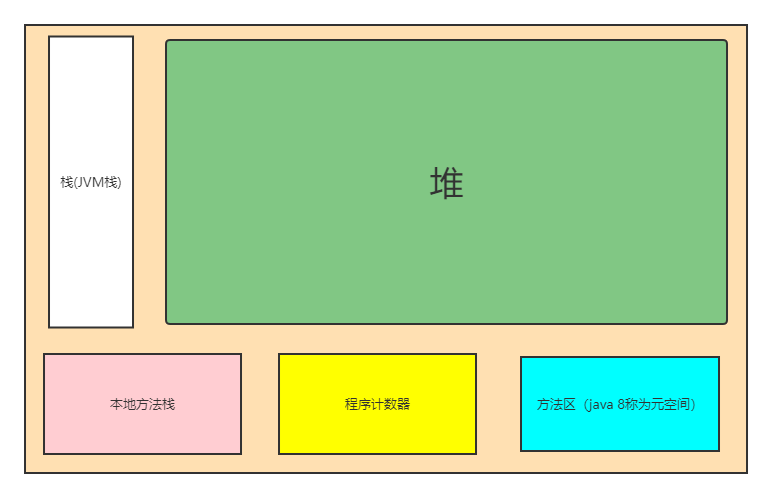

# JVM（java虚拟机）

## Java的内存

## 一个类的生命周期


## JVM内存模型



- **本地方法栈**

  一些c++代码

  > 1.native是java中的一个关键字，在Java诞生的时候正是c跟c++盛行的时候，想要立足就得能够调用c跟c++的程序，native就是用来实现这个功能的。
  > 2.凡是带了native关键字的，说明java的作用已经达不到了，会去调用底层库。
  > 3.native关键字作用与方法上，并且不提供实现体（废话，肯定是其他语言实现的了），它会进入本地方法栈，通过调用JNI接口实现对其他语言代码和代码库的使用。
  > 4.内存中有一块专门开辟的区域：Native Method Stack，登记Native方法。

- **程序计数器**

  保存程序运行的位置

本地方法栈和程序计数器都是程序员极少涉及的。

- **方法区**

  ==存放Static修饰的静态类变量和静态方法，classloader类加载器等全局数据信息，final修饰的常量，运行时常量池==

- **JVM栈**

  存放在函数运行中的一些临时变量。

  JVM栈的生命周期和线程是一至的

- **堆**

  存放对象。**Class对象是存放在堆区的**，不是方法区，这点很多人容易犯错。`类的元数据（元数据并不是类的Class对象。Class对象是加载的最终产品，类的方法代码，变量名，方法名，访问权限，返回值等等都是在方法区的）才是存在方法区的。`
  
  

> **本地方法栈、程序计数器、栈都为线程私有的，每一个线程都会创建一次。堆、方法区则为线程公有。**
>
> 在JDK1.8中，使用元空间代替永久代来实现方法区，但是方法区并没有改变，所谓"Your father will always be your father"，变动的只是方法区中内容的物理存放位置。正如上面所说，类型信息（元数据信息）等其他信息被移动到了元空间中；但是运行时常量池和字符串常量池被移动到了堆中。但是不论它们物理上如何存放，逻辑上还是属于方法区的。
>
> ​    JDK1.8中字符串常量池和运行时常量池逻辑上属于方法区，但是实际存放在堆内存中，因此==既可以说两者存放在堆中，也可以说两则存在于方法区中，这就是造成误解的地方。==

## 类的加载机制

### 类的加载

**静态加载**：编译时加载相关的类，如果没有则报错，有很强的依赖性。

**动态加载**：运行时加载需要的类，如果运行时不用改类，即使不存在该类，也不会报错，降低了依赖性。

```java
public Class ClassLoadTest{
    public static void main(String[] args){
        Scanner scanner = new Scanner(System.in);
        String key= scanner.next();
        switch(key){
               case "1":
                    Dog dog = new Dog();//静态加载；编译时如果不引入 Dog类就会报错
                    dog.cry();
               break;
               case "2":
                    Class cls = Class.forName("Person");//通过反射动态加载。即使Person类不存在，编译时也不会报错，但是运行时如果类不存在就会报错
                	Person person = (Person) cls.newInstance();
                    Method method = person.getMethod("hello"),
                    method.invoke(person);
                break;
        }
       
    }
}
```

**类加载的时机**

1. 当创建对象时（new) // 静态加载

2. 当子类被加载时，父类也加载// 静态加载

3. 调用类的静态成员时// 静态加载

4. 通过反射// 动态加载

### 类加载的过程


#### 类的加载阶段分为三个过程  

**加载 (loading)  -->  连接(Linking)  -->  初始化(initialization)**

1. **加载阶段**

​        **JVM**在该阶段的主要目的是将字节码从不同的数据源（可能是class文件，也可能是jar包，甚至是网络）转化未==二进制字节流加载到内存中==并生成一个代表该类的java.long.Class对象。

2. **连接阶段**

   连接阶段又分为：验证(verification); 准备(Preparation); 解析(Resolution) 三个子阶段。

   - **验证**

     2. > 1. 目的是为了确保Class文件的**字节流中包含的信息符合当前虚拟机的要求，并且不会危害虚拟机自身的安全**。
        >
        > 2. 包括：文件格式验证(是否以魔数 oxcafebabe开头)、元数据验证、字节码验证和符号引用验证。
        > 3. 可以使用 -Xverify:none 参数来关闭大部分的类验证措施，缩短虚拟机类加载的时间        。

     ​         

   - **准备**

     > 1. JVM会在该阶段对静态变量，分配内存并默认初始化(对应数据类型的默认初始化，如0，0L，null，false等)。这些变量所使用的内存都会在方法区分配。
     >
     >    ```java
     >    Class A {
     >       //属性--成员变量--字段；在大多数情况下都是一样的。
     >        public int n1 = 10;// n1是实例属性，不是静态变量，因此在准备阶段，是不会分配内存的。
     >        public static int n2 = 20;// n2是静态变量，分配内存 n2 是默认初始化0，而不是20。
     >        public static final n3 = 30;// n3是static final常量，他和静态变量不一样，因为一旦赋值就不变n3=30。
     >    }
     >    ```

   - **解析**

     > 1. 虚拟机将常量池的符号引用替换为直接引用
     >
     >    符号引用在把字节码文件放入内存前 类似于 A要引用B，只是名字上显示 A引用B；
     >
     >    直接引用就是把字节码文件放入内存后，有了地址，把名字上的引用，变为A的内存地址引用B的内存地址