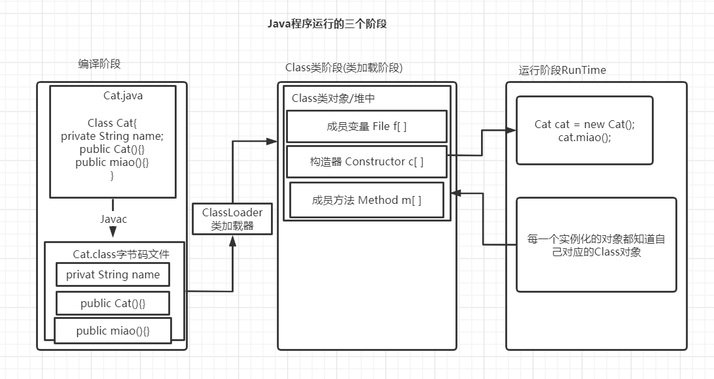
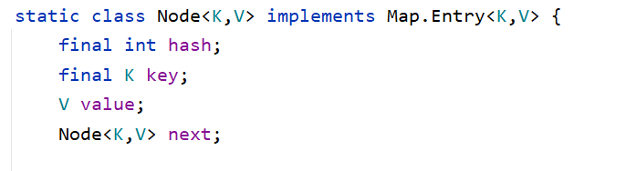
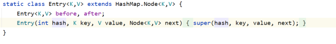
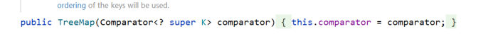
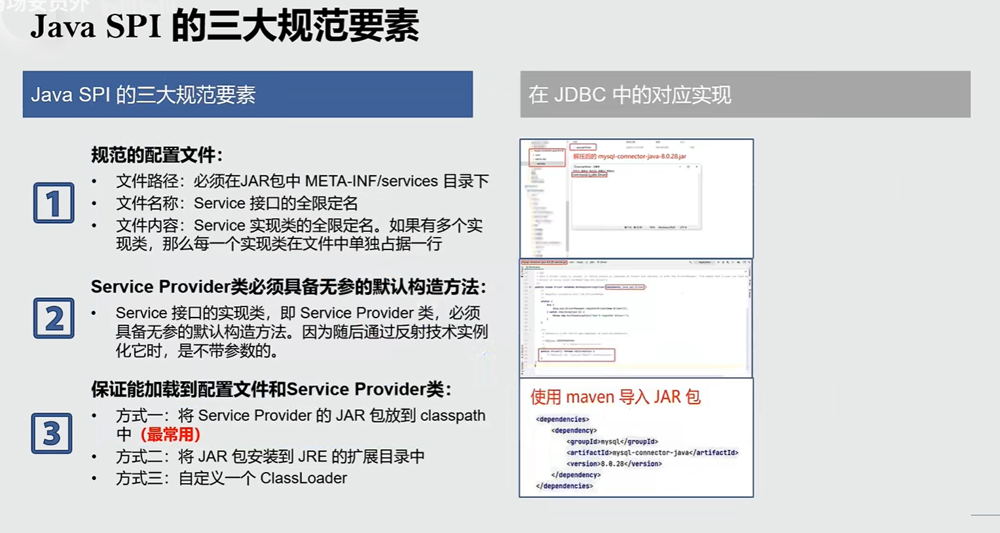
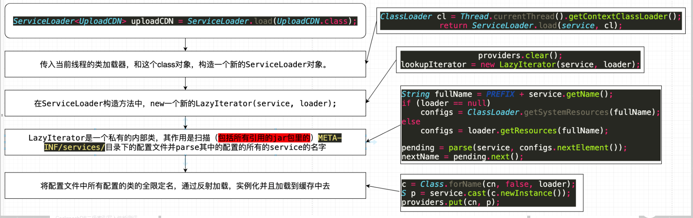

# 基本类型 

| 类型    | 默认值  | 大小                |
| ------- | ------- | ------------------- |
| byte    | 0       | 8位（1B）           |
| short   | 0       | 16位（2B）          |
| int     | 0       | 32位（4B）          |
| long    | 0L      | 64位（8B）          |
| float   | 0.0f    | 32位（4B）          |
| double  | 0.0d    | 64位（8B）          |
| char    | 'u0000' | 16位unicode码（2B） |
| boolean | false   | 1位（1bit）         |

一：在ASCII码编码方案中，一个英文字符占用一个字节，一个汉字字符占用两个字节的空间；

二：在Unicode编码方案中，一个英文字符或一个汉字字符都占用两个字节的空间；

三：在UTF-8编码方案中，一个英文字符占用一个字节，一个汉字字符占用三个字节的空间。

# 修饰符访问权限

| 修饰符      | 当前类 | 同一包内 | 子孙类 | 其他包 | 其他包子孙类                                                 |
| :---------- | :----- | :------- | :----- | :----- | :----------------------------------------------------------- |
| `public`    | Y      | Y        | Y      | Y      | Y                                                            |
| `protected` | Y      | Y        | Y      | N      | Y/N（[说明](https://www.runoob.com/java/java-modifier-types.html#protected-desc)） |
| `default`   | Y      | Y        | N      | N      | N                                                            |
| `private`   | Y      | N        | N      | N      | N                                                            |

## 关键字

**transient关键字的特点：**

transient是Java语言的关键字，用来表示一个成员变量不是该对象序列化的一部分，当一个对象被序列化的时候，transient型变量的值不包括在序列化的结果中，而非transient型的变量是被包括进去的，注意static修饰的静态变量天然就是不可序列化的。

一旦变量被transient修饰，变量将不再是对象持久化的一部分，该变量内容在序列化后无法被访问，本地变量是不能被transient关键字修饰的，变量如果是用户自定义类变量，则该类需要实现Serializable接口。

**volatile关键字**


# 类的加载机制




### 类的加载

**静态加载**：编译时加载相关的类，如果没有则报错，有很强的依赖性。

**动态加载**：运行时加载需要的类，如果运行时不用改类，即使不存在该类，也不会报错，降低了依赖性。

```java
public Class ClassLoadTest{
    public static void main(String[] args){
        Scanner scanner = new Scanner(System.in);
        String key= scanner.next();
        switch(key){
               case "1":
                    Dog dog = new Dog();//静态加载；编译时如果不引入 Dog类就会报错
                    dog.cry();
               break;
               case "2":
                    Class cls = Class.forName("Person");//通过反射动态加载。即使Person类不存在，编译时也不会报错，但是运行时如果类不存在就会报错
                	Person person = (Person) cls.newInstance();
                    Method method = person.getMethod("hello"),
                    method.invoke(person);
                break;
        }
       
    }
}
```

**类加载的时机**

1. 当创建对象时（new) // 静态加载

2. 当子类被加载时，父类也加载// 静态加载

3. 调用类的静态变量或静态方法// 静态加载

4. 通过反射// 动态加载

### 类加载的过程


#### 类的加载阶段分为三个过程  

**加载 (loading)  -->  连接(Linking)  -->  初始化(initialization)**

1. **加载阶段**(loading)

​        **JVM**在该阶段的主要目的是将字节码从不同的数据源（可能是class文件，也可能是jar包，甚至是网络）转化未==二进制字节流加载到内存中==并生成一个代表该类的java.lang.Class对象。

2. **连接阶段**(Linking)

   连接阶段又分为：验证(verification); 准备(Preparation); 解析(Resolution) 三个子阶段。

   - **验证**

     2. > 1. 目的是为了确保Class文件的**字节流中包含的信息符合当前虚拟机的要求，并且不会危害虚拟机自身的安全**。
        >
        > 2. 包括：文件格式验证(是否以魔数 oxcafebabe开头)、元数据验证、字节码验证和符号引用验证。
        > 3. 可以使用 -Xverify:none 参数来关闭大部分的类验证措施，缩短虚拟机类加载的时间        。

     ​         

   - **准备**

     > 1. JVM会在该阶段对静态变量，分配方法区的内存并默认初始化(对应数据类型的默认初始化，如0，0L，null，false等)。这些变量所使用的内存都会在方法区分配。
     >
     >    ```java
     >    Class A {
     >       //属性--成员变量--字段；在大多数情况下都是一样的。
     >        public int n1 = 10;// n1是实例属性，不是静态变量，因此在准备阶段，是不会分配内存的。
     >        public static int n2 = 20;// n2是静态变量，分配内存 n2 是默认初始化0，而不是20。
     >        public static final n3 = 30;// n3是static final常量，他和静态变量不一样，因为一旦赋值就不变n3=30。
     >    }
     >    ```

   - **解析**

     > 1. 虚拟机将常量池的符号引用替换为直接引用
     >
     >    符号引用在把字节码文件放入内存前 类似于 A要引用B，只是名字上显示 A引用B；
     >
     >    直接引用就是把字节码文件放入内存后，有了地址，把名字上的引用，变为A的内存地址引用B的内存地址

3. **初始化阶段**(initialization)

   >1. 到初始化阶段，才真正执行类中定义的Java代码此阶段是执行<clinit>()方法的过程。
   >2. <clinit>()方法是由编译器按语句在源文件中出现的顺序，依此自动收集类中的所有==静态变量的赋值动作==和==静态代码块中的赋值语句==，并进行整和。
   >
   >3. 虚拟机会保证一个类的<clinit>()方法在多线程环境中被正确地加锁、同步；如果多个多线程同时去初始化一个类，那么只有一个线程去执行这个方法，其他线程都要阻塞等待，直到活动线程执行<clinit>()方法完毕。

**Java中类加载执行顺序是：**
主类中的静态代码块–>父类中的静态成员和静态代码块–>子类中的静态成员和静态代码块–>父类中的成员变量和构造代码块–>父类中的构造方法–>子类中的成员变量和构造代码块–>子类构造方法

**`类的只会初始化一次静态代码块和静态成员变量`**

https://www.cnblogs.com/sophine/p/3531282.html   各种代码块

**构造代码块的了解**

- {…}花括号包裹起来的代码我们称之为代码块或代码段。
- 只有一对花括号包裹起来的代码我们称之为构造代码块。
- 构造代码块与构造方法一样都是在==类被实例化的过程中被调用的==。
- 构造代码块==在构造方法之前先执行==。
- 类每次被实例化的过程中都会==调用构造代码块==。

**双亲委派机制**

　　双亲委派机制是当类加载器需要加载某一个.class字节码文件时，则首先会把这个任务委托给他的上级类加载器，递归这个操作，如果上级没有加载该.class文件，自己才会去加载这个.class。


## **i++和++i有哪些区别？**

i++和++i都是实现变量i的自增，两者的区别在于i++是先运算，再加1，而++i是先加1，后运算。但是不管是i++还是++i，最后i的值都是相同的

# 单例模式

单例模式又两种：饿汉模式，和懒汉模式

### 饿汉模式

> 在一开始就创建了，使用对象

```java
ublic class MySinleton {

    public static void main(String[] args) {
        Bank instance01 = Bank.getInstance();
        Bank instance02 = Bank.getInstance();

        System.out.println(instance01 == instance02);// true
    }
}
class Bank{

    //1.将构造方法设为私有，使在本类外不能，使用new 来构造方法。
    private Bank(){};

    //实例化一个唯一的 Bank对象
    private static Bank bank = new Bank();

    //将getInstance() 设置为静态，这样不用实例化对象就可以调用。
    //静态方法只能返回比 private 权限高的属性；所以上面的bank要设置为静态成员变量。
    public static Bank getInstance(){
        return bank;
    }
}
```

### 懒汉模式

> 在第一次调用 getInstence( ) 方法时才会创建对象

```java
public class MySingleton02 {
    public static void main(String[] args) {
        Order order01 = Order.getInstence();
        Order order02 = Order.getInstence();

        System.out.println(order01 == order02); //true
    }

}
class Order{

    //1.将构造方法设为私有，使在本类外不能，使用new 来构造方法。
    private Order(){};

    //实例化一个唯一的 order对象
    private static Order order = null;


    //将getInstance() 设置为静态，这样不用实例化对象就可以调用。
    //静态方法只能返回比 private 权限高的属性；所以上面的bank要设置为静态成员变量。
    public static Order getInstence(){
        if (order == null){
            order = new Order();
        }
        return order;
    }
}
```

### 对比

- 饿汉式： 
  - 好处：**因为一开始就创建对象，所以线程是安全的。**
  - 坏处：类加载的时间会比较长。

- 懒汉式：
  - 好处：延迟类对象的创建。类加载的会比较快。
  - 坏处：**线程不安全，如果多个线程同时调用，getInstence( )方法，会创建多个实例化对象。**


# 比较器

## Compareable接口

Compareable  又叫做自然排序

```java
public class MyComparable {

    public static void main(String[] args) {
        Good[] goods = new Good[5];
         goods[0] = new Good("小米", 1300);
         goods[1] = new Good("华为", 1200);
         goods[2] = new Good("魅族", 1000);
         goods[3] = new Good("vivo", 1400);
         goods[4] = new Good("redmi", 1400);
         Arrays.sort(goods); //默认从小到大排序
        for (Good good : goods) {
            System.out.println(good);
        }
    }
}

class Good implements Comparable{

    private String name;
    private int price;

    public Good() {
    }

    public Good(String name, int price) {
        this.name = name;
        this.price = price;
    }

    public String getName() {
        return name;
    }

    public void setName(String name) {
        this.name = name;
    }

    public int getPrice() {
        return price;
    }

    public void setPrice(int price) {
        this.price = price;
    }

    @Override
    public String toString() {
        return "Good{" +
                "name='" + name + '\'' +
                ", price=" + price +
                '}';
    }

    /*
    * 如果当前对象大于形参 返回整数，小于返回负数。相等返回0。
    * */
    @Override
    public int compareTo(Object o) {
        if ( o instanceof Good){
            o = (Good)o;
            if (this.getPrice()<((Good) o).getPrice()){
                return 1;
            }else if (this.getPrice()>((Good) o).getPrice()){
                return  -1;
            }else {
               return this.getName().compareTo(((Good) o).getName());
            }
        }
       throw new RuntimeException("输入数据类型不一致");
    }
}
```

**==Arrays.sort( )方法默认是比较实现Comparable 或者带有Comparator类型参数的方法，例如String==** 默认从小到大排序

## Comparator接口

定制排序

```java
public class MyComparator {
    public static void main(String[] args) {
        Good2[] good2s = new Good2[5];
        good2s[0] = new Good2("小米", 1300);
        good2s[1] = new Good2("华为", 1200);
        good2s[2] = new Good2("魅族", 1000);
        good2s[3] = new Good2("vivo", 1400);
        good2s[4] = new Good2("redmi", 1400);
        Arrays.sort(good2s, new Comparator<Good2>() {
            @Override
            public int compare(Good2 o1, Good2 o2) {
                if (o1.getPrice()>o2.getPrice()){
                    return 1;
                }else if(o1.getPrice()<o2.getPrice()){
                    return -1;
                }else {
                   return o1.getName().compareTo(o2.getName());
                }
            }
        }); 
        
        for (Good2 good2 : good2s) {
            System.out.println(good2);
        }
    }
}
class Good2 {

    private String name;
    private int price;

    public Good2() {
    }

    public Good2(String name, int price) {
        this.name = name;
        this.price = price;
    }

    public String getName() {
        return name;
    }

    public void setName(String name) {
        this.name = name;
    }

    public int getPrice() {
        return price;
    }

    public void setPrice(int price) {
        this.price = price;
    }

    @Override
    public String toString() {
        return "Good2{" +
                "name='" + name + '\'' +
                ", price=" + price +
                '}';
    }
}
```

## 对比

实现Compareable接口与Comparator接口的类，都是为了对象实例数组排序的方便，因为可以直接调用
java.util.Arrays.sort(对象数组名称),可以自定义排序规则。排序实现的原理都是基于红黑二叉树原理实现的。

Comparable是排序接口。若一个类实现了Comparable接口，就意味着该类支持排序。实现了Comparable接口的类的对象的列表或数组可以通过Collections.sort或Arrays.sort进行自动排序。
Comparator是比较接口，我们如果需要控制某个类的次序，而该类本身不支持排序(即没有实现Comparable接口)，那么我们就可以建立一个“该类的比较器”来进行排序，这个“比较器”只需要实现Comparator接口即可。也就是说，我们可以通过实现Comparator来新建一个比较器，然后通过这个比较器对类进行排序。
不同之处：
1 排序规则实现的方法不同

Comparable接口的方法：compareTo(Object o)

Comparator接口的方法：compare(T o1, To2)

2 类设计前后不同

Comparable接口用于在类的设计中使用；设计初期，就实现这个借口，指定排序方式。

Comparator接口用于类设计已经完成，还想排序（Arrays）。


# HashSet

HashSet 基于 HashMap 来实现的，是一个不允许有重复元素的集合。

HashSet 允许有 null 值。

HashSet 是无序的，即不会记录插入的顺序。

HashSet 不是线程安全的， 如果多个线程尝试同时修改 HashSet，则最终结果是不确定的。 您必须在多线程访问时显式同步对 HashSet 的并发访问。

HashSet 实现了 Set 接口。

```java
public class Test01 {
    public static void main(String[] args){
        List<String> list =new ArrayList<>();
        List<Boolean> list2 =new ArrayList<>();
        boolean sss = true;
        boolean eee = false;
        //list默认按着元素的添加顺序来，添加索引,切允许使用重复元素
        list.add("a");
        list.add("c");
        list.add("b");
        list2.add(sss);
        list2.add(eee);
        System.out.println(list);//[a, c, b]
        System.out.println(list2);
        list.add(1,"f");//可以在指定索引位置插入元素，之前位置的元素向后移动
        System.out.println(list);//[a, f, c, b]

        ArrayList<String> list1 = new ArrayList<>();
        list1.add("123");
        list1.add("456");
        list.addAll(2,list1);//可以在指定索引位置插入集合，之前位置的元素向后移动
        System.out.println(list);//[a, f, 123, 456, c, b]

        System.out.println(list.get(2));//根据索引获取元素 123

        System.out.println(list.indexOf("f"));//获取元素在集合中第一次出现的元素下标
        System.out.println(list.lastIndexOf("f"));//获取元素在集合中最后一次出现的元素下标

        list.remove(2);//根据索引下标移除元素
        System.out.println(list);//[a, f, 456, c, b]


        list.set(1,"ff");//更改元素
        System.out.println(list);//[a, ff, 456, c, b]

        //根据索引下标的起始位置截取一段元素形成新的集合，截取时包含开始索引，不包含结束索引
        List<String> subList = list.subList(2, 4);
        System.out.println(subList);//[456, c]
    }
}
```

HashSet的底层是由HashMap实现的。而HashMap的底层是以 ==jdk7:数组+链表；jdk8:数组+链表+红黑树==

**添加元素的过程** 

- 向Hashset中添加元素 a ，首先调用元素 a 的hashCode( )方法得到哈希值，在通过某种算法将哈希值作为参数计算出在Hashset中底层数组存放的位置（即索引值），判断此位置上是否有元素
  - 如果此位置上没有，则添加成功。
  - 如果此位置有其他元素b（或链表形式存在的多个元素），则 a 与 b **比较哈希值是否相等**
    - 如果不相等，则元素 a 添加成功
    - 如果相等，则需要调用 a 元素的 equlas( ) 方法。
      - equlas( )返回true ,元素 a 添加失败。
      - equlas( )返回false ,元素 a 添加成功。

对于在相同索引位置是以链表形式存储的  (简称7上8下，新元素元素对旧元素来说)

**jdk7**：元素 a 放到数组中，指向原来的该位置的元素。

**jdk8**：原来的该位置的元素不变，指向 a 元素。     

### LinkedHashSet

​        LinkedHashSet作为HashSet的子类，在添加数据的同时还维护了两个引用，记录此数据的前一个和后一个数据。可以按照添加数据的顺序来遍历。

**优点**：对于频繁的遍历操作。LinkedHashSet要优于HashSet。


# HashMap

> **jdk7**
>
> 在hashmap数组实例化之后会创建长度为16的Entry数组 table
>
> 向HashMap中添加元素 **<key1,value1>** ，首先调用**key** 1的hashCode( )方法得到哈希值，在通过某种算法将哈希值作为参数计算出在HashMap中底层数组存放的位置（即索引值），判断此位置上是否有元素
>
> - 如果此位置上没有，则添加成功。
> - 如果此位置有其他键值对（或链表形式存在的多个键值对），则 key1与 keyn **比较哈希值是否相等**
>   - 如果不相等，则元素  **<key1,value1>** 添加成功
>   - 如果相等，则需要调用**key1**元素的 equlas( ) 方法。
>     - equlas( )返回true ,**<key1,value1>**添加失败。
>     - equlas( )返回false ,**<key1,value1>**添加成功。

**扩容问题**

- 默认扩容为以前的2倍，并将元素复制过来。
- https://www.cnblogs.com/shawn-sun/p/13871006.html

>**jdk8**
>
>jdk8的实现原理和jdk7基本相同
>
>不同点：
>
>- Jdk7使用头插法插入新元素，jkd8使用尾插法。
>
>- new HashMap( )；底层并没有立即创建一个长度为16的数组
>- jdk8的底层数组是Node[ ]而不是Entry[ ]
>- 首次调用put( )方法是底层才会创建一个长度为16的数组。
>-  底层结构不同==jdk7:数组+链表；jdk8:数组+链表+红黑树==
> - 当数组某一个位置上的元素以链表形式存在的数据的长度 > 8 且当前数组长度 > 64 时（扩容两次时）

### LinkedHashMap

​        LinkedHashMap作为HashMap的子类，在添加数据的同时还维护了**两个引用，记录此数据的前一个和后一个数据**。可以按照添加数据的顺序来遍历。

HashMap的**Node**



**LinkedHashMap的Entry**

 

**优点**：对于频繁的遍历操作。LinkedHashMap要优于HashMap。

## TreeMap

TreeMap默认以key来排序，看key是否实现Comparable接口，或者在实例化中带有Comparator对象的参数来比较，实际开发中一般用String作为Key，不用实现Comparable或Comparator。



# Hashtable

## Hashtable和HashMap的不同

1. hashtable是继承自陈旧的Dictionary类的，而hashmap继承自AbstractMap类的同时对Java1.2引进的Map接口进行了实现。

2. hashtable的方法是同步的，而hashmap不是，所以在需要多线程应用中就可以使用hashtable,而在一个单线程应用时应采用hashmap,因为同步，hashtable的系统的开销相比hashmap自然加大。如果要实现hashmap的线程同步，就要用Collections.synchronized(hashmap)来处理。

3. hashtable的key 和value都不可以为null,而hashmap可以。HashTable中不允许Null值。HashMap中需要Null键，只有一个，允许Null值，可以由一个或多个键对应Null值。

## properties

# IO流

## 抽象基类

### 流的三种分类方式

**流向：**输入流、输出流

**数据单位：**字节流、字符流

**流的角色：**节点流(文件流)、处理流(比如 缓冲流)


**4个抽象基类**InputStream，OutputStream，Reader，Writer

OutputStream

`public void write(byte[] b)`：将 b.length个字节从指定的字节数组写入此输出流。

InputStream

`public void read(byte[] b)`：将输入流中的数据写入字节数组中


**字符流`专门用于处理文本`文件。如果处理纯文本的数据优先考虑字符流，其他情况就只能用字节流了**


### 文件字节输入流FileInputStream

### 文件字节输入出流FileOutputStream


### 文件字符输入流FileReader

### 文件字符输出流FileWriter


## 缓存流

### 缓冲字节输入流BufferedinputStream

- `public BufferedInputStream(InputStream in)` ：创建一个新的缓冲输入流，注意参数类型为**InputStream**。

### 缓冲字节输出流BufferedOutputStream

- `public BufferedOutputStream(OutputStream out)`： 创建一个新的缓冲输出流，注意参数类型为**OutputStream**。


### 缓冲字节输入流BufferedReader

### 缓冲字节输出流BufferedWriter


## 转换流

### 字节流转换为字符流

* 转换输入流  (转换必须要保持编码格式一致，不然会出现中文乱码)
* InputStreamReader


### 字节流转换为字符流

* 转换输出流  (转换必须要保持编码格式一致，不然会出现中文乱码)
* OutputStreamReader


## 对象流

Java 提供了一种对象序列化的机制。用一个字节序列可以表示一个对象，该字节序列包含该对象的数据、对象的类型和对象中存储的属性等信息。字节序列写出到文件之后，相当于文件中持久保存了一个对象的信息。

反之，该字节序列还可以从文件中读取回来，重构对象，对它进行反序列化。对象的数据、对象的类型和对象中存储的数据信息，都可以用来在内存中创建对象。看图理解序列化：


==InputStream和Reader是接收数据（读），OutputStream和Writer是发送数据（写）。==

# JUC

# Thread多线程

## 继承Thread类的方式实现多线程

重写run方法

```java
public class TestThread extends Thread {
    @Override
    public void run() {
        System.out.println("多线程运行的代码");
        for(int i=0;i<5;i++){
            System.out.println("这是多线程的逻辑代码"+i);
        }
    }
}


```

```java
public class Test01 {
    public static void main(String[] args) {
        Thread t0= new TestThread();
        t0.start();//启动线程
        System.out.println("++++++++++");
        System.out.println("++++++++++");
        System.out.println("++++++++++");
    }
```

 main方法执行t0.start之后，就相当于在main方法之外开辟了一条支流
 在t0.start之后的main方法的其他代码就与run中的代码无关了，
 是并行运行的；各走各的了。

 如果拆开来看，run()中的代码和main之后的代码是保存各自的执行顺序的

 这就是多线程的异步性
 同步性是严格按照代码从上到下执行

## 实现Runnable接口实现多线程

实现run()方法

```java
public class TestRunable implements Runnable{
    @Override
    public void run() {
            System.out.println(Thread.currentThread().getName()+"  Runnable多线程运行的代码");
            for(int i=0;i<5;i++){
                System.out.println("Runnable 这是多线程的逻辑代码"+i);
        }
    }
}
```


```java
public class Test01 {
    public static void main(String[] args) {
        /*Thread t0= new TestThread();
        t0.start();//启动线程*/

        Thread t3 = new Thread(new TestRunable());

        Thread t4 = new Thread(new TestRunable(),"d4c");//参数1：实现Runable接口的类实例对象，参数2：线程名
        t3.start();
        t4.start();
        System.out.println("++++++++++");
        System.out.println("++++++++++");
        System.out.println("++++++++++");
    }
```


**一般使用实现接口(Runnable)的方式来实现多线程**

**好处**：1、避免了单继承的局限性

​            2、多个线程可以共享同一个接口实现类的对象，非常适合多个相同的线程来处理同一个资源

   **使用多线程的优点**

1.提高应用程序的响应。对图形化界面更有意义，可增强用户体验

2.提高CPU的利用率

3.改善程序结构。将既长又复杂的进程分为多个线程，独立运行，利于理解和修改 


```java
public class TestRunable implements Runnable{
    int count = 0;//设置变量count
    @Override
    public void run() {

            System.out.println(Thread.currentThread().getName()+"  Runnable多线程运行的代码");
            for(int i=0;i<5;i++){
                count++;
                System.out.println("Runnable 这是多线程的逻辑代码"+count);
        }
    }
}
```


```java
public class Test01 {
    public static void main(String[] args) {
        /*Thread t0= new TestThread();
        t0.start();//启动线程*/
        TestRunable testRunable  =new TestRunable();//实例化一个实现了Runable接口的对象

        Thread t3 = new Thread(testRunable);

        Thread t4 = new Thread(testRunable,"d4c");
        t3.start();
        t4.start();
    }
```

```java
Runnable 这是多线程的逻辑代码1
Runnable 这是多线程的逻辑代码2
Runnable 这是多线程的逻辑代码3
Runnable 这是多线程的逻辑代码5
Runnable 这是多线程的逻辑代码6
Runnable 这是多线程的逻辑代码4
Runnable 这是多线程的逻辑代码8
Runnable 这是多线程的逻辑代码9     //count++被两个线程执行了10次，count变量被两个线程共享了
Runnable 这是多线程的逻辑代码10
Runnable 这是多线程的逻辑代码7   
```

## 实现Callable接口

```java
public class Test06 {
    public static void main(String[] args) {
        //创建Callable接口实现类对象
        MyCallable callable = new MyCallable();
        //将此Callable接口实现类对象 作为参数，放入FutureTask构造器中。
        FutureTask task = new FutureTask(callable);

        //将FutureTask的对象作为参数传递到Thread对象中。因为FutureTask实现了Runnable接口。
        //先开启线程，task才能使用get()方法。
        new Thread(task).start();
        try {
            //get()方法返回的值就是 在new FutureTask(callable) 中 Callable实现类的call()的返回值。
            Object o = task.get();
            System.out.println("sum = " + o);
        } catch (InterruptedException e) {
            e.printStackTrace();
        } catch (ExecutionException e) {
            e.printStackTrace();
        }
    }
}
class MyCallable implements Callable{

    @Override
    public Object call() throws Exception {
            int sum = 0;
              for (int i = 0; i <= 100; i++) {
                 if (i%2==0){
                     sum += i;
                     System.out.println("i = "+i);
                  }
                }
        return sum;
    }
}
```


## 线程池

**总体来说，线程池有如下的优势**：

（1）降低资源消耗。通过重复利用已创建的线程降低线程创建和销毁造成的消耗。

（2）提高响应速度。当任务到达时，任务可以不需要等到线程创建就能立即执行。

（3）提高线程的可管理性。线程是稀缺资源，如果无限制的创建，不仅会消耗系统资源，还会降低系统的稳定性，使用线程池可以进行统一的分配，调优和监控。


## **线程的生命周期**

线程是一个动态执行的过程，它也有一个从产生到死亡的过程。

(1)生命周期的五种状态

**新建（new Thread）**

当创建Thread类的一个实例（对象）时，此线程进入新建状态（未被启动）。

例如：Thread t1=new Thread();

**就绪（runnable）**

线程已经被启动，正在等待被分配给CPU时间片，也就是说此时线程正在就绪队列中排队等候得到CPU资源。例如：t1.start();

**运行（running）**

线程获得CPU资源正在执行任务（run()方法），此时除非此线程自动放弃CPU资源或者有优先级更高的线程进入，线程将一直运行到结束。

**死亡（dead）**

当线程执行完毕或被其它线程杀死，线程就进入死亡状态，这时线程不可能再进入就绪状态等待执行。

自然终止：正常运行run()方法后终止

异常终止：调用stop()方法让一个线程终止运行

**堵塞（blocked）**

由于某种原因导致正在运行的线程让出CPU并暂停自己的执行，即进入堵塞状态。

正在睡眠：用sleep(long t) 方法可使线程进入睡眠方式。一个睡眠着的线程在指定的时间过去可进入就绪状态。

正在等待：调用wait()方法。（调用notify()方法回到就绪状态）

被另一个线程所阻塞：调用suspend()方法。（调用resume()方法恢复）

# 线程同步问题 

> 同步代码块
>
> - **synchronized( 同步监视器 ){**
>
>   ​      //需要同步的代码
>
>   **}**
>
>   说明：1.操作共享数据的代码块，即为需要被同步的代码块
>
>   ​			2.共享数据：多个线程共同操作的变量
>
>   ​			3.同步监视器：俗称：**锁**，任何一个类的对象，都可以充当锁，表示该对象在某一时刻只能由一个线程访问。通常为               				**this**，注意使用继承Thread 不能使用**this**
>
>   ​					要求：多个线程公用一把锁。下例子中的锁就是 w。
>
>   

```java
public class Test04 {

    public static void main(String[] args) {
        Window w = new Window();
        Thread thread1 = new Thread(w,"窗口1：");
        Thread thread2 = new Thread(w,"窗口2：");
        Thread thread3 = new Thread(w,"窗口3：");

        thread1.start();
        thread2.start();
        thread3.start();
    }
}
class Window implements Runnable{

    private int tick = 100;

    @Override
    public void run() {

        while (true){
            synchronized(this){
              if (tick>0){
                  System.out.println(Thread.currentThread().getName()+tick);
                  tick--;
              }else {
                  break;
              }
          }

        }
    }
}
```


>同步方法
>
>- 在方法上加**synchronized**
>
>  **public synchronized void func(){**
>
>  ​			//需要同步的代码
>
>  **}**
>
>  ​      加在方法上的 **synchronized** 是默认有锁，默认如果是非静态方法，则锁为当前对象 This，如果为**静态方法**，锁为该类的Class对象 ，其他特性和同步代码块一样。


>**Lock**  
>
>- ReentrantLock 简称lock
>
>  功能和**synchronized** 功能一样，但是更灵活，在想要同步的代码处 ==lock.lock()开启同步锁==和==lock.unlock()关闭同步锁==

```java
public class Test05 {
    public static void main(String[] args) {
        Window window1 = new Window();
        Thread thread1 = new Thread(window1,"窗口1：");
        Thread thread2 = new Thread(window1,"窗口2：");
        Thread thread3 = new Thread(window1,"窗口3：");

        thread1.start();
        thread2.start();
        thread3.start();
    }


}
class Window1 implements Runnable{

    private int tick = 100;

    private ReentrantLock lock = new ReentrantLock();
    @Override
    public void run() {

        while (true){

            try {
                lock.lock(); //开启同步锁
                if (tick > 0) {
                    System.out.println(Thread.currentThread().getName() + tick);
                    tick--;
                } else {
                    break;
                }
            }finally {
                lock.unlock();//关闭同步锁
            }
        }
    }
}
```

## synchronized与Lock的区别

两者区别：

1.首先synchronized是java内置关键字，在jvm层面，Lock是个java类；

2.synchronized无法判断是否获取锁的状态，Lock可以判断是否获取到锁；

3.synchronized会自动释放锁(a 线程执行完同步代码会释放锁 ；b 线程执行过程中发生异常会释放锁)，Lock需在finally中手工释放锁（unlock()方法释放锁），否则容易造成线程死锁；

4.用synchronized关键字的两个线程1和线程2，如果当前线程1获得锁，线程2线程等待。如果线程1阻塞，线程2则会一直等待下去，而Lock锁就不一定会等待下去，如果尝试获取不到锁，线程可以不用一直等待就结束了；

5.synchronized的锁可重入、不可中断、非公平，而Lock锁可重入、可判断、可公平（两者皆可）

6.Lock锁适合大量同步的代码的同步问题，synchronized锁适合代码少量的同步问题。

### 线程安全的懒汉模式

```java
class Order{

    //1.将构造方法设为私有，使在本类外不能，使用new 来构造方法。
    private Order(){};

    //实例化一个唯一的 order对象,volatlie 防止在synchronization中指令重排序
    private volatlie static Order order = null;


    //将getInstance() 设置为静态，这样不用实例化对象就可以调用。
    //静态方法只能返回比 private 权限高的属性；所以上面的bank要设置为静态成员变量。
    
    //效率低，每个线程都会进入锁查看是否已经创建单列
//  public static Order getInstence(){
//      synchronized (order){
//          if (order == null){
//              order = new Order();
//          }
//      }
//        return order;
//    }


	//效率更高，在外面加一层if判断，告诉其他线程是否又实例，不用进在进入同步代码块
	public static Order getInstence(){
        if(order == null){
            synchronized (order){
             /* 这个判断，假如第一线程创建出对象之后，下一个线程进入，就会第二次判断是否依旧有实例对象，不然第二个线程会继
              * 续创建对象,就不是单列模式了
              */
             if(order == null){
                order = new Order();
                }
        }
      }
        return order;
    }
}
```

# 线程通信

## Object 的 wait()和notify()，notifyAll()

**wait()**：令当前线程挂起并放弃CPU、同步资源，使别的线程可访问并修改共享资源，而当前线程排队等候再次对资源的访问。在那个线				程中调用就会把那个线程阻塞

**notify()**：唤醒正在排队等待同步资源的线程中优先级最高者，结束等待。 

**notifyAll()**：唤醒正在排队等待同步资源的所有线程。唤醒同一个对象上所有调用wait()方法的线程，注意并不是给所有唤醒线程一个对    象的锁，而是让它们竞争

**Java.lang.Object**提供的这三个方法只有在**synchronized方法**或**synchronized代码块**中才能使用，否则会报异常

是属于Object的方法

## condition的 await( ) 和 signal( ),signalAll( )

- `Condition`因素出`Object`监视器方法（ [`wait`](../../../../java/lang/Object.html#wait--) ， [`notify`](../../../../java/lang/Object.html#notify--)和[`notifyAll`](../../../../java/lang/Object.html#notifyAll--)  ）成不同的对象，以得到具有多个等待集的每个对象，通过将它们与使用任意的组合的效果[`Lock`个](../../../../java/util/concurrent/locks/Lock.html)实现。  `Lock`替换`synchronized`方法和语句的使用，  `Condition`取代了对象监视器方法的使用。 

- 用 lock.newCondition( )创建cindition

  ```java
     final Lock lock = new ReentrantLock();
     final Condition condition  = lock.newCondition(); 
  ```

- **await 同 object.wait( )**

  **signal同 object.notify( )**

  **signalAll 同 object.notifyAll( )**

### condition 自定义线程的通信

- 例如：想要线程按顺序唤醒，如果用wait()，notifyAll()，线程之间会争夺资源，降低效率,

  用有多少个线程，就创建多少个condition 实现精准唤醒，提高了效率

- ```java
  class ShareResource{
  
      private int flag = 1;
  
      //private int num = 0;
  
      private Lock lock = new ReentrantLock();
  	
      //创建多个condition
      private Condition condition1 = lock.newCondition();
      private Condition condition2 = lock.newCondition();
      private Condition condition3 = lock.newCondition();
  
      //打印5次
      public void print5(int loop){
          lock.lock();
          try{
              while(flag!=1){
                  condition1.await();
              }
              for (int i = 0; i < 5; i++) {
                  System.out.println(Thread.currentThread().getName()+"打印5次:轮数="+loop);
              }
              flag=2;
              condition2.signal(); //精准唤醒
          } catch (InterruptedException e) {
              e.printStackTrace();
          } finally {
              lock.unlock();
          }
      }
  
      //打印10次
      public void print10(int loop){
          lock.lock();
          try{
              while(flag!=2){
                  condition2.await();
              }
              for (int i = 0; i < 10; i++) {
                  System.out.println(Thread.currentThread().getName()+"打印10次:轮数="+loop);
              }
              flag=3;
              condition3.signal();//精准唤醒
          } catch (InterruptedException e) {
              e.printStackTrace();
          } finally {
              lock.unlock();
          }
      }
  
      //打印15次
      public void print15(int loop){
          lock.lock();
          try{
              while(flag!=3){
                  condition3.await();
              }
              for (int i = 0; i < 15; i++) {
                  System.out.println(Thread.currentThread().getName()+"打印15次:轮数="+loop);
              }
              flag=1;
              condition1.signal();//精准唤醒
          } catch (InterruptedException e) {
              e.printStackTrace();
          } finally {
              lock.unlock();
          }
      }
  }
  
  
  public class ThreadTest03 {
      public static void main(String[] args) {
  
          final ShareResource resource = new ShareResource();
  
          new Thread(new Runnable(){
              public void run() {
                  for (int i = 0; i <=10 ; i++) {
                      resource.print5(i);
                  }
              }
          },"AA").start();
  
          new Thread(new Runnable(){
              public void run() {
                  for (int i = 0; i <=10 ; i++) {
                      resource.print10(i);
                  }
              }
          },"BB").start();
  
          new Thread(new Runnable(){
              public void run() {
                  for (int i = 0; i <=10 ; i++) {
                      resource.print15(i);
                  }
              }
          },"CC").start();
      }
  
  }
  ```

  

## sleep() 和 wait() 有什么区别？

sleep() 是 Thread 类的静态本地方法；wait() 是Object类的成员本地方法
sleep() 方法可以在任何地方使用；wait() 方法则只能在同步方法或同步代码块中使用，否则抛出异常Exception in thread "Thread-0" java.lang.IllegalMonitorStateException
sleep() 会休眠当前线程指定时间，释放 CPU 资源，让其他线程使用cpu，==不释放对象锁==，休眠时间到自动苏醒继续执行；wait() 方法放弃持有的对象锁，进入==等待队列==，当该对象被调用 notify() / notifyAll() 方法后才有机会竞争获取对象锁，进入运行状态
JDK1.8 sleep() wait() 均需要捕获 InterruptedException 异常。

```java
/*
* 生产者和消费者
* */
public class Test {
    public static void main(String[] args) {
        Clerk c = new Clerk();
        new Thread(new Runnable() {
            @Override
            public void run() {
                synchronized (c) {
                    while (true) {//保持一直生产
                        if (c.productNum == 0) {//产品数为0，开始生产
                            System.out.println("产品数为0，开始生产");
                            while (c.productNum < 4) {
                                c.productNum++;
                                System.out.println("库存" + c.productNum);
                            }
                            System.out.println("产品数为" + c.productNum + "结束生产");
                            c.notify();//唤醒消费者线程
                        } else {
                            try {
                                c.wait();//生产者线程等待
                            } catch (Exception e) {
                                e.printStackTrace();
                            }
                        }

                    }
                }
            }
        }, "生产者").start();

        new Thread(new Runnable() {
            @Override
            public void run() {
                synchronized (c) {
                    while (true) {//保持一直消费
                        if (c.productNum == 4) {//产品数为4，开始消费
                            System.out.println("产品数为0，开始生产");
                            while (c.productNum > 0) {
                                c.productNum--;
                                System.out.println("库存" + c.productNum);
                            }
                            System.out.println("产品数为" + c.productNum + "结束消费");
                            c.notify();//唤醒生产者线程
                        } else {
                            try {
                                c.wait();//消费者线程等待
                            } catch (Exception e) {
                                e.printStackTrace();
                            }
                        }

                    }
                }
            }
        }, "消费者").start();
    }
}
 class Clerk{
    public static int productNum = 0;
}
```

## thread.join()方法

线程对象的join( )保证调用该方法的线程对象先执行任务，如下

```java
public static void main(String[] args) throws InterruptedException {
    Thread thread = new Thread(() -> {
        for (int i =0 ;i<=10;i++)
            System.out.println(Thread.currentThread().getName()+" | " + i);

    });
    thread.start();
    thread.join();
    for (int i =0 ;i<=10;i++)
    System.out.println(Thread.currentThread().getName() + " | "+ i);
    new Thread(() -> {
        for (int i =0 ;i<=10;i++)
            System.out.println(Thread.currentThread().getName()+" | " + i);

    }).start();
}
```

​		join( )方法的源码中调用了wait( )方法，在执行 线程对象.join( )时；阻塞的**并不是调用join( )的线程对象**，而是执行该方法的线程，例如上面代码中`thread.join();`阻塞的是main线程，因为是在main线程中执行的。join( )方法底层源码使用了wait( )，将main线程阻塞阻塞，保证`thread`中的任务会比main中的先执行。当`thread`中的任务执行完毕之后在结束阻塞。main线程会自动唤醒。==当线程对象作为锁调用wait()方法，会阻塞直到线程对象中的任务执行完毕，运行结束的时候，notify是被线程的子系统调用的，普通对象作为锁则不行==

# 常用工具类Arrays和Collectoins

## Arrays

### 数组转字符串

```java
int[] array = new int[]{1, 2, 3};
out.println(Arrays.toString(array)); //[1, 2, 3]
```

如果是一维数组，toString方法可以很好的适用。但遇到多维数组时，需要使用**deepToString**把数组完全转成字符串。

```java
int[][] deepArray = new int[][]{{1, 3},{2, 4}};
out.println(Arrays.toString(deepArray)); //[[I@1540e19d, [I@677327b6]
out.println(Arrays.deepToString(deepArray)); //[[1, 3], [2, 4]]
```

### 填充数组

```java
array = new int[5];
Arrays.fill(array, 2);
out.println(Arrays.toString(array)); //[2, 2, 2, 2, 2]

array = new int[5];
Arrays.fill(array, 1, 4, 2); //部分填充,从索引1开始，到索引4，不包括4（其实就是到3），因为源码中使用的是 < 并非 <=
out.println(Arrays.toString(array));//[0, 2, 2, 2, 0]
```

### 数组元素排序

```java
array = new int[]{3, 10, 4, 0, 2};
Arrays.sort(array);
out.println(Arrays.toString(array)); //[0, 2, 3, 4, 10]

array = new int[]{3, 10, 4, 0, 2};
Arrays.parallelSort(array); //和sort相比是这个是并行的
out.println(Arrays.toString(array)); //[0, 2, 3, 4, 10]

array = new int[]{3, 10, 4, 0, 2};
Arrays.sort(array, 0, 4); //部分排序 从索引1开始，到索引4，不包括4（其实就是到3），因为源码中使用的是 < 并非 <=
out.println(Arrays.toString(array)); //[0, 3, 4, 10, 2]
```

### 数组的比较

```java
array = new int[]{1, 2, 3};
int[] array2 = new int[]{1, 2, 3};
out.println(Arrays.equals(array, array2)); //true
```

和toString方法一样，equals方法遇到多维数组时也会出现问题。

```java
int[][] deepArray1 = new int[][]{{1, 3},{2, 4}};
int[][] deepArray2 = new int[][]{{1, 3},{2, 4}};
out.println(Arrays.equals(deepArray1, deepArray2)); //false
out.println(Arrays.deepEquals(deepArray1, deepArray2)); //true
```

**deepEquals**用于判定两个指定数组彼此是否==深层相等==，此方法适用于任意深度的嵌套数组。

**equals**用于判定两个数组是否相等，如果两个数组以相同顺序包含相同元素，则返回true。

如果两个数组使用equals返回true，则使用deepEquals必定也返回true，也就是说在比较的两个数组均为一维数组的前提下，equals和deepEquals的比较结果没有差别。

### 数组复制

```java
array = new int[]{3, 10, 4, 0, 2};
int[] arrayCopy = Arrays.copyOf(array, 3);
out.println(Arrays.toString(arrayCopy)); //[3, 10, 4] copy长度为3

arrayCopy = Arrays.copyOf(array, 7);
out.println(Arrays.toString(arrayCopy)); //[3, 10, 4, 0, 2, 0, 0], 多出的长度补0

arrayCopy = Arrays.copyOfRange(array, 1, 4);
out.println(Arrays.toString(arrayCopy)); //[10, 4, 0] 从索引1开始，到索引4，不包括4（其实就是到3），因为源码中使用的是 < 并非 <=
```

### 二分查找返回下标

```java
array = new int[]{0, 3, 4, 10, 20};
out.println(Arrays.binarySearch(array, 10)); //3, array必须是排序的，否则得到的是错误的结果
out.println(Arrays.binarySearch(array, 6)); //-4, 找不到的值，从-1开始，6如果存在下标是3， 所以返回-4
out.println(Arrays.binarySearch(array, 2, 5, 10)); //3, 返回的还是全局的下标值。从索引1开始，到索引4，不包括4（其实就是到3），因为源码中使用的是 < 并非 <=
```

### 数组转List

```java
int array = new int[]{3, 10, 4, 0, 2};
out.println(Arrays.asList(array).contains(3)); //false ,数组中没有3

Integer arr[] = new Integer[]{3, 10, 4, 0, 2};
out.println(Arrays.asList(arr).contains(3)); //true，数组中有3
```

这里是比较有意思的地方，实际上拆开来看是这样的

```java
int array = new int[]{3, 10, 4, 0, 2};
List<int[]> ints = Arrays.asList(array); //int[] 类型

Integer arr[] = new Integer[]{3, 10, 4, 0, 2};
List<Integer> integers = Arrays.asList(arr); //Integer类型
```


现在就知道区别了，原始数据类型int的数组调用asList之后得到的List只有一个元素，这个元素就是**==元素类型的数组==**。而封装类Integer数组调用asList是把**==数组中每个元素==**加到了List中。

### 对数组元素采用指定的方法计算

```java
array = new int[]{3, 10, 4, 0, 2};
Arrays.parallelPrefix(array, (x,y)->(x+y)); //[3, 13, 17, 17, 19]
out.println(Arrays.toString(array));

int [] array = new int[]{3, 10, 4, 0, 2};
Arrays.parallelSetAll(array, (x)->(x*x)); //[0, 1, 4, 9, 16]
System.out.println(Arrays.toString(array));

Arrays.setAll(array, (x)->(x%3));
out.println(Arrays.toString(array)); //[0, 1, 2, 0, 1], 与parallelSetAll相比只是不并行
```

## Collections

在`Java.util`包下，是针对集合操作的工具类。此类仅由静态方法组合或返回集合，静态方法可以直接通过类名调用。它包含对集合进行操作的多态算法，“包装器”，返回由指定集合支持的新集合，以及其他一些可能的和最终的。

### 将指定列表按升序排列

```java
    public static <T> void sort(List<T> list, Comparator<? super T> c) {
        Object[] a = list.toArray();
        //底层调用的Array的sort方法
        Arrays.sort(a, (Comparator)c);
        ListIterator<T> i = list.listIterator();
        for (int j=0; j<a.length; j++) {
            i.next();
            i.set((T)a[j]);
        }
    }

```

### 反转指定列表中元素的顺序

```java
    public static void reverse(List<?> list) {
        int size = list.size();
        if (size < REVERSE_THRESHOLD || list instanceof RandomAccess) {
            for (int i=0, mid=size>>1, j=size-1; i<mid; i++, j--)
                swap(list, i, j);
        } else {
            // instead of using a raw type here, it's possible to capture
            // the wildcard but it will require a call to a supplementary
            // private method
            ListIterator fwd = list.listIterator();
            ListIterator rev = list.listIterator(size);
            for (int i=0, mid=list.size()>>1; i<mid; i++) {
                Object tmp = fwd.next();
                fwd.set(rev.previous());
                rev.set(tmp);
            }
        }
    }

```

### 使用默认的随机源随机排列指定的列表

```java
//使列表中的元素随机排序
public static void shuffle(List<?> list) {
    Random rnd = r;
    if (rnd == null)
        r = rnd = new Random(); // harmless race.
    shuffle(list, rnd);
}
```
# Collectors

## Collectors 的作用

Collectors 是 Java 8 加入的操作类，位于 java.util.stream 包下。它会根据不同的策略将元素收集归纳起来，比如最简单常用的是将元素装入Map、Set、List 等可变容器中。特别对于 Java 8 Stream Api 来说非常有用。

## Java 8 中 Collectors 的方法

Collectors 提供了一系列的静态方法供我们使用，通常情况我们静态导入即可使用。接下来我们来看看都提供了哪些方法吧。

### 1 类型归纳

这是一个系列，作用是将元素分别归纳进可变容器 List、Map、Set、Collection 或者ConcurrentMap 。

```java
Collectors.toList();
Collectors.toMap();
Collectors.toSet();
Collectors.toCollection();
Collectors.toConcurrentMap();
```
我们可以根据以上提供的 **API** 使用 `Stream` 的 `collect` 方法中的转换为熟悉的集合容器。非常简单这里不再演示。

###  joining

将元素以某种规则连接起来。该方法有三种重载 `joining(CharSequence delimiter)` 和 `joining(CharSequence delimiter,CharSequence prefix,CharSequence suffix)`

```java
 //   输出 FelordcnTomcatJettyUndertowResin
 servers.stream().collect(Collectors.joining());

 //   输出 Felordcn,Tomcat,Jetty,Undertow,Resin
 servers.stream().collect(Collectors.joining("," ));

 //   输出 [Felordcn,Tomcat,Jetty,Undertow,Resin]
 servers.stream().collect(Collectors.joining(",", "[", "]")); 
```

用的比较多的是读取 `HttpServletRequest` 中的 **body** ：

```java
  HttpServletRequest.getReader().lines().collect(Collectors.joining());
```

**更多使用方法详见：**https://blog.csdn.net/agonie201218/article/details/125563291


# JavaSPI



基本原理：



SpringBoot的自动装配也是借鉴了SPI的设计思想实现的