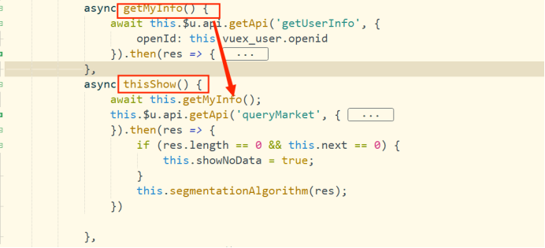

#  JavaScript的常用方法


## JavaScript的基本类型

USOBN

- U undefined

- S String Symbol

-  O object

- B boolean

- N null number

  

## promise

Promise说得通俗一点就是一种写代码的方式，一种语法糖，并且是用来写JavaScript编程中的异步代码的。

基本用法

```javascript
let p = new Promise((resolve, reject) => {
  // 做一些事情
  // 然后在某些条件下resolve，或者reject
  if (/* 条件随便写^_^ */) {
    resolve() 
  } else {
    reject()
  }
})

p.then(() => {
    // 如果p的状态被resolve了，就进入这里
}, () => {
    // 如果p的状态被reject
})
```

**new Promise（function(resolve, reject){}）**

创建Promise对象传入一个方法参数，该方法又有两个方法类型的参数 **resolve( )** 和 **reject( )** ,调用 **resolve( )**  ，将在方法中调用**resolve( )**

Promise对象可以调用原型方法 **then( )**，该方法有两个方法类型的参数 **val( ) **和 **rej( )** ,同时这两个方法有一个形参来接受参数，

基本流程：

> 在传入new Promise 传入的方法，在方法中调用 **resolve( )**  或 **reject( )** 的方法会改变Promise对象的状态，调用 **resolve( )**  方法会将Promise对象的状态改变为fulfilled（成功），调用**reject( )**方法会将Promise对象的状态改变为rejected（失败），这两个对象都可以传入一个参数，如果Promise对象的状态为成功fulfilled（成功），则Promise对象在调用**then**方法时，then方法就会执行第一个方法参数，如果为rejected（失败）则会执行第二个方法参数。
>
> 同样， **resolve( )**  或 **reject( )**还可以传递参数， **resolve( a )**  传递的参数会被，then的第一个方法参数接受到，**reject( b )** 会被第二个方法参数接受到

**3种状态**

首先，promise实例有三种状态：

- pending（待定）

- fulfilled（已执行）

- rejected（已拒绝）

  **fulfilled**和**rejected**有可以说是已成功和已失败，这两种状态又归为已完成状态

**resolve和reject**

调用resolve和reject能将分别将promise实例的状态变成**fulfilled**和**rejected**，只有状态变成已完成（即**fulfilled**和**rejected**之一），==才能触发状态的回调==

**promise的内容分为构造函数、实例方法和静态方法**

- 1个构造函数： new Promise
- 2个实例方法：.then 和 .catch
- 4个静态方法：Promise.all、Promise.race、Promise.resolve和Promise.reject

## asyns和await

### **async 作用是什么**

在一个普通函数前加上`async`,该函数就变成了`async函数`，`async` ``函数返回的是一个 Promise 对象。async 函数（包含函数语句、函数表达式、Lambda表达式）会返回一个 Promise 对象，如果在函数中 `return` 一个直接量，async 会把这个直接量通过 `Promise.resolve()` 封装成 **Promise** 对象。

如果 **async** 函数没有返回值， 它会返回 `Promise.resolve(undefined)` 成功状态。

### **await**

**await** 等待的是一个表达式（一般使用为 右边是一个Promise对象），这个表达式的计算结果是 **Promise** 对象或者其它值（换句话说，**await** 可以等任意表达式的结果）。

如果它等到的不是一个 Promise 对象，那 await 表达式的运算结果就是它等到的东西。

如果它等到的是一个 Promise 对象，await 就忙起来了，**它会==阻塞后面的代码==，等着 Promise 对象 resolve，然后得到 resolve 的值，作为 await 表达式的运算结果。**

==asyns和await是单向依赖，await只能放在asyn函数中==

### async加await的使用可以将异步函数变成同步函数

**例如**




> ​		getMyInfo( )方法返回一个Promise对象，在thisShow( )中，使用await getMyInfo的Promise对象，因为getMyInfo方法是一个像后端请求参数的异步请求，本来在thisShow方法中，getMyInfo是异步进行的，thisShow可以直接跳过getMyInfo方法，往下执行请求后端参数的，但是 这里getMyInfo方法前加了await ,也就是必须要getMyinfo方法执行成功之后，await返回一个成功的Promise，才可以继续向下执行，如果getMyInfo方法执行失败，await返回一个失败的Promise，则直接结束thisShow方法，也就是两个请求之间形成了依赖关系，也将thisShow方法变成了同步执行。
>
> 总之，必须要await返回一个成功的Promise,才可以往下执行，所以说：==async加await的使用可以将异步函数变成同步函数==

# JavaScript在开发中的常用方法

## Object.defineProperty()

`Object.defineProperty()`的作用就是直接在一个对象上定义一个新属性，或者修改一个已经存在的属性


```javascript
Object.defineProperty(obj, prop, desc)
```

1. obj 需要定义属性的当前对象
2. prop 当前需要定义的属性名
3. desc 属性描述符

##### 属性描述符desc

通过Object.defineProperty()为对象定义属性，有两种形式，且不能混合使用，分别为**数据描述符，存取描述符，**下面分别描述下两者的区别：

**数据描述符 --特有的两个属性（value,writable）**

```javascript
let Person = {}
Object.defineProperty(Person, 'name', {
   value: 'jack',
   writable: true // 是否可以改变
})
```


注意，如果描述符中的某些属性被省略，会使用以下默认规则：


**存取描述符 --是由一对 getter、setter 函数功能来描述的属性**

`get`：一个给属性提供`getter`的方法，如果没有`getter`则为`undefined`。该方法返回值被用作属性值。默认为`undefined`。
 `set`：一个给属性提供`setter`的方法，如果没有`setter`则为`undefined`。该方法将接受唯一参数，并将该参数的新值分配给该属性。默认值为`undefined`。

```javascript
let Person = {}
let temp = null
Object.defineProperty(Person, 'name', {
  get: function () {
    return temp
  },
  set: function (val) {
    temp = val
  }
})
```


(原文链接)[[深入浅出Object.defineProperty() - 简书 (jianshu.com)](https://www.jianshu.com/p/8fe1382ba135)]

## JS数组添加元素的三种方法 

- push() 方法可向数组的末尾添加一个或多个元素，并返回新的长度。
- unshift() 方法可向数组的开头添加一个或更多元素，并返回新的长度。
- splice() 方法向/从数组中添加/删除项目，然后返回被删除的项目。

[JS数组添加元素的三种方法](https://www.cnblogs.com/willingtolove/p/10957669.html#_label2)

## JavaScript数组插入元素4种方法

一、unshift 在数组第一个元素前插入元素

```javascript
// 使用unshift在数组第一个元素前插入元素
// 返回数组长度
var tmp = ['a','b'];
var len = tmp.unshift('c');
alert(len); // 3
alert(tmp); // c,a,b
```

也可以一次插入多个元素，顺序依次从左边排起

```javascript
// 使用unshift在数组第一个元素前插入元素
// 返回数组长度
var tmp = ['a','b'];
var len = tmp.unshift('c','d');
alert(len); // 4
alert(tmp); // c,d,a,b
```

二、shift弹出数组第一个元素，返回被弹出的元素值

```javascript
// 使用shift弹出数组第一个元素
// 返回被弹出的元素值
var tmp = ['a','b','c'];
var val = tmp.shift();
alert(val); // a
alert(tmp); // b,c
```

如果是一个空数组：

```javascript
// 使用shift弹出数组第一个元素
// 返回被弹出的元素值
var tmp = [];
var val = tmp.shift();
alert(val); // undefined
alert(tmp); // 空
```

三、push在数组末尾添加元素

跟unshift相反，push在数组末尾添加元素，返回添加元素以后的数组长度

```javascript
// 使用push在数组末尾添加多个元素
// 返回数组最新长度
var tmp = ['a','b','c'];
var len = tmp.push('d');
alert(len); // 4
alert(tmp); // a,b,c,d
```

也可以一次添加多个元素

```javascript
// 使用push在数组末尾添加多个元素
// 返回数组最新长度
var tmp = ['a','b','c'];
var len = tmp.push('d','e','f');
alert(len); // 6
alert(tmp); // a,b,c,d,e,f
```

四、pop函数删除数组末尾元素

跟shift相反，pop弹出的是数组末尾元素，返回被弹出的元素值

```javascript
// 使用pop弹出数组末尾元素
// 返回被弹出的元素值
var tmp = ['a','b','c'];
var val = tmp.pop();
alert(val); // c
alert(tmp); // a,b
```

如果数组为空，返回undefined

```javascript
// 使用pop弹出数组末尾元素
// 返回被弹出的元素值
var tmp = [];
var val = tmp.pop();
alert(val); // undefined
alert(tmp); // 空
```

利用以上四个函数，我们可以做一些队列处理，具体案例就不写代码了。push功能其实也可以这么实现 

```javascript
var tmp = ['a','b','c'];
tmp[tmp.length] = 'd';
alert(tmp); // a,b,c,d
```

注意：以上四个函数unshift、shift、pop、push函数操作都会在数组本身上修改。
原文链接：https://blog.csdn.net/LYambition/article/details/97763587

## 字符串转换成数组

### **split() 方法**

```javascript
const text = "abc";
const chars = text.split('');
console.log(chars);
//['a', 'b', 'c']

const text = "a-b-c";
const chars = text.split('-');
console.log(chars);
//['a', 'b', 'c']
```

## 数组转换为字符串

### toString() 方法

数组中 toString() 方法能够把每个元素转换为字符串，然后以逗号连接输出显示。

```javascript
var a = [1,2,3,4,5,6,7,8,9,0];  //定义数组
var s = a.toString();  //把数组转换为字符串
console.log(s);  //返回字符串“1,2,3,4,5,6,7,8,9,0”
console.log(typeof s);  //返回字符串string，说明是字符串类型
```

### join()方法

join() 方法可以把数组转换为字符串，不过它可以指定分隔符。在调用 join() 方法时，可以传递一个参数作为分隔符来连接每个元素。如果省略参数，默认使用逗号作为分隔符，这时与 toString() 方法转换操作效果相同。

```javascript
var a = [1,2,3,4,5];  //定义数组
var s = a.join("==");  //指定分隔符
console.log(s);  //返回字符串“1==2==3==4==5”
```

### 链接两个字符串的方法

**concat() 方法用于连接两个或多个字符串。**

该方法没有改变原有字符串，但是会返回连接两个或多个字符串新字符串。

```javascript
var str1 = "Hello ";
var str2 = "world!";
var n = str1.concat(str2); //Hello world!
```


## Map()方法返回一个新的数组

- `function(currentValue, index, arr)`：**必须**。为一个函数，数组中的每个元素都会执行这个函数。其中函数参数：

  > 1. `currentValue`：**必须**。当前元素的的值。
  > 2. `index`：**可选**。当前元素的索引。
  > 3. `arr`：**可选**。当前元素属于的数组对象。

- `thisValue`：**可选**。对象作为该执行回调时使用，传递给函数，用作"`this`"的值。

返回由原数组中每个元素的计算组成的新数组：

```javascript
//array.map(function(currentValue, index, arr), thisIndex)

let array = [1, 2, 3, 4, 5];

let newArray = array.map((item) => {
    return item * item;
})

console.log(newArray)  // [1, 4, 9, 16, 25]
```

## JavaScript Array some() 方法

some() 方法用于检测数组中的元素是否满足**指定条件**（函数提供）。

some() 方法会依次执行数组的每个元素：

- 如果有一个元素满足条件，则表达式返回*true* , 剩余的元素不会再执行检测。
- 如果没有满足条件的元素，则返回false。

**注意：** some() 不会对空数组进行检测。

**注意：** some() 不会改变原始数组。

可以用来比较 **对象数组**

```javascript
var ages = [3, 10, 18, 20];

function checkAdult(age) {
  return age >= 18;
}

function myFunction() {
  document.getElementById("demo").innerHTML = ages.some(checkAdult); //true
}
```

## JavaScript every() 方法

JavaScript every() 方法用来判断数组的==所有元素==是否都满足指定的条件,与 every() 方法类似的还有 some() 方法，它们的区别是：只有当数组中的所有元素都满足条件时，every() 才返回 true；只要数组中有一个元素满足条件，some() 就返回 true。请转到《[JS some()](http://c.biancheng.net/view/5678.html)》了解详情。

every() 具体用法如下：

array.every(callbackfn[, thisArg]);

参数说明：

- array：必需参数，一个数组对象。
- callbackfn：必需参数，一个接收量最多三个参数的函数。every() 方法会为 array 中的每个元素调用 callbackfn函数，直到 callbackfn 返回 false，或直到到达数组的结尾。
- thisArg：可选参数，可在 callbackfn 函数中为其引用 this 关键字的对象。如果省略 thisArg，则 undefined 将用作 this 值。


如果 callbackfn 函数为所有数组元素返回 true，则返回值为 true；否则返回值为 false。如果数组没有元素，则 every() 方法将返回 true。

every() 方法会按升序顺序对每个数组元素调用一次 callbackfn 函数，直到 callbackfn 函数返回 false。如果找到导致 callbackfn 返回 false 的元素，则 every() 方法会立即返回 false；否则，every() 方法返回 true。every() 方法不为数组中缺少的元素调用该回调函数。

除了数组对象之外，every() 方法可由具有 length 属性具有自己按数字编制索引的属性名的任何对象使用，如关联数组对象、Arguments 等。

回调函数语法如下：

function callbackfn(value, index, array); 

用户可以使用三个参数来声明回调函数。回调函数的参数说明如下。

- value：数组元素的值。
- index：数组元素的数字索引。
- array：包含该元素的数组对象。

```javascript
function f (value, index, ar) {
    if (value % 2 == 0) {
        return true;
    }else {
        return false;
    }
}
var a = [2,4,5,6,8];
if (a.every(f)) {
    console.log("都是偶数");
}else{
    console.log("不全为偶数");
}
```


## JavaScript Array includes方法

includes方法用于判断数组中是否包含指定**值**，如果包含返回true，否则返回false

可以用来比较值 **类型的数组**

```javascript
   var arr = [1,3,2,5,11,23]
   var result = arr.includes(5)
   console.log(result) //true
```


## Object.values()

## Javascript中对象如何检查key（键）是否存在

js中判断键是否存在？

```javascript
var obj = {};
if(obj[key]==undefined){
//不存在
}
```

复制

但是这种写法是错误的，因为可能键是存在的，但是值为undefined。: (

例如以下代码：

```javascript
var obj = { key: undefined };
obj["key"] != undefined // 返回false，但是键是存在的
```

复制

###  in操作符

你应该使用in操作符来替换之前的操作，例：

```javascript
"key" in obj // 存在时返回true
```

复制

**注：**  如果需要检查不存在，需要添加括号，否则结果将不是我们预想的了。

```javascript
!("key" in obj) // true if "key" doesn't exist in object
!"key" in obj   // ERROR!  Equivalent to "false in obj"
```

复制

### hasOwnProperty方法

如果要特别测试对象实例的属性（而不是继承的属性），请使用hasOwnProperty：

```javascript
obj.hasOwnProperty("key") // true
```