# Mysql

mysql在linux的安装路径**/usr/local/mysql**

进入路径，用 **bin/mysql -uroot -p**  启动MySQL

**DML**

**数据操作语言（Data Manipulation Language）**

**DDL**

**数据定义语言（data definition language）**

**DQL**

**数据查询语言（data query language）**

linux的MySQL的安装地址:**/usr/local/mysql**

登录：bin/mysql -uroot -p

## 数据库引擎InnoDB和MyISAM的区别

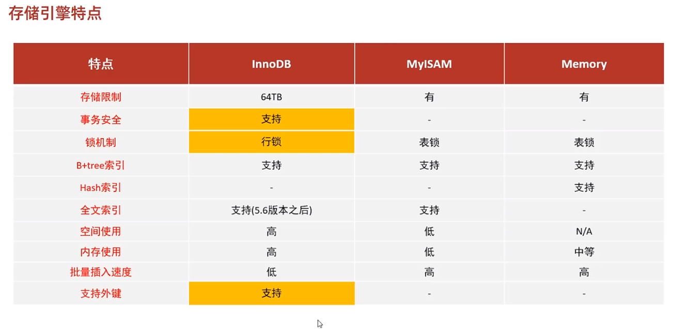

**三大区别：事务、外键、行级锁**

## 事务

### 事务的特点

1. 原子性 （atomicity）:强调事务的不可分割. 要么全都完成，要么全部不完成
2. 一致性 （consistency）:事务的执行的前后数据的完整性保持一致.
3. 隔离性 （isolation）:一个事务执行的过程中,不应该受到其他事务的干扰
4. 持久性（durability） :事务一旦结束,数据就持久到数据库

### MYSQL 事务处理主要有两种方法：

1、用 BEGIN, ROLLBACK, COMMIT来实现

- **BEGIN** 开始一个事务
- **ROLLBACK** 事务回滚
- **COMMIT** 事务确认

2、直接用 SET 来改变 MySQL 的自动提交模式:

- **SET AUTOCOMMIT=0** 禁止自动提交
- **SET AUTOCOMMIT=1** 开启自动提交

**select @@autocommit**查看自动提交是否打开，1 打开；0 关闭

在mysql中默认开启自动提交事务，在一组SQL语句中每一条DML或DQL都默认为一个事务，如果用**BEGIN** 开启，那就会变成一组事务事务，需要在最后用 **commit** 提交。

## 索引

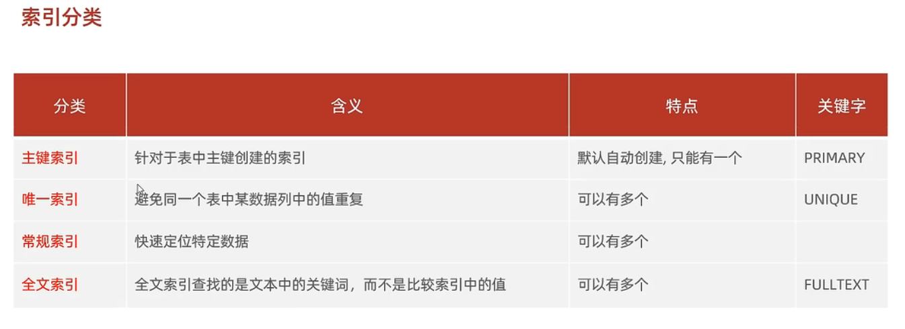

**在InnoDB中索引的分类**

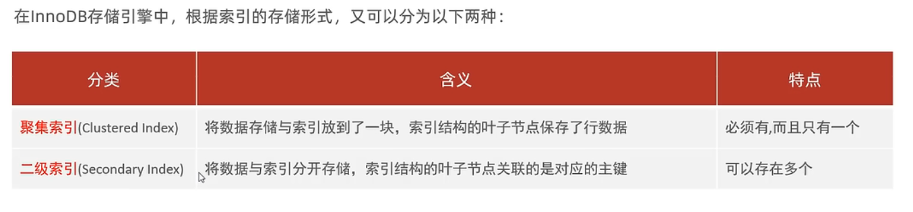

聚集索引的选取规则

- 如果表中存在主键，则主键为聚集索引
- 如果不存在主键，则第一个unique索引为聚集索引
- 如果没有表主键，或是没有合适的唯一主键，则nooDB会自动生成一个rowid为聚集索引

区别聚集索引的B+Tree的叶子节点存放的是该行的数据。二级索引的B+Tree的叶子节点下存放的是该行的 **聚集索引**。==也就是说二级索引要找到数据必须要靠聚集索引== 也就是：**回表查询**。所以说主键字段查询的效率要比非主键字段的效率高

### SQL性能分析

1. #### **查看一个数据库的sql的执行频次**

- **show global status like 'Com___'** 6个_

2. #### **慢查询日志**

- 慢查询日志记录了所有执行时间超过指定参数（**log_query_time，单位：秒，默认10秒**）的所有SQL语句的日志。==作为判断sql是否高效的方式之一。==
- Mysql默认慢查询日志不开启，需要在Mysql配置文件中（/etc/my.cnf）中配置如下信息：

​     （查询慢查询日志是否开启的SQL语句：**show variables like 'slow_query_log'**）；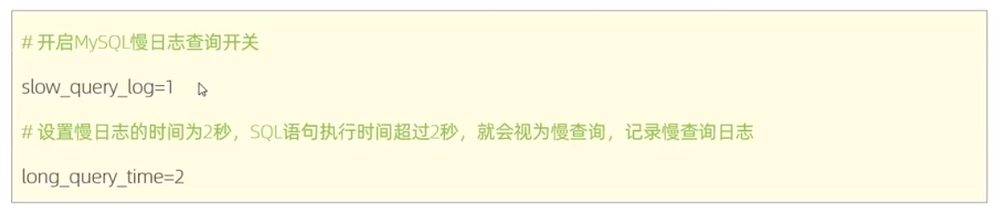

查询慢查询的规定时间：**show variables like 'long_query_time';**

设置开启慢查询日志**：set global slow_query_log=1**

设置慢查询的时间：**set global long_query_time=2**    单位：秒

3. #### profile

- **select  @@have_profling;** 查看是否支持profile
- **select @@profiling ;查看profile是否开启**
- **set profiling=1;在当前会话开启profile**
- 开启之后可以执行以下指令。

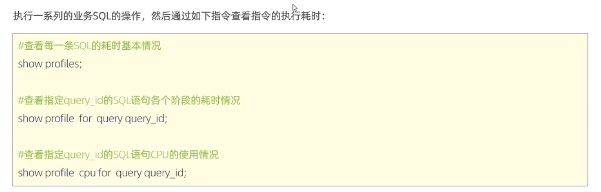

4. **explain**

在SQL语句之前加上EXPLAIN关键字就可以获取这条SQL语句执行的计划

那么返回的这些字段是什么呢？

我们先关心一下比较重要的几个字段：

**1.id**

select 的查询序号，表示查询中执行select子句或者是操作表的顺序（id相同，执行顺序从上到下；id不同，值越大，越先执行）

**2. select_type 查询类型**

1）simple 简单查询，没有UNION和子查询

2）priamry 主查询，有UNION或子查询的最外层查询

3）union 联合查询，有UNION的第二个和以后的查询

4）subquery 子查询，有子查询的除FROM包含的子查询

5）derived 派生查询，FROM包含的子查询

6）dependent union, dependent subquery 受到外部表查询影响的union和subquery

**3.type 查询方式**

依次从好到差：**system，const，eq_ref，ref，fulltext，ref_or_null，unique_subquery，index_subquery，range，**index_merge，index，ALL

ps: **除了all之外，其他的type都可以使用到索引，除了index_merge之外，其他的type只可以用到一个索引**

1）system 只有一行数据或者是空表，且引擎是myisam

2）const 常量 WHERE使用唯一索引（主键id，或者其他UNIQUE索引字段）搜索

3）eq_ref 

4）ref 常见于辅助索引的等值查找

5）fulltext 全文索引检索

6）ref_or_null 与ref方法类似，只是增加了null值的比较

7）unique_subquery 用于where中的in形式子查询，子查询返回不重复值唯一值

8）index_subquery 用于where中的iin形式子查询，使用到了辅助索引或者in常数列表，子查询可能返回重复值

9）range 索引范围扫描，常见于使用>,<,is null,between ,in ,like等运算符的查询中

10）index_merge 使用了两个以上的索引，最后取交集或者并集

11）index 遍历索引树

12）ALL 全表数据扫描

**4. extra 额外讯息**

**5. 其他**

1）possible key 此次查询中可能选用的索引，一个或多个

2）key 查询真正使用到的索引

3）key_len 索引长度（用到的索引字段的长度相加，例如用到 id int(8) + age int(5) 索引长度为8+5+2=15，加2是固定额外要加的）

4）rows 估算的扫描行数

5）filtered 存储引擎返回的数据在server层过滤后，剩下多少满足查询的记录数量的百分比

​     

###    索引的使用规则

- **最左前缀法则**

  - 针对**联合索引**，要遵循最左前缀法则。最左前缀法则就是：==索引从最左列开始，且不能跳过中件的列==；如果跳过中间某一类，会导致索引部分失效。如果索引在表中最左侧的列不存在，则该索引会失效。

  - 新建一个 索引 ：**create index idx_gname_gstar_price on games(g_name,g_star,price);**

    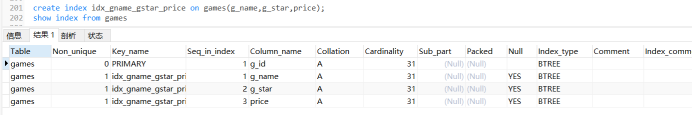

  ​	     1. 执行  **explain select * from games where g_name = '《CS: GO》' and g_star = 705 and price = 0;**

  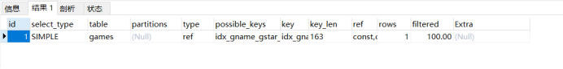

  ​		   用到了索引 ，索引长度为163，只要最左侧的列存在，不论放在 **where** 后面的那个位置，索引都会生效

   		2.执行  **explain select * from games where g_star = 705 and price = 0;**

  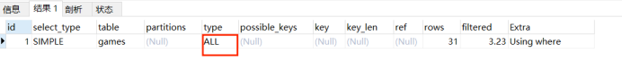

  ​				在**where**后最左侧的列没有了，所以变成全表扫描了。

  ​		3.执行  **explain select * from games where g_name = '《CS: GO》'and price = 0;**

  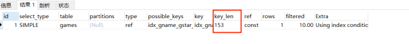

  ​				没有 创建索引的列的中间列 **g_star** ,虽然会使用索引，单索引长度变为153，变为部分索引。

- **索引失效**

  - 在联合索引中出现范围查询（> ， <），==范围查询**右侧**的列会失效==

    还是在上例中执行：**explain select * from games where g_name = '《CS: GO》' and g_star ==<==705 and price = 0;**

    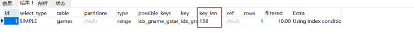

    索引长度变为158 ；说明 **price** 该列的索引失效了

    - 在条件允许的情况下尽量使用（>=，<=）来查询；

      将sql语句改为：**explain select * from games where g_name = '《CS: GO》' and g_star ==<=== 705 and price = 0;**

      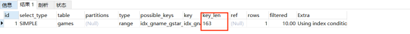

      索引长度有变为163，右侧的列索引生效了

  - 具体失效情况：https://www.jianshu.com/p/3ccca0444432

- **SQL提示**

  - SQL提示可以指定表使用或不使用那个索引。
  - user index( ) 建议使用那个索引。
    - **explain select * from games ==use== index(xxxx索引名xxx) ;**

  - ignore index( ) 忽略那个索引。
    -  **explain select * from games ==ignore== index(xxxx索引名xxx) ;**

  - force index( )  只能用那个索引
    - **explain select * from games ==force== index(xxxx索引名xxx) ;**

- **覆盖索引和回表查询**

  - 如果一个索引包含了（或覆盖了）满足查询语句中字段与条件的数据就叫 做**覆盖索引**。
  - 

  - 在使用索引的时候要**select**出索引不在场的列，就会出现回表查询，所以尽量避免出现**select ***   否则容易出现**回表查询** ，索引效率会降低。
    - https://www.bilibili.com/video/BV1Kr4y1i7ru?p=84

- **前缀索引**

  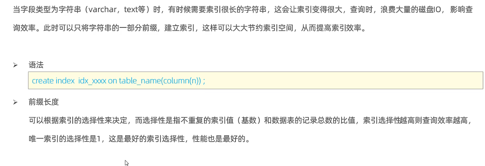

  https://www.jianshu.com/p/fc80445044cc

- **单列/联合索引**

  - 在单例索引和联合索引中存在相同的列时，执行select语句时MySQL优化器会自动选择单列索引，如果返回列较多时，必然会造成回表查询，所以要使用SQL提示来指定联合索引。

    - https://www.bilibili.com/video/BV1Kr4y1i7ru?p=86 	

    - 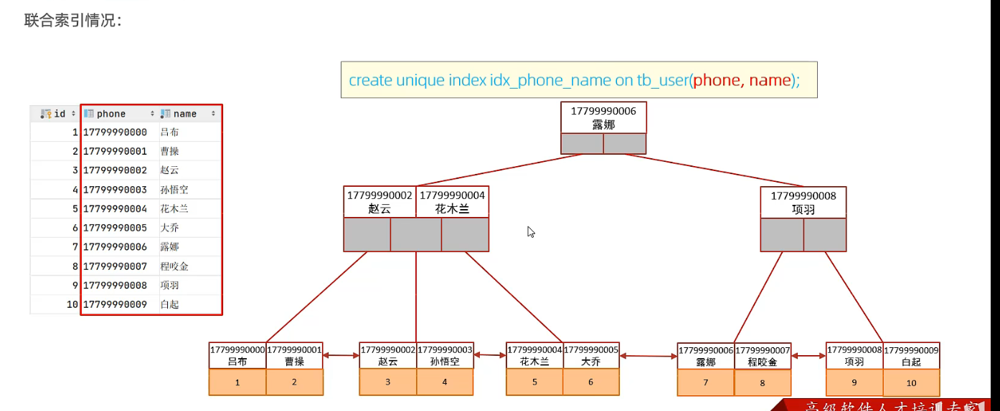

      - 在创建索引的时候的最左前缀 就是 上图中的 phone 列， **phone列**必须存在才可以使用索引。

        如果语句变成 **create unique index idx_phone_name on tb_user(name,phone)；**

        则最左列变成 name , **name列**必须存在才可以使用索引。

- **索引的设计原则**

  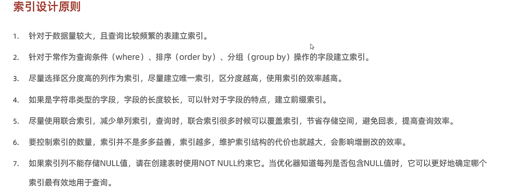