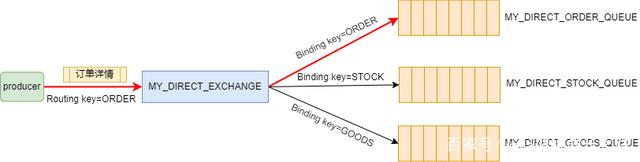
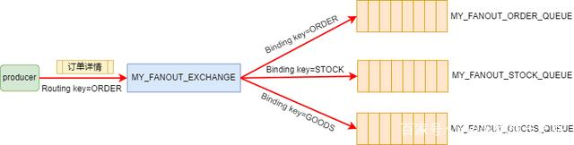
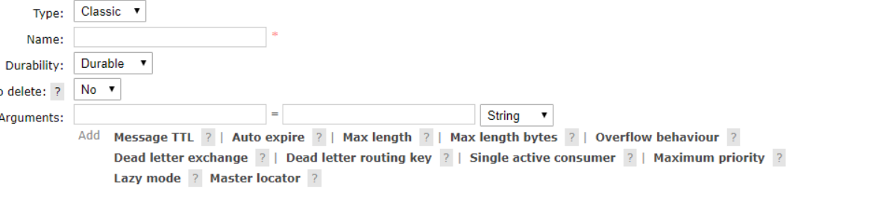
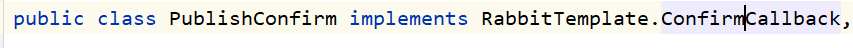
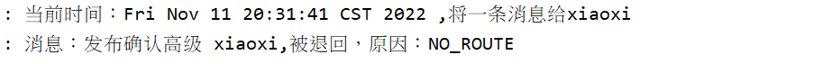

# RabbitMQ

#### **使用**

建议队列以及绑定关系提前建立好，不要依赖代码。

生产者

消费者 

#### **模型**

生产者通过channel连接到exchange上(connection复用)，exchange根据路由策略将消息发送到queue，再推送给消费者。

路由的方式有direct/fanout/topic，分别对应一对一，一对多，通配符路由。

#### **交换器**

#### **队列**

#### **绑定**

queue to Exchange

Exchange to exchange

#### **发送消息**

#### **消费消息**

关键就三点：

设置回调函数(性能上：异步回调>批量>串行)

设置basicQos，指定最多未手动ack的消息数量

手动ack(deliveryTag是rabbitmq传过来的递增的唯一标识)

有推模式和拉模式。不建议用拉模式，性能太低。

#### **死信队列&延迟队列**

#### **消息分发**

轮询的方式，不支持广播消息。

多消费者平均分发可能造成吞吐量不高，可以限制channel上的消费者的最大未消费消息数量

### **可靠性**

1.exchange和queue都持久化

2.生产者端开启confirm机制，消息会在发送到队列写入磁盘后才ack回复

3.消费者端手动ack

4.队列本身可能宕机，这时假设开启了镜像模式，切换到从broken，可能有同步不及时导致的数据缺失

### **高可用**

#### **普通集群**

集群中节点包括内存节点、磁盘节点。内存节点就是将所有数据放在内存，磁盘节点将数据放在磁盘上。如果在投递消息时，打开了消息的持久化，那么即使是内存节点，数据还是安全的放在磁盘。对于Queue来说，消息实体只存在于其中一个节点，A、B两个节点仅有相同的元数据，即队列结构，但队列的元数据仅保存有一份。

#### **镜像集群模式**

这个镜像是指队列镜像

其实质和普通模式不同之处在于，消息实体会主动在镜像节点间同步，而不是在consumer取数据时临时拉取。该模式带来的副作用也很明显，除了降低系统性能外，如果镜像队列数量过多，加之大量的消息进入，集群内部的网络带宽将会被这种同步通讯大大消耗掉


### **重复消费**

幂等，通过数据库唯一索引或redissetnx

### **消息积压**

1.一次发送多条消息给消费者，加快消息被消费的速度

2.多条消息回复一次ack ，降低处理 ack 带来的开销

3.生产者端流量控制

### **顺序性**

无法保证，可以业务方自实现全局顺序ID

## RabbitMQ的5大核心概念

RabbitMQ的工作架构图 


​		中间的Broker表示RabbitMQ服务，每个Broker里面至少有一个Virtual host虚拟主机，每个虚拟主机中有自己的Exchange交换机、Queue队列以及Exchange交换机与Queue队列之间的绑定关系Binding。producer（生产者）和consumer（消费者）通过与Broker建立Connection来保持连接，然后在Connection的基础上建立若干Channel信道，用来发送与接收消息。

### Connection（连接）

每个producer（生产者）或者consumer（消费者）要通过RabbitMQ发送与消费消息，首先就要与RabbitMQ建立连接，这个连接就是Connection。Connection是一个TCP长连接。

### Channel（信道）

Channel是在Connection的基础上建立的虚拟连接，RabbitMQ中大部分的操作都是使用Channel完成的，比如：声明Queue、声明Exchange、发布消息、消费消息等。

看到此处，你是否有这样一个疑问：既然已经有了Connection，我们完全可以使用Connection完成Channel的工作，为什么还要引入Channel这样一个虚拟连接的概念呢？==因为现在的程序都是支持多线程的，如果没有Channel，那么每个线程在访问RabbitMQ时都要建立一个Connection这样的TCP连接，对于操作系统来说，建立和销毁TCP连接是非常大的开销，在系统访问流量高峰时，会严重影响系统性能。== Channel就是为了解决这种问题，通常情况下，每个线程创建单独的Channel进行通讯，每个Channel都有自己的channel id帮助Broker和客户端识别Channel，所以Channel之间是完全隔离的。

Connection与Channel之间的关系可以比作光纤电缆，如果把Connection比作一条光纤电缆，那么Channel就相当于是电缆中的一束光纤。

### Virtual host（虚拟主机）

Virtual host是一个虚拟主机的概念，一个Broker中可以有多个Virtual host，每个Virtual host都有一套自己的Exchange和Queue，**同一个Virtual host中的Exchange和Queue不能重名**，不同的Virtual host中的Exchange和Queue名字可以一样。这样，不同的用户在访问同一个RabbitMQ Broker时，可以创建自己单独的Virtual host，然后在自己的Virtual host中创建Exchange和Queue，很好地做到了不同用户之间相互隔离的效果。


### Queue（队列）

Queue是一个用来存放消息的队列，生产者发送的消息会被放到Queue中，消费者消费消息时也是从Queue中取走消息。

### Exchange（交换机）

Exchange是一个比较重要的概念，**它是消息到达RabbitMQ的第一站，主要负责根据不同的分发规则将消息分发到不同的Queue，供订阅了相关Queue的消费者消费到指定的消息**。那Exchange有哪些分发消息的规则呢？这就要说到Exchange的4种类型了：direct、fanout、topic、headers。

在介绍这4种类型的Exchange之前，我们先来了解一下另外一个比较重要的概念：**Routing key**，翻译成中文就是路由键。当我们创建好Exchange和Queue之后，需要使用Routing key（通常叫作Binding key）将它们绑定起来，producer在向Exchange发送一条消息的时候，必须指定一个Routing key，然后Exchange接收到这条消息之后，会解析Routing key，然后根据Exchange和Queue的绑定规则，将消息分发到符合规则的Queue中。


#### **1.direct**（定向）

direct的意思是直接的，direct类型的Exchange会将消息转发到指定Routing key的Queue上，Routing key的解析规则为精确匹配。**也就是只有当producer发送的消息的Routing key与某个Binding key相等时，消息才会被分发到对应的Queue上。**



#### **2.fanout**（扇出）

fanout是扇形的意思，该类型通常叫作广播类型。fanout类型的Exchange不处理Routing key，**而是会将发送给它的消息路由到所有与它绑定的Queue上。忽略Routing key**



#### **3.topic**（主题）

topic的意思是主题，topic类型的Exchange会根据通配符对Routing key进行匹配，只要Routing key满足某个通配符的条件，就会被路由到对应的Queue上。通配符的匹配规则如下：

**● Routing key必须是一串字符串，每个单词用“.”分隔；**

**● 符号“#”表示匹配一个或多个单词；**

**● 符号“*”表示匹配一个单词。**

例如：“*.123” 能够匹配到 “abc.123”，但匹配不到 “abc.def.123”；“#.123” 既能够匹配到 “abc.123”，也能匹配到 “abc.def.123”。

#### 4、Headers  (**标题 )**

将消息中的headers与该Exchange相关联的所有Binging中的参数进行匹配，如果匹配上了，则发送到该Binding对应的Queue中。

## RabbitMQ的工作模式

### 1.simple模式（即最简单的收发模式）

1.消息产生消息，将消息放入队列

2.消息的消费者(consumer) 监听 消息队列,如果队列中有消息,就消费掉,消息被拿走后,自动从队列中删除(隐患 消息可能没有被消费者正确处理,已经从队列中消失了,造成消息的丢失，这里可以设置成手动的ack,但如果设置成手动ack，处理完后要及时发送ack消息给队列，否则会造成内存溢出)。

### 2.work工作模式(资源的竞争)

1.**==消息产生者将消息放入队列，消费者可以有多个,消费者1,消费者2同时监听同一个队列,消息被消费==**。C1 C2共同争抢当前的消息队列内容,谁先拿到谁负责消费消息(隐患：高并发情况下,默认会产生某一个消息被多个消费者共同使用,可以设置一个开关(syncronize) 保证一条消息只能被一个消费者使用)。

### 3.publish/subscribe发布订阅(共享资源)

1、每个消费者监听自己的队列；

2、生产者将消息发给broker，由交换机将消息转发到绑定此交换机的每个队列，每个绑定交换机的队列都将接收到消息。

### 4.routing路由模式

1.消息生产者将消息发送给交换机按照路由判断,路由是字符串(info) 当前产生的消息携带路由字符(对象的方法),交换机根据路由的key,只能匹配上路由key对应的消息队列,对应的消费者才能消费消息;

2.根据业务功能定义路由字符串

3.从系统的代码逻辑中获取对应的功能字符串,将消息任务扔到对应的队列中。

4.业务场景:error 通知;EXCEPTION;错误通知的功能;传统意义的错误通知;客户通知;利用key路由,可以将程序中的错误封装成消息传入到消息队列中,开发者可以自定义消费者,实时接收错误;

### 5.topic 主题模式(路由模式的一种)

1.星号井号代表通配符

2.星号代表多个单词,井号代表一个单词

3.路由功能添加模糊匹配

4.消息产生者产生消息,把消息交给交换机

5.交换机根据key的规则模糊匹配到对应的队列,由队列的监听消费者接收消息消费


## RabbitMQ 声明队列

```java
// 创建一个持久化 非排他的 非自动删除的队列       
channel.queueDeclare(QUEUR_NAME, true, false, false, null);
```

```java
queueDeclare(String queue, 
            boolean durable, 
            boolean exclusive, 
            boolean autoDelete,
            Map<String, Object> arguments);
```

### 方法的参数

**queue**

队列名称

**exclusive**

是否排外的。 当设置`exclusive = true`时有两个作用:

- 当连接关闭时`connection.close()`该队列会会自动删除
- 会对当前队列加锁，其他通道channel是不能访问的.如果强制访问会报异常.一般等于true的话用于一个队列只能有一个消费者来消费的场景

**autoDelete**

`autoDelete`: 是否自动删除，当最后一个消费者断开连接之后队列是否自动被删除，可以通过`RabbitMQ Management`，查看某个队列的消费者数量，当`consumers = 0`时队列就会自动删除

**durable**

是否持久化, 队列的声明默认是存放到内存中的，如果`rabbitmq`重启会丢失，如果想重启之后还存在就要使队列持久化，保存到`Erlang`自带的`Mnesia`数据库中，当`rabbitmq`重启之后会读取该数据库

**arguments**

（1）x-message-ttl：**==消息的过期时间==**，单位：毫秒；
（2）x-expires：**==队列过期时间==**，队列在多长时间未被访问将被删除，单位：毫秒；
（3）x-max-length：队列最大长度，超过该最大值，则将从队列头部开始删除消息；
（4）x-max-length-bytes：队列消息内容占用最大空间，受限于内存大小，超过该阈值则从队列头部开始删除消息；
（5）x-overflow：设置队列溢出行为。这决定了当达到队列的最大长度时消息会发生什么。有效值是drop-head、reject-publish或reject-publish-dlx。仲裁队列类型仅支持drop-head；
（6）x-dead-letter-exchange：死信交换器名称，过期或被删除（因队列长度超长或因空间超出阈值）的消息可指定发送到该交换器中；
（7）x-dead-letter-routing-key：死信消息路由键，在消息发送到死信交换器时会使用该路由键，如果不设置，则使用消息的原来的路由键值
（8）x-single-active-consumer：表示队列是否是单一活动消费者，true时，注册的消费组内只有一个消费者消费消息，其他被忽略，false时消息循环分发给所有消费者(默认false)
（9）x-max-priority：队列要支持的最大优先级数;如果未设置，队列将不支持消息优先级；
（10）x-queue-mode（Lazy mode）：将队列设置为延迟模式，在磁盘上保留尽可能多的消息，以减少RAM的使用;如果未设置，队列将保留内存缓存以尽可能快地传递消息；
（11）x-queue-master-locator：在集群模式下设置镜像队列的主节点信息。

 

### 消息应答

​		**消息应答一般在消费端，接收消息的一方** RabbitMQ一旦向消费者传递了一条消息，就会把该消息标记为消除，在这种情况下如果这时候有一个消费者宕机了，会就导致消息的丢失，为保证消息在发送的过程中不丢失，RabbitMQ引入了消息应答机制：**消费者在接收到并处理完消息的时候会告诉RabbitMQ消息已经使用，RabbitMQ就可以把该队列中消息删除了，** 

- **自动应答**
         消息发送后立即被认为己经传送成功，这种模式需要在高吞吐量和数据传输安全性方面做权衡，因为这种模式如果消息在接收到之前，消费者那边出现连接或者channel关闭，那么消息就丢失了，当然另一方面这种模式消费者那边可以传递过载的消息，没有对传递的消息数量进行限制，当然这样有可能使得消费者这边由于接收太多还来不及处理的消息，导致这些消息的积压，最终使得内存耗尽，最终这些消费者线程被操作系统杀死，所以这种模式仅适用在消费者可以高效并以某种速率能够处理这些消息的情况下使用。

```java
//设置第二个参数为true,即是自动应答
channel.basicConsume(QUEUE_NAME,true,consumer);
```

​		要**注意**自动应答在执行完上面代码后就会回应RabbitMQ，要是后续处理message时出现问题，就会造成消息丢失，所以一般采用手动应答。

- 手动应答

  - 肯定应答

    ```java
    /*
    *  手动返回一个回执确认
    *       参数：1 deliveryTag：消息投递序号，每个channel对应一个(long类型)，从1开始到
    *            2 multiple：是否批量确认, true:批量, false:不批量,只确认当前消息
    * */
    channel.basicAck(long deliveryTag, boolean multiple);
    ```

    ​     **注意**： 1 批量应答会将队列中的所有消息都同一应答。

    ​				 2  **应该把该条代码写在处理完消息后。以免造成消息丢失**

  - 否定应答

    ```java
    //可以批量应答会将队列中的所有消息都同一允许删除
    //第三个参数为是否重新入队
    channel.basicNack(long deliveryTag, boolean multiple, boolean requeue)
    
    //用法和上面一样只是不能批处理
    channel.basicReject(long deliveryTag,boolean requeue);
    ```

    

发布确认

​		**消息应答一般在生产者，发信息的一方**

​		生产者将信道设置成**confirm模式**，一旦信道进入confirm模式，所有在该信道上面发布的消息都将会被指派一个唯一的ID(从1开始)，一旦消息被投递到所有匹配的队列之后，broker就会发送一个确认给生产者(包含消息的唯一ID)，这就使得生产者知道消息已经正确到达目的队列了，**如果消息和队列是可持久化的，那么确认消息会在将消息写入磁盘之后发出，**broker回传给生产者的确认消息中delivery-tag域包含了确认消息的序列号，**此外broker也可以设置basic.ack的multiple域，表示到这个序列号之前的所有消息都已经得到了处理。**
​		confirm模式最大的好处在于他是异步的，一旦发布一条消息，生产者应用程序就可以在等信道返回确认的同时继续发送下一条消息，当消息最终得到确认之后，生产者应用便可以通过回调方法来处理该确认消息，如果RabbitMQ因为自身内部错误导致消息丢失，就会发送一条nack消息，生产者应用程序同样可以在回调方法中处理该nack消息。

## RabbitMQ - 死信队列

#### 死信的概念

先从概念解释上搞清楚这个定义，死信，顾名思义就是无法被消费的消息，字面意思可以这样理解，一般来说，producer 将消息投递到 broker 或者直接到 queue 里了，consumer 从 queue 取出消息进行消费，但某些时候由于特定的原因导致 queue 中的某些消息无法被消费，这样的消息如果没有后续的处理，就变成了死信，有死信自然就有了死信队列。

应用场景：为了保证订单业务的消息数据不丢失，需要使用到 RabbitMQ 的死信队列机制，当消息消费发生异常时，将消息投入死信队列中。还有比如说：用户在商城下单成功并点击去支付后在指定时间未支付时自动失效。

#### 死信的来源

- **消息 TTL 过期：TTL 是 Time To Live 的缩写，也就是生存时间。**

- **队列达到最大长度：队列满了，无法再添加数据到 mq 中。**

- **消息被拒绝：(basic.reject 或 basic.nack) 并且 requeue=false。**

  

RabbitMQ可以对**消息和队列**设置TTL。目前有两种方法可以设置。

- 第一种方法是通过队列属性设置，队列中**==所有消息都有相同的过期时间==**。
- 第二种方法是对消息进行单独设置，**==每条消息TTL可以不同==**。

## RabbitMQ - 延迟队列

### 延迟队列概念：

延时队列内部是有序的，最重要的特性就体现在它的延时属性上，延时队列中的元素是希望在指定时间到了以后或之前取出和处理，简单来说，延时队列就是用来存放需要在指定时间被处理的元素的队列。

### 延迟队列使用场景：

订单在十分钟之内未支付则自动取消；
新创建的店铺，如果在十天内都没有上传过商品，则自动发送消息提醒；
用户注册成功后，如果三天内没有登陆则进行短信提醒；
用户发起退款，如果三天内没有得到处理则通知相关运营人员；
预定会议后，需要在预定的时间点前十分钟通知各个与会人员参加会议。

### 实现延迟队列

> 实现延迟队列两种方法：**1、使用死信队列，2、使用插件**

#### 使用死信队列实现延迟队列

​		**使用一个队列作为中间队列，把消息发到该队列，设置过期时间，时间一到，就把该队列的过期消息发送到死信队列，然后发送给消费者**

**配置类**

```java
@Configuration
public class TtlQueueConfig {

    static final  String NORMAL_QUEUE_A = "springboot_normal_queue_a";
    static final  String NORMAL_QUEUE_B = "springboot_normal_queue_b";

    static final  String DEAD_QUEUE = "springboot_dead_queue";

    static final  String NORMAL_EXCHANGE = "springboot_normal_exchange";

    static final  String DEAD_EXCHANGE = "springboot_dead_exchange";

//   定义普通交换机
    @Bean
    public DirectExchange normalExchange(){
        return new DirectExchange(NORMAL_EXCHANGE);
    }

//  定义死信交换机
    @Bean
    public DirectExchange deadExchange(){
        return new DirectExchange(DEAD_EXCHANGE);
    }


    //    定义普通队列a
    @Bean
    public Queue normalQueueA(){
        Map<String, Object> arguments = new HashMap<>();
        /*
         * 设置死信队列，
         *   要分清是写在容器中死信队列的id，还是在rabbitmq中的死信队列名，这里写在rabbitmq中的名字
         * */
        arguments.put("x-dead-letter-exchange",DEAD_EXCHANGE);
        arguments.put("x-dead-letter-routing-key","QDtoDE");
        arguments.put("x-message-ttl",10000);
        return QueueBuilder.durable(NORMAL_QUEUE_A).withArguments(arguments).build();
    }

    @Bean
    public Queue normalQueueB(){
        Map<String, Object> arguments = new HashMap<>();
        /*
         * 设置死信队列，
         *   要分清是写在容器中死信队列的id，还是在rabbitmq中的死信队列名，这里写在rabbitmq中的名字
         * */
        arguments.put("x-dead-letter-exchange",DEAD_EXCHANGE);
        arguments.put("x-dead-letter-routing-key","QDtoDE");
        arguments.put("x-message-ttl",40000);
        return new Queue(NORMAL_QUEUE_B,true,false,false,arguments);
    }

    @Bean
    public Queue deadQueue(){
        return QueueBuilder.durable(DEAD_QUEUE).build();
    }


     //设置普通交换机和普通队列A的绑定关系
    @Bean
    public Binding normalExhangeBindingA(@Qualifier("normalQueueA") Queue QueueA,
                                         @Qualifier("normalExchange") Exchange exchange){
        return BindingBuilder.bind(QueueA).to(exchange).with("QAtoNE").noargs();
    }

    //设置普通交换机和普通队列B的绑定关系
    @Bean
    public Binding normalExhangeBindingB(@Qualifier("normalQueueB") Queue QueueB,
                                         @Qualifier("normalExchange") Exchange exchange){
        return BindingBuilder.bind(QueueB).to(exchange).with("QBtoNE").noargs();
    }

    //设置死信交换机和死信队列的绑定关系
    @Bean
    public Binding deadExhangeBinding(@Qualifier("deadQueue") Queue Queue,
                                         @Qualifier("deadExchange") Exchange exchange){
        return BindingBuilder.bind(Queue).to(exchange).with("QDtoDE").noargs();
    }
}
```

**消费者**

```java
@Slf4j
@Component
public class DeadLetterQueueConsumer {

    static final  String DEAD_QUEUE = "springboot_dead_queue";
		
    	//监听死信队列
        @RabbitListener(queues = "springboot_dead_queue")
        public void receiveMsg(Message message, Channel channel) throws Exception{
            String s = new String(message.getBody(), StandardCharsets.UTF_8);
            log.info("接收到消息的时间:{} , {}",new Date().toString(),s);
        }

}
```

**生产者发送消息**

```java
@GetMapping("/sendMsg/{msg}")
public String setMsg(@PathVariable String msg){
  log.info("当前时间：{} ,将一条消息给两条队列{}",new Date().toString(),msg);

  rabbitTemplate.convertAndSend(NORMAL_EXCHANGE,"QAtoNE","来自ttl为10s的消息队列"+msg);
  rabbitTemplate.convertAndSend(NORMAL_EXCHANGE,"QBtoNE","来自ttl为40s的消息队列"+msg);
  return "success!";
}
```

**弊端：**

- ==使用死信队列来实现延迟队列，会有一个弊端，如果让不同过期时间的消息进入到同一个队列，队列只会看排在第一个的消息的过期时间(expire)，比如第一个消息的过期时间(expire) 为20s，第二个消息为2s , 队列必须要等到20s后才能把第二个消息发送出去。==


#### 使用插件实现延迟队列

**安装插件**：https://blog.csdn.net/m0_67402774/article/details/124169540

**机制**

安装插件后会生成新的Exchange类型`x-delayed-message`，该类型消息支持延迟投递机制,接收到消息后**并未立即将消息投递至目标队列中，而是存储在`mnesia`**(一个分布式数据系统)表中，并且当前节点是磁盘节点，那么节点重启后，消息还能保留。检测消息延迟时间，**如达到可投递时间时并将其通过`x-delayed-type`类型标记的交换机类型投递至目标队列**。但是要注意的是，如果集群中只有一个磁盘节点，如果说磁盘节点丢失，或者节点上的插件失效。意味着消息将会丢失。

**特性**

- 可通过 x-delayed-type 指定类型 为 direct fanout topic 等
- 检测消息延迟时间，如果达到投递时间，通过x-delayed-type 标记的交换机类型进行投递。
- 消息存储在声明交换机的那个节点上，消息发送到延时交换机上，消息还未到发送时间，此时停机该节点，消费者不能消费此延时消息，后启动该节点，消息会被重新投递，消费者能够消费此延时消息。
- 磁盘节点，消息持久化，交换机持久化，消息不会丢失。

**配置类代码**

​		在我们自定义的交换机中，这是一种新的交换机类型，该类型消息支持延迟投递机制，消息传递后并不会立即投递到目标队列中，而是存储在 mnesia（一个分布式数据系统）表中，当达到投递时间时，才投递到目标队列中。

```java
    
	public static final String DELAY_EXCHANGE = "springboot_delay_exchange";
    public static final String DELAY_QUEUE = "springboot_delay_queue";	

	@Bean
    public CustomExchange delayExchange(){
        HashMap<String, Object> map = new HashMap<>();

        //延迟时间到了计算机改用什么方式传递 message
        // 可通过 x-delayed-type 指定类型 为 direct fanout topic 等
        //检测消息延迟时间，如果达到投递时间，通过x-delayed-type 标记的交换机类型进行投递。
        map.put("x-delayed-type","direct");
        return new CustomExchange(DELAY_EXCHANGE,"x-delayed-message",true,false,map);
    }

 	@Bean
    public Queue delayQueue(){
        return QueueBuilder.durable(DELAY_QUEUE).build();
    }

    @Bean
    public Binding binding(@Qualifier("delayQueue") Queue queue,
                           @Qualifier("delayExchange")Exchange exchange){
        return BindingBuilder.bind(queue).to(exchange).with("DelayTo").noargs();
    }
```

**生产者代码**

```java
@GetMapping("/sendMessage/{msg}/{delayTime}")
public String sendMsgForDelay(@PathVariable String msg,@PathVariable Integer delayTime){

    log.info("当前时间：{} ,将一条消息和delayTime给队列{}",new Date().toString(),msg);
    
    //将传入的消息包装成一个Message对象
    Message message = new Message(msg.getBytes(StandardCharsets.UTF_8));
    MessageProperties properties = message.getMessageProperties();

    //设置发送消息的延迟时长
    properties.setDelay(delayTime);
    rabbitTemplate.convertAndSend(DelayMessageConfig.DELAY_EXCHANGE,"DelayTo",message);
    return "success! 使用延迟队列！";
}
```

**消费者代码**

```java
@RabbitListener(queues = DelayMessageConfig.DELAY_QUEUE)
public void receviceMessage(Message message, Channel channel) throws IOException {
    log.info("收到延迟消息：{}, 时间：{}",new String(message.getBody(), StandardCharsets.UTF_8),
            new Date().toString());
    channel.basicAck(message.getMessageProperties().getDeliveryTag(),false);
}
```

## 消息的可靠传递

**参考**：https://blog.51cto.com/waxyz/5335973

### ConfirmCallback

开启发布确认confirm

只保证生产者到交换机的可靠性

实现RabbitTemplate的内部接口**ConfirmCallback** 



```java
public class PublishConfirm implements RabbitTemplate.ConfirmCallback{

    @Autowired
    RabbitTemplate rabbitTemplate;
	
    //该注解标准的方法会在构造方法执行后执行
    @PostConstruct
    public void init(){
        this.rabbitTemplate.setConfirmCallback(this);
    }

    @Override
    /*
    * 参数1 correlationData : 发送消息时传递的关联数据，由发送方创建
    * 参数2 ack: 消息发送是否成功，true(成功) false(失败)
    * 参数3 case : 失败原因, 当消息发布失败才有, 成功没有.
    * */
    public void confirm(CorrelationData correlationData, boolean ack, String cause) {
        String id = correlationData == null ? "Id为空" : correlationData.getId();
        if (ack)
            log.info("消息发布成功,消息id:{} ",id);
        else
            log.info("消息发布失败,id:{} | 原因：{}",id,cause);
    }
}
```

在配置文件中开启

```yaml
spring:
  rabbitmq:
#    开启发布确认
    publisher-confirm-type: correlated
```

生产者代码

```java
@GetMapping("/testConfirm/{msg}")
public String testConfirm(@PathVariable String msg){
    log.info("当前时间：{} ,将一条消息给{}",new Date().toString(),msg);

    //创建一个关联数据
    CorrelationData data = new CorrelationData();
    data.setId(1+"");

    rabbitTemplate.convertAndSend(ConfirmConfig.CONFIRM_EXCHANGE,
            ConfirmConfig.CONFIRM_ROUTING_KEY,"发布确认高级 "+msg,data);
    return "success!confirm";
}
```

==因为RabbitTemplate实例在spring容器中只有一个，使用在这个项目中的所有有RabbitTemplate实例发布的消息都会被发布确认==

**注意：**

- 发布确认只保障了 生产者到交换机（producer --> exchange） 这段的可靠性。
-  交换机到队列 （exchange --> queue）的可靠性无法保证。

### ReturnCallback

​		通过实现 ReturnCallback 接口，启动消息失败返回，比如路由不到队列时触发回调，保证了交换机到队列 （exchange --> queue）的可靠性。

```java
public class PublishConfirm implements RabbitTemplate.ReturnsCallback {

    @Autowired
    RabbitTemplate rabbitTemplate;

    @PostConstruct
    public void init(){
        this.rabbitTemplate.setReturnsCallback(this);
    }

    @Override
    public void returnedMessage(ReturnedMessage returned) {
        String msg = new String(returned.getMessage().getBody());
        log.info("消息：{},被退回，原因：{}",msg,returned.getReplyText());
    }
```

在配置文件中开启消息回退

```yaml
spring:
  rabbitmq:
    publisher-returns: true 
```

<a id="ys">请求一个错误路由的消息</a> 

```java
@GetMapping("/testConfirm/{msg}")
public String testConfirm(@PathVariable String msg){
    log.info("当前时间：{} ,将一条消息给{}",new Date().toString(),msg);

    //创建一个关联数据
    CorrelationData data = new CorrelationData();
    data.setId(1+"");

    rabbitTemplate.convertAndSend(ConfirmConfig.CONFIRM_EXCHANGE,
            ConfirmConfig.CONFIRM_ROUTING_KEY+"123" //设置错误路由
                                  ,"发布确认高级 "+msg,data);
    return "success!confirm";
}
```

输入url : http://localhost:8080/test/testConfirm/xiaoxi 验证



### 使用备用交换机

采用备用交换机，也是解决消息无法到对应路由的方案。

配置类的代码

```java
	//给一个交换机添加备用交换机
	@Bean
    public DirectExchange confirmExchange(){
        return ExchangeBuilder.directExchange(CONFIRM_EXCHANGE)
            .alternate(ALTERNATE_EXCHANGE).build();//添加备用交换机；alternate:备用，轮换
    }


@Bean
public FanoutExchange alternateExchange(){
    return ExchangeBuilder.fanoutExchange(ALTERNATE_EXCHANGE).build();
}

@Bean
public Queue alternateQueue(){
    return QueueBuilder.durable(ALTERNATE_QUEUE).build();
}

@Bean
public Binding alternateBinding(Queue alternateQueue,FanoutExchange alternateExchange){
    return BindingBuilder.bind(alternateQueue).to(alternateExchange);
}
```

从起项目后继续执行<a href="#ys">跳转</a>

- 结果：消息发送成功！

### 消息的持久化

```java
//springboot整和方式
Message message = new Message(msg.getBytes(StandardCharsets.UTF_8));
MessageProperties properties = message.getMessageProperties();
//设置消息持久化 
properties.setDeliveryMode(MessageDeliveryMode.PERSISTENT);
/****/

//普通方式
channel.basicPublish("",QUEUE_NAME,
                     MessageProperties.PERSISTENT_TEXT_PLAIN,//设置消息持久化
                     message.getBytes());
```

### 

## RabbitTemplate

​		**在整和SpringBoot使用时发现了一个问题**，SpringBoot是先创建出**exchange**、**queue** 的Bean再创建他们之间的**Binding**绑定的，因为SpringBoot实现了解耦，所以如果有重名的**exchange** 的Bean或 **queue** 的Bean 还是会让**Binding** 的Bean创建，但是在RabbitMQ的服务器中还是没有建立队列和路由的关系

