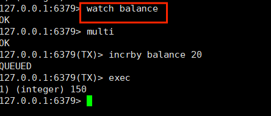

# Redis

> ps -ef | grep redis 找到redis进程

## keys 命令

下表给出了与 Redis 键相关的基本命令：

| 序号 | 命令及描述                                                   |
| :--- | :----------------------------------------------------------- |
| 1    | [DEL key](https://www.runoob.com/redis/keys-del.html) 该命令用于在 key 存在时删除 key。 |
| 2    | [DUMP key](https://www.runoob.com/redis/keys-dump.html) 序列化给定 key ，并返回被序列化的值。 |
| 3    | [EXISTS key](https://www.runoob.com/redis/keys-exists.html) 检查给定 key 是否存在。 |
| 4    | [EXPIRE key](https://www.runoob.com/redis/keys-expire.html) seconds 为给定 key 设置过期时间，以秒计。 |
| 5    | [EXPIREAT key timestamp](https://www.runoob.com/redis/keys-expireat.html) EXPIREAT 的作用和 EXPIRE 类似，都用于为 key 设置过期时间。 不同在于 EXPIREAT 命令接受的时间参数是 UNIX 时间戳(unix timestamp)。 |
| 6    | [PEXPIRE key milliseconds](https://www.runoob.com/redis/keys-pexpire.html) 设置 key 的过期时间以毫秒计。 |
| 7    | [PEXPIREAT key milliseconds-timestamp](https://www.runoob.com/redis/keys-pexpireat.html) 设置 key 过期时间的时间戳(unix timestamp) 以毫秒计 |
| 8    | [KEYS pattern](https://www.runoob.com/redis/keys-keys.html) 查找所有符合给定模式( pattern)的 key 。 |
| 9    | [MOVE key db](https://www.runoob.com/redis/keys-move.html) 将当前数据库的 key 移动到给定的数据库 db 当中。 |
| 10   | [PERSIST key](https://www.runoob.com/redis/keys-persist.html) 移除 key 的过期时间，key 将持久保持。 |
| 11   | [PTTL key](https://www.runoob.com/redis/keys-pttl.html) 以毫秒为单位返回 key 的剩余的过期时间。-1 永不过期；-2已经过期 |
| 12   | [TTL key](https://www.runoob.com/redis/keys-ttl.html) 以秒为单位，返回给定 key 的剩余生存时间(TTL, time to live)。 |
| 13   | [RANDOMKEY](https://www.runoob.com/redis/keys-randomkey.html) 从当前数据库中随机返回一个 key 。 |
| 14   | [RENAME key newkey](https://www.runoob.com/redis/keys-rename.html) 修改 key 的名称 |
| 15   | [RENAMENX key newkey](https://www.runoob.com/redis/keys-renamenx.html) 仅当 newkey 不存在时，将 key 改名为 newkey 。 |
| 16   | [SCAN cursor [MATCH pattern\] [COUNT count]](https://www.runoob.com/redis/keys-scan.html) 迭代数据库中的数据库键。 |
| 17   | [TYPE key](https://www.runoob.com/redis/keys-type.html) 返回 key 所储存的值的类型。 |


## String

下表列出了常用的 redis 字符串命令：

1.        **set key value**设置key对应string类型的值，返回1表示成功，0失败。
2.        **setnx key value**如果key不存在，设置key对应string类型的值。如果key已经存在，返回0。
3.        **get key**获取key对应的string值,如果key不存在返回nil
4.        **getset key value**先获取key的值，再设置key的值。如果key不存在返回nil。
5.        **mget  key1 key2 ...... keyN**一次获取多个key的值，如果对应key不存在，则对应返回nil
6.        **mset key1 value1 ...... keyN valueN**一次设置多个key的值，成功返回1表示所有的值都设置了，失败返回0表示没有任何值被设置。
7.        **msetnx key1 value1 ...... keyN valueN**一次设置多个key的值，但是不会覆盖已经存在的key incr key 对key的值做++操作，并返回新的值。注意incr一个不是int的value会返回错误，incr一个不存在的key，则设置key值为1。
8.        **incr key**：将 key 中储存的数字值增一。
9.        **decr key**: 对key的值做--操作，decr一个不存在key，则设置key值为-1。
10.        **incrby key integer**对key加上指定值，key不存在时候会设置key，并认为原来的value 是0。
11.        **decrby key integer**对key减去指定值。decrby完全是为了可读性，我们完全可以通过incrby一个负值来实现同样效果，反之一样。

是redis中最基本的数据类型，一个key对应一个value。

String类型是二进制安全的，**意思是 redis 的 string 可以包含任何数据。如数字，字符串，jpg图片或者序列化的对象。**

使用：get 、 set 、 del 、 incr、 decr 等

实战场景：

1. 缓存： 经典使用场景，把常用信息，字符串，图片或者视频等信息放到redis中，redis作为缓存层，mysql做持久化层，降低mysql的读写压力。

2. 计数器：redis是单线程模型，一个命令执行完才会执行下一个，同时数据可以一步落地到其他的数据源。

3. session：常见方案spring session + redis实现session共享，

### 原子性

==所谓原子操作是不会被线程调度机制打断的操作==这种操作一旦开始就不可结束，

1. 在单线程中，能够在单条指令中完成的操作都可以认为是“原子操作”，因为中断只能发生在指令之间
2. 在多线程中，不能被其他进程（线程）中断的操作叫做原子操作。

Redis的单命令的原子性主要得益于Redis的单线程，Redis是单线程的多路IO复用

### 数据结构

​      **String**的数据结构为简单的动态字符串（Simple Dynamic String 缩写 SDS）。是可以修改的字符串，内部结构实现上类似于java的ArrayList，采用预分配冗余空间的方式来减少内存的频繁分配。

​        如图所示，内部为字符串分配空间一般是大于len的，当字符串长度小于1M时，扩容都是**加倍现有空间**，当字符串长度大于1M时，扩容一次只会**增加1M的空间**，主要字符串的最大长度长度**不能超过512M**。


##  List

list是一个链表结构，可以理解为一个每个子元素都是 string 类型的双向链表。主要功

能是push、pop、获取一个范围的所有值等。操作中key理解为链表的名字。

List类型数据操作指令简介

1.        **lpush keystring** 在key对应list的头部添加字符串元素，返回1表示成功，0表示key存在且不是list类型。

2.        **rpush keystring** 在key对应list的尾部添加字符串元素。

3.        **llen key** 返回key对应list的长度，如果key不存在返回0，如果key对应类型不是list 返回错误。

4.        **lrangekey start end** 返回指定区间内的元素，下标从0开始，负值表示从后面计算，-1表示倒数第一个元素 ，key不存在返回空列表。

5.        **ltrim keystart end** 截取list指定区间内元素，成功返回1，key不存在返回错误。

6.        **lset keyindex value** 设置list中指定下标的元素值，成功返回1，key或者下标不存在返回错误。

7.        **lrem keycount value** 从 List 的头部（count正数）或尾部（count负数）删除一定数量（count）匹配value的元素，返回删除的元素数量。count为0时候删除全部。

8.        **lpop key** 从list的头部删除并返回删除元素。如果key对应list不存在或者是空返回nil，如果key对应值不是list返回错误。

9.        **rpop key**从list的尾部删除并返回删除元素。

10.    **blpopkey1 ...... keyN timeout** 从左到右扫描，返回对第一个非空list进行lpop操作并返回，比如blpop list1 list2 list3 0 ,如果list不存在list2,list3都是非空则对list2做 lpop并返回从list2中删除的元素。如果所有的list都是空或不存在，则会阻塞timeout秒，timeout为0表示一直阻塞。当阻塞时，如果有client对key1...keyN中的任意key 进行push操作，则第一在这个key上被阻塞的client会立即返回。如果超时发生，则返回 nil。有点像unix的select或者poll。

11.    **brpop 同blpop**，一个是从头部删除一个是从尾部删除

List 说白了就是链表（redis 使用双端链表实现的 List），是有序的，value可以重复，可以通过下标取出对应的value值，左右两边都能进行插入和删除数据。


使用列表的技巧

- lpush+lpop=Stack(栈)
- lpush+rpop=Queue（队列）
- lpush+ltrim=Capped Collection（有限集合）
- lpush+brpop=Message Queue（消息队列）

### 数据结构

> **list数据结构为quickList**

​        首先在列表元素较少的情况下会使用一块连续的内存存储,这个结构是ziplist ,也即是压缩列表。它将所有的元素紧挨着一起存储,分配的是**一块连续的内存**。当数据量比较多的时候才会改成quicklist。 

​       因为普通的链表需要的附加指针空间太大,会比较浪费空间。比如这个列表里存的只是int类型的数据,结构上还需要两个额外的指针prev和next. 。Redis将链表和ziplist结合起来组成了quicklist。 也就是将多个ziplist使用双向指针串起来使用。这样既满足了快速的插入删除性能,又不会出现太大的空间冗余。


## Set  集合

集合类型也是用来保存多个字符串的元素，但和列表不同的是集合中

1. 不允许有重复的元素，
2. 集合中的元素是无序的，不能通过索引下标获取元素，
3. 支持集合间的操作，可以取多个集合取交集、并集、差集。


 

 

使用：命令都是以s开头的 sset 、srem、scard、smembers、sismember

1.        **sadd key member** 添加一个string元素到key对应set集合中，成功返回1,如果元素以及在集合中则返回0，key对应的set不存在则返回错误。

2.        **srem key member** 从key对应set中移除指定元素，成功返回1，如果member在集合中不存在或者key不存在返回0，如果key对应的不是set类型的值返回错误。

3.        **spop key** 删除并返回key对应set中随机的一个元素,如果set是空或者key不存在返回 nil。

4.        **srandmember key** 同spop，随机取set中的一个元素，但是不删除元素。

5.        **smovesrckey dstkey member** 从srckey对应set中移除member并添加到dstkey对应set中，整个操作是原子的。成功返回1,如果member在srckey中不存在返回0，如果key不是set 类型返回错误。

6.        **scard key** 返回set的元素个数，如果set是空或者key不存在返回0。

7.        **sismember key member** 判断member是否在set中，存在返回1，0表示不存在或者key不存在。

8.        **sinter key1 key2 …… keyN** 返回所有给定key的交集。

9.        **sinterstoredst key key1 ....... keyN** 返回所有给定key的交集，并保存交集存到dstkey下。

10.    **sunion key1 key2 ...... keyN** 返回所有给定key的并集。

11.    **sunionstoredst key key1 ...... keyN** 返回所有给定key的并集，并保存并集到dstkey下。

12.    **sdiff key1 key2 ...... keyN** 返回所有给定key的差集。

13.    **sdiffstoredst key key1 ...... keyN** 返回所有给定key的差集，并保存差集到dstkey下。

14.        **smembers key** 返回key对应set的所有元素，结果是无序的。

### 数据结构

set集合的数据结构类似Java中的hashSet，底层都是由hashMap实现。 


## Hash 

下表列出了 redis hash 基本的相关命令：

1.        **hset key field value** 设置hash field为指定值，如果key不存在，则创建。

2.        **hget key field** 获取指定的hash field。

3.        **hmget key filed1....fieldN** 获取全部指定的hash filed。

4.        **hmset key filed1 value1 ...... filedN valueN** 同时设置hash的多个field。

5.        **hincrby key field integer** 将指定的hashfiled 加上指定值。成功返回hashfiled变更后的值。

6.        **hexists key field** 检测指定field是否存在。 hdelkey field 删除指定的hash field。

7.        **hlen key** 返回指定hash的field数量。 hkeys key 返回hash的所有field。

8.        **hvals key** 返回hash的所有value。

9.        **hgetall  key**返回hash的所有filed和value。

是一个map，指值本身又是一种键值对结构，如 value={{field1,value1},......fieldN,valueN}}


 

使用：所有hash的命令都是 h  开头的   hget 、hset 、 hdel 等

实战场景：

1. 缓存： 能直观，相比string更节省空间，的维护缓存信息，如用户信息，视频信息等。

### 数据结构

​      hash对应的数据结构有两种：zipList压缩列表，和hashTable哈希表。当field-value的长度较短且数量较少时，使用zipList，否则使用hashTable。


## zset 有序集合

有序集合和集合有着必然的联系，保留了集合不能有重复成员的特性，区别是，有序集合中的元素是可以排序的，它给每个元素设置一个分数，作为排序的依据。从小到大。

（有序集合中的元素不可以重复，但是score 分数 可以重复，就和一个班里的同学学号不能重复，但考试成绩可以相同）。


 

使用： 有序集合的命令都是 以 z 开头  zadd 、 zrange、 zscore。、

实战场景：

1.排行榜：有序集合经典使用场景。例如小说视频等网站需要对用户上传的小说视频做排行榜，榜单可以按照用户关注数，更新时间，字数等打分，做排行。

1. **zadd key score member** 添加元素到集合，元素在集合中存在则更新对应score。

2.        **zrem key member** 删除指定元素，1 表示成功，如果元素不存在返回 0。

3.        **zincrby key incr member** 增加对应 member 的 score 值，然后移动元素并保持skip list 保持有序。返回更新后的 score 值。

4.        **zrank key member** 返回指定元素在集合中的排名（下标），集合中元素是按 score 从小到大排序的。

5.        **zrevrank key member** 同上,但是集合中元素是按score 从大到小排序。

6.        **zrange key start end** 类似 lrange 操作从集合中去指定区间的元素。返回的是有序结果

7.        **zrevrange key start end** 同上，返回结果是按 score 逆序的。

8.        **zrangebyscore key min max** 返回集合中 score 在给定区间的元素。

9.        **zcount key min max** 返回集合中 score 在给定区间的数量。

10.    **zcard key** 返回集合中元素个数。

11.    **zscore key element** 返回给定元素对应的 score。

12.    **zremrangebyrank key min max** 删除集合中排名在给定区间的元素。

13.    **zremrangebyscore key min max** 删除集合中 score 在给定区间的元素。


## 发布和订阅

Redis 发布订阅 (pub/sub) 是一种**消息通信模式**：发送者 (pub) 发送消息，订阅者 (sub) 接收消息。

Redis 客户端可以订阅任意数量的频道。

下图展示了频道 channel1 ， 以及订阅这个频道的三个客户端 —— client2 、 client5 和 client1 之间的关系：


当有新消息通过 PUBLISH 命令发送给频道 channel1 时， 这个消息就会被发送给订阅它的三个客户端：


### 实例

以下实例演示了发布订阅是如何工作的，需要开启两个 redis-cli 客户端。

在我们实例中我们创建了订阅频道名为 **runoobChat**:

### 第一个 redis-cli 客户端

redis 127.0.0.1:6379**>** subscribe chat1


重新另外开启个 redis 客户端，然后在同一个频道 chat1发布两次消息，订阅者就能接收到消息。


接收到消息。


## RedisTemplate中API使用

### springboot依赖

```xml
<dependency>
    <groupId>org.springframework.boot</groupId>
    <artifactId>spring-boot-starter-data-redis</artifactId>
</dependency>
```

**官方文档**

https://docs.spring.io/spring-data/redis/docs/current/api/org/springframework/data/redis/core/RedisTemplate.html

## Redis事务

> **redis的事务和Mysql相似却不同，redis的事务是将操作放入一个队列中，然后执行整个队列。**

- multi :开启事务
- exec：执行事务
- discrad：回滚事务  


### 事务错误处理的两种情况

- **第一种：加入队列中的语句有误，导致exec所有的语句都不会执行**，事务回滚


​      **演示：**

​      演示中 **set k3**  语句中并没有写值，执行exec导致所有语句都不执行


- **第二种：加入队列的语句没有错误，但是执行时有语句执行失败，导致只有部分成功** ，部分原子性。


  **演示：**

  中间的指令 **incr k1** 因为k1的值为不是数字，所以在执行的时候无法加1 导致出错。

   

### 悲观锁(Pessimistic Lock)

1️⃣理解
 当要对数据库中的一条数据进行修改的时候，为了避免同时被其他人修改，最好的办法就是直接对该数据进行加锁以防止并发。这种借助数据库锁机制，在修改数据之前先锁定，再修改的方式被称之为悲观并发控制【Pessimistic Concurrency Control，缩写“PCC”，又名“悲观锁”】。

悲观锁，具有强烈的独占和排他特性。它指的是对数据被外界(包括本系统当前的其他事务，以及来自外部系统的事务处理)修改持保守态度。因此，在整个数据处理过程中，将数据处于锁定状态。悲观锁的实现，往往依靠数据库提供的锁机制(也只有数据库层提供的锁机制才能真正保证数据访问的排他性，否则，即使在本系统中实现了加锁机制，也无法保证外部系统不会修改数据。


之所以叫做悲观锁，是因为这是一种对数据的修改持有悲观态度的并发控制方式。总是假设最坏的情况，每次读取数据的时候都默认其他线程会更改数据，因此需要进行加锁操作，当其他线程想要访问数据时，都需要阻塞挂起。悲观锁的实现：

1. **传统的关系型数据库使用这种锁机制，比如行锁、表锁、读锁、写锁等，都是在操作之前先上锁。**
2. **Java 里面的同步 synchronized 关键字的实现。**

2️⃣悲观锁主要分为共享锁和排他锁：

- 共享锁【shared locks】又称为读锁，简称 S 锁。顾名思义，共享锁就是多个事务对于同一数据可以共享一把锁，都能访问到数据，但是只能读不能修改。
- 排他锁【exclusive locks】又称为写锁，简称 X 锁。顾名思义，排他锁就是不能与其他锁并存，如果一个事务获取了一个数据行的排他锁，其他事务就不能再获取该行的其他锁，包括共享锁和排他锁。获取排他锁的事务可以对数据行读取和修改。

3️⃣说明
 悲观并发控制实际上是“先取锁再访问”的保守策略，为数据处理的安全提供了保证。但是在效率方面，处理加锁的机制会让数据库产生额外的开销，还有增加产生死锁的机会。另外还会降低并行性，一个事务如果锁定了某行数据，其他事务就必须等待该事务处理完才可以处理那行数据。

### 乐观锁(Optimistic Locking)

1️⃣理解
 乐观锁是相对悲观锁而言的，乐观锁假设数据一般情况不会造成冲突，所以在数据进行提交更新的时候，才会正式对数据的冲突与否进行检测，如果冲突，则返回给用户异常信息，让用户决定如何去做。乐观锁适用于**读多写少**的场景，这样**可以提高程序的吞吐量**。


乐观锁采取了更加宽松的加锁机制。也是为了避免数据库幻读、业务处理时间过长等原因引起数据处理错误的一种机制，但乐观锁不会刻意使用数据库本身的锁机制，而是依据数据本身来保证数据的正确性。乐观锁的实现：

1. **CAS 实现：Java 中java.util.concurrent.atomic包下面的原子变量使用了乐观锁的一种 CAS 实现方式。**
2. **版本号控制：一般是在数据表中加上一个数据版本号 version 字段，表示数据被修改的次数。当数据被修改时，version 值会 +1。当线程 A 要更新数据时，在读取数据的同时也会读取 version 值，在提交更新时，若刚才读取到的 version 值与当前数据库中的 version 值相等时才更新，否则重试更新操作，直到更新成功。**

2️⃣说明
 乐观并发控制相信事务之间的数据竞争(data race)的概率是比较小的，因此尽可能直接做下去，直到提交的时候才去锁定，所以不会产生任何锁和死锁。


### Watch 命令

1. Watch监控(Watch指令，类似乐观锁，事务提交时，如果Key的值已被别的客户端改变，比如某个list已被别的

   客户端push/pop过了，整个事务队列都不会被执行)

> **Redis事务的三个特性**
> **单独的隔离操作：**事务中的所有命令都会序列化、按顺序地执行。事务在执行的过程中，不会被其他客户端发送来的命令请求所打断。
>
> **没有隔离级别的概念：**队列中的命令没有提交之前都不会实际的被执行，因为事务提交前任何指令都不会被实际执行，也就不存在”事务内的查询要看到事务里的更新，在事务外查询不能看到”这个让人万分头痛的问题
>
> **不保证原子性：**redis同一个事务中如果有一条命令执行失败，其后的命令仍然会被执行，没有回滚

**实例：**

打开两个会话连接同一个redis服务器

第一个会话test，用 **watch** 指令监控 **balance**字段，开启事务，假设两个会话同时开启事务，对**balance** 进行**incrby**操作，==假设==在最后一步执行事务的时候，==**test**会话==比==**Aliyun**会话==快一步执行exec，则**Aliyun**会话的**incrby**操作无法执行。



同样的，第二个会话Aliyun，同样用**watch**指令监视 **balance**


## 持久化（RDB和AOF）

redis是一个内存数据库，数据保存在内存中，但是我们都知道内存的数据变化是很快的，也容易发生丢失。幸好Redis还为我们提供了持久化的机制，分别是RDB(Redis DataBase)和AOF(Append Only File)。

在这里假设你已经了解了redis的基础语法，某字母网站都有很好的教程，可以去看。基本使用的文章就不写了，都是一些常用的命令。

下面针对这两种方式来介绍一下。由浅入深。

**一、持久化流程**

既然redis的数据可以保存在磁盘上，那么这个流程是什么样的呢？

要有下面五个过程：

（1）客户端向服务端发送写操作(数据在客户端的内存中)。

（2）数据库服务端接收到写请求的数据(数据在服务端的内存中)。

（3）服务端调用write这个系统调用，将数据往磁盘上写(数据在系统内存的缓冲区中)。

（4）操作系统将缓冲区中的数据转移到磁盘控制器上(数据在磁盘缓存中)。

（5）磁盘控制器将数据写到磁盘的物理介质中(数据真正落到磁盘上)。

这5个过程是在理想条件下一个正常的保存流程，但是在大多数情况下，我们的机器等等都会有各种各样的故障，这里划分了两种情况：

（1）Redis数据库发生故障，只要在上面的第三步执行完毕，那么就可以持久化保存，剩下的两步由操作系统替我们完成。

（2）操作系统发生故障，必须上面5步都完成才可以。

在这里只考虑了保存的过程可能发生的故障，其实保存的数据也有可能发生损坏，需要一定的恢复机制，不过在这里就不再延伸了。现在主要考虑的是redis如何来实现上面5个保存磁盘的步骤。它提供了两种策略机制，也就是RDB和AOF。

**二、RDB机制**

RDB其实就是把数据以快照的形式保存在磁盘上。什么是快照呢，你可以理解成把当前时刻的数据拍成一张照片保存下来。

RDB持久化是指在指定的时间间隔内将内存中的数据集快照写入磁盘。也是默认的持久化方式，这种方式是就是将内存中数据以快照的方式写入到二进制文件中,默认的文件名为dump.rdb。

在我们安装了redis之后，所有的配置都是在redis.conf文件中，里面保存了RDB和AOF两种持久化机制的各种配置。

既然RDB机制是通过把某个时刻的所有数据生成一个快照来保存，那么就应该有一种触发机制，是实现这个过程。对于RDB来说，提供了三种机制：save、bgsave、自动化。我们分别来看一下

**1、save触发方式**

该命令会阻塞当前Redis服务器，执行save命令期间，Redis不能处理其他命令，直到RDB过程完成为止。具体流程如下：


执行完成时候如果存在老的RDB文件，就把新的替代掉旧的。我们的客户端可能都是几万或者是几十万，这种方式显然不可取。

**2、bgsave触发方式**

执行该命令时，Redis会在后台异步进行快照操作，快照同时还可以响应客户端请求。具体流程如下：


具体操作是Redis进程执行fork操作创建子进程，RDB持久化过程由子进程负责，完成后自动结束。阻塞只发生在fork阶段，一般时间很短。基本上 Redis 内部所有的RDB操作都是采用 bgsave 命令。

**3、自动触发**

自动触发是由我们的配置文件来完成的。在redis.conf配置文件中，里面有如下配置，我们可以去设置：

**①save：**这里是用来配置触发 Redis的 RDB 持久化条件，也就是什么时候将内存中的数据保存到硬盘。比如“save m n”。表示m秒内数据集存在n次修改时，自动触发bgsave。

默认如下配置：

\#表示900 秒内如果至少有 1 个 key 的值变化，则保存save 900 1#表示300 秒内如果至少有 10 个 key 的值变化，则保存save 300 10#表示60 秒内如果至少有 10000 个 key 的值变化，则保存save 60 10000

不需要持久化，那么你可以注释掉所有的 save 行来停用保存功能。

**②stop-writes-on-bgsave-error ：**默认值为yes。当启用了RDB且最后一次后台保存数据失败，Redis是否停止接收数据。这会让用户意识到数据没有正确持久化到磁盘上，否则没有人会注意到灾难（disaster）发生了。如果Redis重启了，那么又可以重新开始接收数据了

**③rdbcompression ；**默认值是yes。对于存储到磁盘中的快照，可以设置是否进行压缩存储。

**④rdbchecksum ：**默认值是yes。在存储快照后，我们还可以让redis使用CRC64算法来进行数据校验，但是这样做会增加大约10%的性能消耗，如果希望获取到最大的性能提升，可以关闭此功能。

**⑤dbfilename ：**设置快照的文件名，默认是 dump.rdb

**⑥dir：**设置快照文件的存放路径，这个配置项一定是个目录，而不能是文件名。

我们可以修改这些配置来实现我们想要的效果。因为第三种方式是配置的，所以我们对前两种进行一个对比：


**4、RDB 的优势和劣势**

①、优势

（1）RDB文件紧凑，全量备份，非常适合用于进行备份和灾难恢复。

（2）生成RDB文件的时候，redis主进程会fork()一个子进程来处理所有保存工作，主进程不需要进行任何磁盘IO操作。

（3）RDB 在恢复大数据集时的速度比 AOF 的恢复速度要快。

②、劣势

RDB快照是一次全量备份，存储的是内存数据的二进制序列化形式，存储上非常紧凑。当进行快照持久化时，会开启一个子进程专门负责快照持久化，子进程会拥有父进程的内存数据，父进程修改内存子进程不会反应出来，所以在快照持久化期间修改的数据不会被保存，可能丢失数据。

**三、AOF机制**

全量备份总是耗时的，有时候我们提供一种更加高效的方式AOF，工作机制很简单，redis会将每一个收到的写命令都通过write函数追加到文件中。通俗的理解就是日志记录。

**1、持久化原理**

他的原理看下面这张图：


每当有一个写命令过来时，就直接保存在我们的AOF文件中。

**2、文件重写原理**

AOF的方式也同时带来了另一个问题。持久化文件会变的越来越大。为了压缩aof的持久化文件。redis提供了bgrewriteaof命令。将内存中的数据以命令的方式保存到临时文件中，同时会fork出一条新进程来将文件重写。


重写aof文件的操作，并没有读取旧的aof文件，而是将整个内存中的数据库内容用命令的方式重写了一个新的aof文件，这点和快照有点类似。

**3、AOF也有三种触发机制**

（1）每修改同步always：同步持久化 每次发生数据变更会被立即记录到磁盘 性能较差但数据完整性比较好

（2）每秒同步everysec：异步操作，每秒记录 如果一秒内宕机，有数据丢失

（3）不同no：从不同步


**4、优点**

（1）AOF可以更好的保护数据不丢失，一般AOF会每隔1秒，通过一个后台线程执行一次fsync操作，最多丢失1秒钟的数据。（2）AOF日志文件没有任何磁盘寻址的开销，写入性能非常高，文件不容易破损。

（3）AOF日志文件即使过大的时候，出现后台重写操作，也不会影响客户端的读写。

（4）AOF日志文件的命令通过非常可读的方式进行记录，这个特性非常适合做灾难性的误删除的紧急恢复。比如某人不小心用flushall命令清空了所有数据，只要这个时候后台rewrite还没有发生，那么就可以立即拷贝AOF文件，将最后一条flushall命令给删了，然后再将该AOF文件放回去，就可以通过恢复机制，自动恢复所有数据

**5、缺点**

（1）对于同一份数据来说，AOF日志文件通常比RDB数据快照文件更大

（2）AOF开启后，支持的写QPS会比RDB支持的写QPS低，因为AOF一般会配置成每秒fsync一次日志文件，当然，每秒一次fsync，性能也还是很高的

（3）以前AOF发生过bug，就是通过AOF记录的日志，进行数据恢复的时候，没有恢复一模一样的数据出来。

**四、RDB和AOF到底该如何选择**

选择的话，两者加一起才更好。因为两个持久化机制你明白了，剩下的就是看自己的需求了，需求不同选择的也不一定，但是通常都是结合使用。有一张图可供总结：


对比了这几个特性，剩下的就是看自己了。


## 主从复制

- 主机数据更新后会根据配置和策略，自动同步到备机master/slaver机制，==**Master以写为主，Slaver以读为主**==

  

- **每个新建的数据库都是主库**

​     **info replication** 查看数据库的信息


- 配从不配主

  ==**slaveof <ip> <prot>**   设置该数据库成为某个库的从库==

  测试：打开一个新链接数据库 ，执行 **slaveof 127.0.0.1 6379**  ,结果如下


- **如果从数据库宕机，重启数据库后，数据库的角色就不再是从数据库**


### 主从复制特点

1）采用异步复制；
2）一个主redis可以含有多个从redis；
3）每个从redis可以接收来自其他从redis服务器的连接；
4）**主从复制对于主redis服务器来说是非阻塞的**，这意味着当从服务器在进行主从复制同步过程中，主redis仍然可以处理外界的访问请求；
5）**主从复制对于从redis服务器来说也是非阻塞的**，这意味着，即使从redis在进行主从复制过程中也可以接受外界的查询请求，只不过这时候从redis返回的是以前老的数据，如果你不想这样，那么在启动redis时，可以在配置文件中进行设置，那么从redis在复制同步过程中来自外界的查询请求都会返回错误给客户端；（虽然说主从复制过程中对于从redis是非阻塞的，但是当从redis从主redis同步过来最新的数据后还需要将新数据加载到内存中，在加载到内存的过程中是阻塞的，在这段时间内的请求将会被阻，但是即使对于大数据集，加载到内存的时间也是比较多的）；
6）主从复制提高了redis服务的扩展性，避免单个redis服务器的读写访问压力过大的问题，同时也可以给为数据备份及冗余提供一种解决方案；
7）为了编码主redis服务器写磁盘压力带来的开销，可以配置让主redis不在将数据持久化到磁盘，而是通过连接让一个配置的从redis服务器及时的将相关数据持久化到磁盘，不过这样会存在一个问题，就是主redis服务器一旦重启，因为主redis服务器数据为空，这时候通过主从同步可能导致从redis服务器上的数据也被清空；

### 主从复制原理

​      **全量同步**
Redis全量复制一般发生在Slave初始化阶段，这时Slave需要将Master上的所有数据都复制一份。具体步骤如下：
\- 从服务器连接主服务器，发送SYNC命令；
\- 主服务器接收到SYNC命名后，开始执行**BGSAVE命令生成RDB文件并使用缓冲区记录此后执行的所有写命令**；
\- 主服务器BGSAVE执行完后，**向所有从服务器发送快照文件，并在发送期间继续记录被执行的写命令**；
\- 从服务器收到快照文件后**丢弃所有旧数据，载入收到的快照**；
\- 主服务器快照发送完毕后开始向从服务器发送缓冲区中的写命令；
\- 从服务器完成对快照的载入，开始接收命令请求，并执行来自主服务器缓冲区的写命令；


完成上面几个步骤后就完成了从服务器数据初始化的所有操作，从服务器此时可以接收来自用户的读请求。

**增量同步**
Redis增量复制是指Slave初始化后开始正常工作时主服务器发生的写操作同步到从服务器的过程。
增量复制的过程主要是**主服务器每执行一个写命令就会向从服务器发送相同的写命令，从服务器接收并执行收到的写命令**。

**简化版原理**


###  薪火相传

之前我们演示的都是一个主机，两个从机的形式，但是，如果现在我们有20个从机，200个从机呢？这个时候，要是我们让所有从机的数据同步都直接跟主机对接，那还得了。

所以，**我们就引出了薪火相传这个概念了，就是，假如我们现在有20个从机，那么我们可以让主机跟其中三个直接对接，再让这三个每个跟另外3个对接，以此类推。这么做的好处了，减轻了主机的负担，但是，也有个缺点就是，前面的如果宕机的话，那么后边的将无法跟主机同步数据。**


怎么操作呢？
很简单，还是以3个为例，6379作为主服务器，6380作为6379的从服务器，6381作为6380的从服务器。那么，我们只需要配置6381的主服务器的端口号为6380即可。使用命令SLAVEOF 127.0.0.1 6380或者在配置文件redis6381.conf中修改replicaof 127.0.0.1 6380即可。


### 反客为主

前面我们讲过，如果主机宕机的话，从机不会做任何操作，但是，这明显不是我们想要的，我们会想，群龙不能无首啊，要是因为主服务器宕机，我们就没法继续进行写操作，那不是裂开了吗，所以，我们肯定希望，有没有哪个大能可以顶上，当一下临时的龙头大哥也好。

==**即当Master宕机后，后面的Slave可以立刻升级为Master，且后面的slave不用做任何修改，这就是反客为主。**==

实现也很简单，在主服务器后面的从服务器中执行命令：slaveof no one 即可变成一个Master。至于哪一台从服务器，那肯定是越近越好。毕竟越近的服务器后面的小弟越多。


### 哨兵模式

**哨兵模式：反客为主的自动版。能够后台监控主机是否故障，如果故障了，根据投票数自动将从机转换为主机。**

#### 测试一主二仆的哨兵模式

> 用1台Linux系统模拟3台redis实例，在test文件夹中复制redis.conf配置文件，再写3个redis-6379.conf、redis-6380.conf、redis-6381.conf配置文件，内容如下：
>
> **include ./redis.conf**    写绝对路径
> **pidfile /var/run/redis_6379.pid**
> **port 6379**
> **dbfilename dump6379.rdb**
>
> 每个配置文件内容只需要修改端口数字名即可，再用 **redis-server redis-xxxx.conf**  加载不同的配置文件，用**redis-cli -p 端口号** 启动不同的连接。
>
> 要启动哨兵模式，就要写一个sentinel.conf配置文件(必须叫这个名字)，再配置文件中写入
>
> **sentinel monitor myMaster  127.0.0.1 6379 1**    sentinel monitor 表示开启**哨兵监视**   myMaster 为监控对象取得名字 起的服务器名称；127.0.0.1：6379 表示要监视的 主服务器 ；1 代表至少有多少个哨兵同意的数量。

**启动哨兵**

**redis-sentinel** sentinel.conf


**哨兵模型选择从服务器的条件优先顺序依次为：**
1、优先级**靠前**的（redis.conf中**replica-priority 的值越小，优先级越高**）
2、偏移量**最大**的（获得**原主机数据最全**的）
3、runid**最小**的（每个redis实例启动后都会**随机生成一个40位的runid**）

当主机挂掉，从机选举中产生新的主机，原来的主机重启后变为从机

**缺点:复制延时**

由于所有的写操作都是在Master上操作，然后同步到Slave上，所以从Master同步到Slave上回有一定的延时，当系统繁忙的时候，延时回更加严重，Slave机器数量的增加，会加重这个问题。


## 

## redis集群

Redis 是一个开源的 key-value 存储系统，由于出众的性能，大部分互联网企业都用来做服务器端缓存。Redis 在3.0版本前只支持单实例模式，虽然支持主从模式、哨兵模式部署来解决单点故障，但是现在互联网企业动辄大几百G的数据，可完全是没法满足业务的需求，所以，Redis 在 3.0 版本以后就推出了集群模式。

Redis 集群采用了P2P的模式，**完全去中心化**。Redis 把所有的 Key 分成了 **16384 个 slot，**每个 Redis 实例负责其中一部分 slot 。集群中的所有信息（节点、端口、slot等），都通过节点之间定期的数据交换而更新。
Redis 客户端可以在任意一个 Redis 实例发出请求，如果所需数据不在该实例中，通过重定向命令引导客户端访问所需的实例。

集群也是Redis扩容的一种方式。


### 搭建一个简单集群

同样同不同端口的redis实例来模拟多台数据库。搭建一个最简单的redis集群至少需要6个数据库，也就是6个redis实例，3主3从，这里选择**6379，6380，6381，6389，6390，6391**来搭建集群。

1. **配置文件和上例同样，不过要加上3行的集群配置。**


**cluster-enabled yes**     打开集群。
**cluster-config-file nodes-6379.conf**    设置节点配置文件名。
**cluster-node-timeout 15000**    设置节点失联时间，超过该时间(毫秒)，集群自动进行主从切换。

同时给其他端口修改配置文件


在vi编辑器中用  **:%s/6379/xxxx**   指令可以快速修改内容。

2. **启动6个redis服务**

    

​     节点的配置文件也生成出来了


3. **将6个节点合成一个集群**

   **在6版本以上的Redis已经集成了 ruby ；所以不需要安装 ruby环境**，但是需要进入到   **/opt/redis-6.2.6/src** Redis的安装目录下

 **redis-cli --cluster create --cluster-replicas 1** ==106.14.76.130:6379==  ==106.14.76.130:6380== ==106.14.76.130:6381== ==106.14.76.130:6389== ==106.14.76.130:6390== ==106.14.76.130:6391==

**--cluster create**   表示创建集群

**--cluster-replicas 1**  1表示以最简单的方式创建集群 6台数据库 

**后加上服务器的ip地址和端口号，一定要是真实ip地址 不能为127.0.0.1**

- 因为使用阿里云服务器，必须要打开端口，设置端口安全组

  redis集群不仅需要开通redis客户端连接的端口，而且需要开通**集群总线端口**

  集群总线端口为redis客户端连接的端口 + 10000

  因为redis模拟集群的端口范围 ：6379 - 6399

  则集群总线端口为 ：16379 - 16399


在每个端口将redis的安全连接关闭

- **config set protected-mode no**


- **执行**

  redis-cli --cluster create --cluster-replicas 1 106.14.76.130:6379 106.14.76.130:6380 106.14.76.130:6381 106.14.76.130:6389 106.14.76.130:6390 106.14.76.130:6391

- **集群搭建成功**


- 在实际开发中尽量保证每台主数据库和主数据库不在同一台电脑上，每台从数据库和从数据库不在同一台电脑上

### 什么是slot

**[ok]All 16384 slots covered**

一个集群Redis集群包含16384个插槽（hash slot）,数据库中的每个键都属于这16384个插槽中的一个，

集群使用公式 **CRC16(Key)%16384**，来计算key是属于那个插槽的，其中CRC16(Key)语句来计算key的CRC16校验和。

集群中的每个节点负责处理一部分插槽，举个例子，如果一个集群可以有主节点，其中

节点A负责：0-5460

节点B负责：5461-10922

节点C负责：10923-16383

进入集群 ：**redis-cli -c -p xxxx(任意一个集群中的redis主机端口)，**

​                     远程连接加上 -h 和IP地址 语法：**`redis-cli -h 192.168.20.33 -p 6379`**

进入集群之后：**set v1 k1；计算出slot插槽的位置12706不在6379的redis实例中，跳转到6381的redis实例中。**


**cluster keyslot** key   查看key是属于那个插槽。


## 使用redis实现分布式锁

