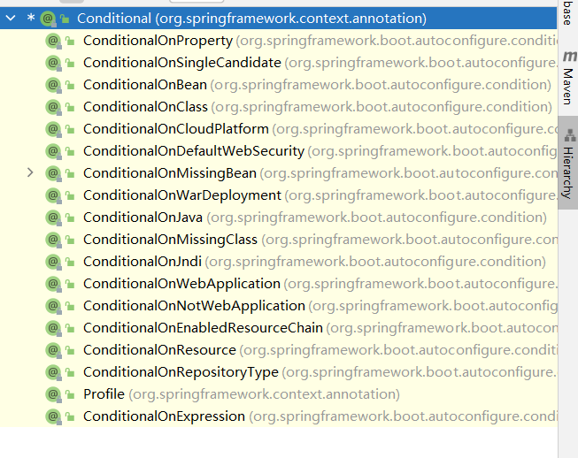

# SpringBoot-Study！

## 想要学习SpringBoot,首先要了解什么是**微服务！**

微服务了解：https://www.cnblogs.com/imyalost/p/6792724.html

spring-boot web开发文档https://docs.spring.io/spring-boot/docs/current/reference/html/web.html#web.servlet.spring-mvc.auto-configuration  2.6.3版本

spring-boot starthttps://docs.spring.io/spring-boot/docs/current/reference/html/using.html#using.build-systems.starters

## 1. SpringBoot介绍

​        先通过来一些概念，会让我们对技术有着更加清晰的理解。J2EE笨重的开发、繁多的配置、低下的开发效率、复杂的部署流程、第三方技术集成难度大，如果开发过SpringMVC或者单纯使用过SSH、SSM框架的同学，肯定是体验过被很多配置文件支配的恐惧，很难受吧，不过不用担心，我们有了SpringBoot。Spring Boot用来简化Spring应用开发，约定大于配置，去繁从简，just run就能创建一个独立的，产品级别的应用。随着Spring全家桶时代的到来，SpringBoot给我们带来了J2EE一站式解决方案，SpringCloud给我们带来了分布式整体解决方案。从此我们可以使用 SpringBoot 快速的开发基于 Spring 框架的项目，由于围绕 SpringBoot 存在很多开箱即用的 Starter 依赖，使得我们在开发业务代码时能够非常方便的、不需要过多关注框架的配置，而只需要关注业务即可。

###   SpringBoot优点

+ 快速创建独立运行的Spring项目以及与主流框架集成。

+ 使用嵌入式的Servlet容器，应用无需打成WAR包。

+ starters自动依赖与版本控制。

+ 大量的自动配置，简化开发，也可以修改默认值。

+ 无需配置XML，无代码生成，开箱即用。

+ 准生产环境的运行时应用监控。

+ 与云计算的天然集成。

  ```java
  ConfigurableApplicationContext context = SpringApplication.run(SpringBootStudy01YamlApplication.class, args);//获取容器，SpringBootStudy01YamlApplication.class 为主程序的class
  ```

###   自动装配

```xml
<dependency>
    <groupId>org.springframework.boot</groupId>
    <artifactId>spring-boot-starter-web</artifactId>
</dependency>
```

- 自动配好Tomcat

- 自动配好SpringMVC

  - 引入SpringMVC的全套组件

  - 自动配置好SpringMVC的常用组件(功能)

- 自动配好web的常见功能，如字符编辑问题

  - SpringBoot配置好了所有Webk开发的常用场景

- 默认包的结构

  - ```java
    @SpringBootApplication //加了该注解的class类即为主程序
    ```
    
  -  与主程序同级的包都会被==默认自动扫描到==，无须以前的扫描包配置

  - 想要改变默认扫描包的路径。@SpringBootApplication(scanBasePackages = "com.dwg")

    - 或者@ComponentScan指定扫描路径 

- 各种配置拥有默认值

  - 配置文件的值最终会绑定到某个类，这个类会在容器中创建对象

- 按需加载自动配置项

  - 非常多的Starter
  - 引入了那些场景，这些场景的自动配置才会开启
  - SpringBoot所有的自动配置功能都在：==spring-boot-autoconfigure==包中


## 2、容器功能

### 	2.1、组件添加

#### 	1.@Configuration

- **基本使用**

  告诉SpringBoot这是一个配置类 == 配置文件

- **Full模式和Liet模式**(SpringBoot2新添加的功能：@**Configuration** (proxyBeanMethods=true)默认为true

  - proxyBeanMethods : 代理Bean的方法,默认为true

  - 如果组件之间有依赖关系，容器每启动一次就会检查依赖的组件是否在容器中

  - Full模式

    - ```txt
      配置组件之间有依赖关系.方法对被调用得到之前单实例组件,用Full模式 (proxyBeanMethods=true)
      ```

  - Liet模式

    - ```txt
      配置组件之间无依赖关系用Lite模式加速容器启动，减少判断 (proxyBeanMethods=false)
      ```


#### 2.@Bean、@Component、@Controller、@Server、@Repository

- @**Bean**
  - 用在方法上，给容器添加组件，默认是单例模式，常与@**Comfiguration**一起使用
- @**Component**
  - 是所有受Spring 管理组件的通用形式，@Component注解可以放在类的头上，@Component不推荐使用。
  - 通常配合 包扫描@**CompontScan**(" ")使用
- @**Controller**
  - @Controller对应表现层的Bean，也就是Action (Controller层)
- @**Service**
  - @Service对应的是业务层Bean（Service层）
- @**Repository**
  - @Repository对应数据访问层Bean（Dao层）SpringBoot中使用@**mapper**

虽然@**Component**，@**Controller**，@**Service**，@**Repository** 都为注入组件注解，但是在SpringBoot中，除了@**Component**需要@**CompontScan** 组件扫描，其他都不用配置，**但是在SpringMVC中，需要在配置文件中配置包扫描**

```xml
<context:component-scan base-package="com.dwg.***"/>
```


#### 3.@Import

- @Import 通常用在配置类上																																																																											

  - 用在类上，给类添加组件数组 

    ```java
    @Import({People.class,Pet.class})
    ```

    

- - 组件名为**全类名**


### 2.2、条件装配

#### @Conditional

- 条件装配；

  - @**Conditional**还是一个根注解，派生了许多条件注解

    

  - 例：@**ConditionalOnBean** ：如果存在某个Bean

    - ```java
          
          @ConditionalOnBean(name = "Tom")
          @Bean//给容器添加组件。以方法名为id,返回类型就是组件的类型,返回的值,就是组件在容器中的实例
          public People people(){
              People people01 = new People();
              //组件people01 依赖了组件Tom
              people01.setDog(pet());
              return people01;
          }
         // @Bean("Tom")
          public Pet pet(){
              return new Pet("小黄");
          }
      
      ```

      如果存在某个Bean的名字为Tom，就给容器添加组件people；因为 // @Bean("Tom") 被注释了，所以容器中没有Tom组件，people组件也不会进入容器。@**ConditionalOnMissBean**则相反

### 2.3、引入外部配置文件

#### @ImportResource

- 作用在**配置类**上，引入外部配置文件的注解

  - ```java
    @ImportResource(value = "classpath:spring-appcationcontext.xml")
    ```

    引入了外部的xml配置文件**spring-appcationcontext.xml**

#### @PropertySource

- 同样作用在**配置类**上，导入properties文件，通常配合@**Value**注解使用

  - ```java
    @PropertySource(value = "classpath:xxx/xxx.properties)
    ```

    相当于xml的

    ```xml
    <context:property-placeholder location="classpath:xxx/xxx.properties"/>
    ```

    

### 2.4、配置绑定

#### @ConfigurationProperties 

- 在**application.properties**中写入

  ```properties
  mycar.brand = BL
  mycar.price = 10000
  ```

- @**ConfigurationProperties** + @**Component**  绑定配置

```java
@Component//只有在容器中的组件，才有能使用SpringBoot的功能
@ConfigurationProperties(value = "mycar")
public class Car {
    private String brand;
    private Integer price;

    public Car() {
    }

    public Car(String brand, Integer price) {
        this.brand = brand;
        this.price = price;
    }

    public String getBrand() {
        return brand;
    }

    public void setBrand(String brand) {
        this.brand = brand;
    }

    public Integer getPrice() {
        return price;
    }

    public void setPrice(Integer price) {
        this.price = price;
    }

    @Override
    public String toString() {
        return "Car{" +
                "brand='" + brand + '\'' +
                ", price=" + price +
                '}';
    }
}
```

第二种方法：

- @**ConfigurationProperties**  + @**EnableConfigurationProperties**

```java
@ConfigurationProperties(value = "mycar")
public class Car {
    private String brand;
    private Integer price;

    public Car() {
    }

    public Car(String brand, Integer price) {
        this.brand = brand;
        this.price = price;
    }

    public String getBrand() {
        return brand;
    }

    public void setBrand(String brand) {
        this.brand = brand;
    }

    public Integer getPrice() {
        return price;
    }

    public void setPrice(Integer price) {
        this.price = price;
    }

    @Override
    public String toString() {
        return "Car{" +
                "brand='" + brand + '\'' +
                ", price=" + price +
                '}';
    }
}
```

@**EnableConfigurationProperties** 要写在配置类上

```java
@EnableConfigurationProperties(Car.class)
// 1.开启Car的配置绑定功能
// 2. 把Car.class注入容器
public class MyConfig {

    /*@ConditionalOnBean(name = "Tom")
    @Bean//给容器添加组件。以方法名为id,返回类型就是组件的类型,返回的值,就是组件在容器中的实例
    public People people(){
        People people01 = new People();
        //组件people01 依赖了组件Tom
        people01.setDog(pet());
        return people01;
    }


    @Bean("Tom")//也可以组件定义组件名
    public Pet pet(){
        return new Pet("小黄");
    }*/
    
}
```

写一个Controller，即可在浏览器中展示出来


- 其实把@**EnableConfiguration**改为==@**Import**==也可以实现一样的功能


##### yaml配置文件

- yaml语法入门

https://www.runoob.com/w3cnote/yaml-intro.html

- yaml与propertise的区别是：yaml更加简洁，并且yaml可以实现对象的注入,注意不论是yaml还是propertise配置文件的名字默认为==application==
- 配置文件

```yaml
person:
  name: "李华"
  age: 18
  mood: true
  hobby:
    - "篮球"
    - "围棋"
    - "LOL"
  dog:
    name: "小白"
    age: 2
```

Person类，注意这里的Dog.class并不需要注入容器


赋值结果


##### 松散绑定和JSR303（**Java Specification Requests**）

- [Spring Boot松散绑定实战_实践求真知-CSDN博客_松散绑定](https://blog.csdn.net/chengqiuming/article/details/106637014)

JSR303

## 3、自动配置入门

### 3.1引导加载自动配置类

#### 1.@**SpringBootApplication**注解

   是由出来元注解外的 @**SpringBootConfiguration**、@**EnableAutoConfiguration**、@**ComponentScan**注解组成

```java
@SpringBootConfiguration
@EnableAutoConfiguration
@ComponentScan(
    excludeFilters = {@Filter(
    type = FilterType.CUSTOM,
    classes = {TypeExcludeFilter.class}), 
                      @Filter(
    type = FilterType.CUSTOM,
    classes = {AutoConfigurationExcludeFilter.class})}
)
public @interface SpringBootApplication {}
```

#### 2.@SpringBootConfiguration

- @**SpringBootConfiguration**
  - 本质是一个配置类 

#### 3.@ComponentScan

- 指定扫描包

- 还可以自定义扫描规则

  

- 如果**type= FilterType.CUSTOM**

  ```java
   
  @Configuration // 相当于写了一个spring的xml配置文件
  @ComponentScan(value="com.lhb.bean",includeFilters = {@Filter(type= FilterType.CUSTOM,classes = MyTypeFilter.class)},useDefaultFilters = false)
  public class MyConfig {
  }
  ```

  - FilterType.CUSTOM
    意思就是：可以指定一个自定义的规则，满足这个规则的类，将作为bean放到容器中。其实就是你自己实现一个TypeFilter接口的类，类中有个方法，**容器会把每个类当做参数传到这个方法中**，如果传进来的类，满足方法中的规则也就是返回true，这个类将作为bean放到容器中。
    例子：将类名含有Dao的类，所谓bean放到容器中
    首先：自定义一个TypeFilter的实现类

    ```java
    public class MyTypeFilter implements TypeFilter {
        /**满足下面方法也就是返回true的类，将作为bean放到容器中
         * @param metadataReader 读取到的当前正在扫描的类的信息
         * @param metadataReaderFactory 可以获取其他任何类型的信息
         */
        @Override
        public boolean match(MetadataReader metadataReader, MetadataReaderFactory metadataReaderFactory) throws IOException {
            //获取当前注解类的信息
            AnnotatedTypeMetadata annotatedTypeMetadata = metadataReader.getAnnotationMetadata();
            //获取当前正在扫描的类信息
            ClassMetadata classMetadata = metadataReader.getClassMetadata();
            //获取当前类资源（比如：类的路径）
            Resource resource = metadataReader.getResource();
     
            String className = classMetadata.getClassName();
            //System.out.println(className);
            // 将类名中包含Dao的类，作为bean放到容器中
            if(className.contains("Dao")){
                return true;
            }
            return false;
        }
    }
    ```

- 更多详见https://blog.csdn.net/liuhaibo_ljf/article/details/123024143

#### 4.@EnableAutoConfiguration

- 由两个注解组成@**AutoConfigurationPackage**和@**Import**({AutoConfigurationImportSelector.class})

  - ```java
    @AutoConfigurationPackage//自动配置包
    @Import({AutoConfigurationImportSelector.class})
    public @interface EnableAutoConfiguration {
    ```

  - @**AutoConfigurationPackage**自动配置的包，指定了默认包规则(也就是主程序所在的包，也就是为什么自动装配会默认扫描主程序所在的包的组件,例如会自动扫描同主程序下的包中的@**Component**，@**Controller**,@**Service**，如果在主程序的包外，就要使用@**ComponentScan**)

    - ```java
      @Import({Registrar.class})//给容器导入Registrar组件
      public @interface AutoConfigurationPackage{}
      ```

    - 利用Registrar.class给容器导入一系列组件,**指定**主程序所在的包下的所有组件

      ```java
      (new AutoConfigurationPackages.PackageImports(metadata)).getPackageNames()//通过反射获取主程序所在包的包名
      ```
    
      

  - @**Import**({AutoConfigurationImportSelector.class})
  
    - ```java
      利用getAutoConfigurationEntry(annotationMetadata)批量导入一些组件
      调用List<String> configurations = this.getCandidateConfigurations(annotationMetadata, attributes)获取所有需要导入容器的配置类（组件）
      利用工厂SpringFactoriesLoader.loadFactoryNames(this.getSpringFactoriesLoaderFactoryClass(), this.getBeanClassLoader())，加载 Map<String, List<String>> loadSpringFactories(ClassLoader classLoader)，得到资源getResources("META-INF/spring.factories") 
      默认扫描当前系统下所有META-INF/spring.factories路径里的文件
          spring-boot-autoconfigure--2.5.5.jar下也有META-INF/spring.factories路径
        
      ```

    - 

    - 
  
      - ```java
        org.springframework.boot.autoconfigure.EnableAutoConfiguration//下的衍生组件正好有131个
          //写死了所有spring-boot一启动就要给容器加载的配置类，但实际使用起来没有那么多，容器会按需配置
        ```

    - 在SpringBoot2.5.5版本下需要导入的组件有131个

      
  
      注：==@**Import**({AutoConfigurationImportSelector.class})中的AutoConfigurationImportSelector.class本类是会默认扫描当前系统下所有 "META-INF/spring.factories" 路径里的文件，因为该注解合成**@EnableAutoConfiguration**，所以AutoConfigurationImportSelector.class才会只找到 autoconfigure 下的"META-INF/spring.factories" 配置文件中的   ”org.springframework.boot.autoconfigure.EnableAutoConfiguration=\“  下 的131个自动配置的组件，虽然默认全部加载但是要按需开启==

### 3.2、按需开启自动配置项

以AOP包为例：


@**ConditionalOn==XXX==**条件装配，如果如上如果有Advice.class就自动装配AOP的组件

### 3.3、定制化修改自动配置

​        因为springboot会自动加载所有的自动配置类**xxxAutoConfiguration**，没给自动配置类按条件生效，默认都会绑定配置文件的值，以**MultipartAutoConfiguration**为例：绑定multipartProperties;<a name="跳转2"></a>


如果生效配置类生效就会给容器添加很多组件，只要容器中有这些组件，就相当于这些功能都有了。

#### 定制化配置：

- 用户可以自己用@Bean修改组件，默认以用户添加为准，如果用户没添加，才会以自动配置的为准。
- 可以在application.porpertise。(想要修改什么就去底层查看该配置类)

### 3.4、最佳实践

加入下面依赖，yaml文件就会提示属性

```XML
<dependency>
    <groupId>org.springframework.boot</groupId>
    <artifactId>spring-boot-configuration-processor</artifactId>
</dependency>
```


在pom.xml中还要加上以下代码，不然打包时也会把以上依赖打入war包

```xml
<build>
        <plugins>
            <plugin>
                <groupId>org.springframework.boot</groupId>
                <artifactId>spring-boot-maven-plugin</artifactId>
                <configuration>
                    <excludes>
                        <exclude>
                            <groupId>org.springframework.boot</groupId>
                            <artifactId>spring-boot-configuration-processor</artifactId>
                        </exclude>
                    </excludes>
                </configuration>
            </plugin>
        </plugins>
    </build>
```

## 4、简单功能分析

### 4.1静态资源访问

spring boot 默认的静态资源为 **类路径（resources）** 下的`/static`（或`/public`或`/resources`或`/META-INF/resources`）


将静态资源放在以上目录下可以直接访问，访问路径为：项目的根路径 + 静态资源名


原理：静态资源的默认映射：/**

​        请求进来先处理动态请求，后再处理静态资源，例：如果有requestmapping请求同为“ /header.jpg”,则先访问动态请求，动态请求如果不存在，才会去找静态资源。

```yaml
spring:
  mvc:
    static-path-pattern: /res/**
```

修改静态资源的默认路径

```yaml
spring:
  web:
    resources:
      static-locations: classpath:/haha/ #必须要/...XXXX.../
```


**webjars**

网站：https://www.webjars.org/

将网页常用的bootstrap、jquery等封装成jar包，用maven导入可以直接使用

访问路径为:  localhost:8080/webjars/**

### 4.2欢迎页支持

默认加载欢迎页有两种方法

- 在静态资源目录下的index.html

  - 但是如果项目配置：

    ```yaml
    spring:
      mvc:
        static-path-pattern: /res/**
    ```

    会导致失效

- Controller 跳转的  "/index" 请求

  

### 4.3自定义favicon

将favicon.ico放在静态资源目录下即可

同样如果配置

```yaml
spring:
  mvc:
    static-path-pattern: /res/**
```

会导致失效

## 5、请求处理

### 5.1

### 5.2基本注解

- @PathVariable 

  获取url中的路径变量，还可以直接将参数存放如一个Map中。

```java
 @GetMapping("/car/{cid}/owner/{owner}")
    public Map<String,Object> checkCar(@PathVariable("cid")Integer cid ,
                                       @PathVariable("owner") String name,
                                       @PathVariable Map<String,Object> ss){}
```

- @RequestHeader ,

  注意获取所有信息的Map类型必须为<String , String>

  ```java
  @GetMapping("/car")
      public Map<String,Object> checkCar1(@RequestHeader("User-Agent")String userAgent ,
                                          @RequestHeader Map<String ,String> ss){}
  ```

- @RequestParam

  获取url中的参数，也有map类型获取所有参数信息

- @CookieValue ,

  既可以获取cookie中的值，还可以根据cookie名获取一个cookie

  ```java
  @GetMapping("/cookie")
      public void checkCar1(@CookieValue("Idea-853aefc0")String Idea ,
                                          @CookieValue("Idea-853aefc0") Cookie cookie){
          System.out.println(Idea);
          System.out.println(cookie.getName()+"====>"+cookie.getValue());
      }
  ```

- @RequsetBody

  只有post请求才有请求体，例如表单提交，获取的请求体就是序列化后的表单格式。

- @RequestAtrribute

  获取request域中的值

  ```java
   @GetMapping("/requestAtriibute")
      public String  checkCar1(HttpServletRequest request){
          request.setAttribute("oh","ohhhhhhhh!");
          return "forward:tessst";//转发可以看作是同一个请求，重定向是两次请求
      }
  
      @GetMapping("/tessst")
      @ResponseBody
      public void tessst(@RequestAttribute("oh")String a){
          System.out.println(a);
      }
  ```

  

## 6、扩展在SpringBoot中的SpringMVC（定制化）

SpringMVC的自动配置类 WebMvcAutoConfiguration类中有一个静态类 WebMvcAutoConfigurationAdapter 实现了 WebMvcConfigurer 接口。<a name="跳转1"></a>


要想定制化SpringMVC，有两种方法：

- 要让一个配置类实现 WebMvcConfigurer 接口并重写想要定制的方法。

- 写一个类实现 WebMvcConfigurer  并且放入容器。

  - 注意该定制方法如果和@**EnableWebMvc**一起使用的话会导致全面接管SpringMVC，自动配置的就会失效，所有MVC规则要自己编写。尽量不要一起使用

因为SpringBoot默认不支持矩阵变量的，所以以定制化获取url的矩阵变量为例：

矩阵变量的url格式为：/car/sell;low=20;brand=byd,bmw 或 /car/sell;low=20;brand=byd;brand=bwm，

​										一般在忘记Cookie情况下使用，不常用。

controller

```java
 @GetMapping("/car/{sell}")
    @ResponseBody
    public Map sell(@MatrixVariable("low") Integer low,
                    @MatrixVariable("brand") List<String> brand){
        Map<String,Object> map = new HashMap<>();
        map.put("low",low);
        map.put("brand",brand);
        return map;
    }
```

定制化组件

```java
@Configuration
public class MyMvcConfig implements WebMvcConfigurer {
    @Override
    public void configurePathMatch(PathMatchConfigurer configurer) {
        /*
         UrlPathHelper类可以处理url格式
         */
        UrlPathHelper pathHelper = new UrlPathHelper();
        pathHelper.setRemoveSemicolonContent(false);//不删除url中的分号 “ ; ” 后的内容
        configurer.setUrlPathHelper(pathHelper);
    }
}

```

这样SpringBoot就会自动启用用户添加的组件。

## 7、常见的定制化方式

- [实现**WebMvcConfigurer** 接口，即可定制化web功能。](#跳转1)

- 实现WebMvcConfigure接口+ @**EnableWebMvc**一起使用，web的自动配置失效，完全接管SpringMVC。

  - 因为WebMvcAutoConfiguration有下面条件注解

    ```java
    @ConditionalOnMissingBean(WebMvcConfigurationSupport.class)//当容器中没有WebMvcConfigurationSupport时生效。
    ```

  - 而@**EnableWebMvc**会引入DelegatingWebMvcConfiguration.class
  - DelegatingWebMvcConfiguration为WebMvcConfigurationSupport的实现类，所以导致web自动配置失效。

- [修改配置文件](#跳转2)


## 8、thymeleaf

https://www.jianshu.com/p/d1370aeb0881   Thymeleaf的使用

|   左对齐   |   右对齐   |             居中对齐              |
| :--------: | :--------: | :-------------------------------: |
|  变量取值  | **${...}** | 获取请求域，session，对象中的属性 |
|  选择变量  | ***{...}** |        获取上下文对象的值         |
|    消息    | **#{...}** |          获取国际化的值           |
|    链接    | **@{...}** |             生成链接              |
| 片段表达式 | **~{...}** |           引入公共页面            |


## 9、登录拦截

**Springboot实现文件上传功能**

- 一个类实现HandlerInterceptor接口,以登录拦截为例

```java
@Slf4j
public class LoginIntercepor implements HandlerInterceptor {
    @Override
    public boolean preHandle(HttpServletRequest request, HttpServletResponse response, Object handler) throws Exception {
        log.info("拦截器");
        HttpSession session = request.getSession();
        if (session.getAttribute("user")!=null){
            return true;//放行
        }else {
            request.setAttribute("msg","请先登录！");
            request.getRequestDispatcher("/").forward(request,response);
            return false;//拦截
        }

    }

    @Override
    public void postHandle(HttpServletRequest request, HttpServletResponse response, Object handler, ModelAndView modelAndView) throws Exception {
                log.info("postHandle执行{}",modelAndView);
    }


    @Override
    public void afterCompletion(HttpServletRequest request, HttpServletResponse response, Object handler, Exception ex) throws Exception {
        log.info("afterCompletion{}",ex);
    }
}
```

- 写一个配置类实现WebMvcConfigure,并重写addInterceptors方法。

  ```java
  @Configuration
  public class MyWebConfig implements WebMvcConfigurer {
      @Override
      public void addInterceptors(InterceptorRegistry registry) {
         registry.addInterceptor(new LoginIntercepor())
                 .addPathPatterns("/**")
                 .excludePathPatterns("/","/login","/css/**","/font/**","/images/**","/js/**","/lib/**");
      }
  }
  ```

用registry来注册拦截器，添加拦截路径为拦截所有(/**)，排除登录页面和静态资源路径。


## 10、文件上传

- Springboot已经自动配置了文件上传的组件 **MultipartAutoConfiguration**

- 绑定配置文件**MultipartProperties**，绑定配置项**spring.servlet.multipart**

  ```yaml
  spring:
    servlet:
      multipart:
        max-file-size: 10MB #文件最大的大小
        max-request-size: 100MB #请求最大大小
  ```

  

- **文件上传测试**

  html代码  表单为post请求，还要加上==enctype="multipart/form-data"==

  ```html
  <form th:action="@{/fileupload}" enctype="multipart/form-data" method="post">
      <label>上传文件:</label>&nbsp;<input type="file" value="上传文件" name="file"><br>
      <label>上传多文件:</label>&nbsp;<input type="file" value="上传多文件" name="files" multiple><br>
      <input type="submit" value="提交">
  </form>
  ```

​     ==如果是多文件上传，input标签还要加上**multiple**==

- 后台代码

  ```java
  @PostMapping("/fileupload")
      public String fileupload(MultipartFile file, MultipartFile[] files,Model model){
          log.info("文件信息{}",file.getSize());
          try {
              //获取文件后缀名
              String substring = file.getOriginalFilename().substring(file.getOriginalFilename().lastIndexOf("."));
              log.info("substring{}",substring);
              file.transferTo(new File("G:\\"+"yes"+substring));
              System.out.println("fileName:"+file.getName()+"\n; OriginalFilename:"+file.getOriginalFilename());
  
              if (files.length>0){
                  for (MultipartFile File : files) {
                      File.transferTo(new File("G:\\"+File.getOriginalFilename()));
                  }
              }
  
          } catch (IOException e) {
              e.printStackTrace();
          }
          model.addAttribute("msg","上传成功");
          return "redirect:fileupload";
      }
  ```

  如果想要将上传的文件改名，就要获取文件后缀名，**保存路径一定要具体到==某个文件==，如果是文件夹，会抛出无法写入异常。**

  ```java
   //获取文件后缀名
   String substring = file.getOriginalFilename().substring(file.getOriginalFilename().lastIndexOf("."));
   file.transferTo(new File("G:\\"+"yes"+substring));
  ```

  

### 错误处理


在template文件夹下创建error文件夹，**可以将自定义的4xx.html，5xx.html，Springboot会自动识别**

## 11、数据访问

### 11.1 jdbc

- jdbc的starter

  ```xml
          <dependency>
              <groupId>org.springframework.boot</groupId>
              <artifactId>spring-boot-starter-data-jdbc</artifactId>
          </dependency>
  ```

- 因为不知道开发者使用户什么数据库，jdbc的starter是没有数据库驱动的。添加MySQL数据库驱动

  ```xml
  <!-- https://mvnrepository.com/artifact/mysql/mysql-connector-java -->
  <dependency>
      <groupId>mysql</groupId>
      <artifactId>mysql-connector-java</artifactId>
      <version>5.1.49</version>
  </dependency>
  ```

- 该starter默认数据源为HikariDataSource。

- 引入的包

  


**11.1.1 分析自动配置的类**

**Spring-boot-autoconfigure**包下的关于Jdbc的自动配置。

- 自动配置类为**DataSourceAutoConfiguration** 
- 修改数据源相关配置:  **spring.datasource**

- 容器中没有datasource才会自动配置，自动配置的数据源为HikariDataSource。
- 配置数据源。

  - ```yaml
    spring:
      datasource:
        username: root
        password: 123456
        url: jdbc:mysql://localhost:3306/mybatis?serverTimezone=UTC&useSSL=false
        driver-class-name: com.mysql.jdbc.Driver
    #    type: com.zaxxer.hikari.util.DriverDataSource 默认为hikari
    ```

- JdbcTemplateAutoConfiguration **自动配置jdbcTemplate**。

### 11.2 Druid数据源

https://github.com/alibaba/druid/wiki/%E5%B8%B8%E8%A7%81%E9%97%AE%E9%A2%98 druid文档

```xml
        //因为不是springboot官方starter，所以没有 版本仲裁
        <dependency>
            <groupId>com.alibaba</groupId>
            <artifactId>druid-spring-boot-starter</artifactId>
            <version>1.1.10</version>
        </dependency>
```


### 11.3 整和mybatis

**11.3.1 Mybatis的starter**

```xml
<dependency>
    <groupId>org.mybatis.spring.boot</groupId>
    <artifactId>mybatis-spring-boot-starter</artifactId>
    <version>1.3.2</version>
</dependency>
```


- **MybatisAutoConfiguration**

  ```java
  @Configuration
  @ConditionalOnClass({SqlSessionFactory.class, SqlSessionFactoryBean.class})
  @ConditionalOnBean({DataSource.class})
  @EnableConfigurationProperties({MybatisProperties.class})//绑定配置文件
  @AutoConfigureAfter({DataSourceAutoConfiguration.class})
  public class MybatisAutoConfiguration {}
  
  
  //MybatisProperties
  @ConfigurationProperties(
      prefix = "mybatis"   //配置项
  )
public class MybatisProperties {}
  ```

  - SqlSessionFactory; 自动配置好了
  
  - ```java
        @Bean
        @ConditionalOnMissingBean
      public SqlSessionFactory sqlSessionFactory(DataSource dataSource) throws Exception {}
    ```

  - SqlSession; **自动配置了SqlSessionTemplate来组合SqlSession**
  
  - ```java
    @Bean
    @ConditionalOnMissingBean
  public SqlSessionTemplate sqlSessionTemplate(SqlSessionFactory sqlSessionFactory) {}
    ```
  
  - Mapper ；只要我们写的操作Mybatis的接口**标注了@Mapper注解，就会被自动扫描进来。**


**11.3.2 Mybatis的配置项**

```yaml
mybatis:
  type-aliases-package: com.dwg.entity #别名
  mapper-locations: classpath:mybatis/mapper/*.xml #指定mapper的位置
  config-location: classpath:mybatis/mybatis-config.xml  #如果写了mybatis的全局配置文件，就一定要写配置文件的位                                                            置，不然配置文件无法生效。
```

如果不写mybatis的全局配置文件

- ```yaml
  mybatis:
    configuration:
      map-underscore-to-camel-case: true #驼峰命名法
  ```

​    配置文件中可以配置的属性都可以在 **mybatis.configuration**  配置项下配置，如上开启驼峰命名法，

​    要使用 **mybatis.configuration**  配置项，就不能指定 mybatis全局配置文件的位置。一般开发中不适用mybatis全局配置文件。

- **使用方式** 
  - 引入Mybatis的Starter。
  - 在application.yaml中指定sql映射文件mapper.xml位置。
  - 给mapper接口加上@Mapper注解。（想要不使用@Mapper注解，可以在配置类上添加@**MapperScan**注解）SpringBoot不用@**Repository**注解
  - 用**xml**或**注解**写sql。（用xml要自定xml的位置）


## 12、RedisTemplate

### springboot依赖

```xml
<dependency>
    <groupId>org.springframework.boot</groupId>
    <artifactId>spring-boot-starter-data-redis</artifactId>
</dependency>
```

**官方文档**	

https://docs.spring.io/spring-data/redis/docs/current/api/org/springframework/data/redis/core/RedisTemplate.html

- 配置密码，端口号和redis的IP地址，这里用阿里云的redis云数据库。阿里云要修改白名单允许0.0.0.0/0 远程访问

```yaml
spring:
  redis:
    password: Dwg123456
    port: 6379
    host: r-bp1zo1kqxffqklqoqfpd.redis.rds.aliyuncs.com

# Redis数据库索引（默认为0）
spring.redis.database=0
# Redis服务器地址
spring.redis.host=127.0.0.1
# Redis服务器连接端口
spring.redis.port=6379
# Redis服务器连接密码（默认为空）
spring.redis.password=
# 连接池最大连接数（使用负值表示没有限制）
spring.redis.jedis(lettuce).pool.max-active=20
# 连接池最大阻塞等待时间（使用负值表示没有限制）
spring.redis.jedis(lettuce).pool.max-wait=-1
# 连接池中的最大空闲连接
spring.redis.jedis(lettuce).pool.max-idle=10
# 连接池中的最小空闲连接
spring.redis.jedis(lettuce).pool.min-idle=0
# 连接超时时间（毫秒）
spring.redis.timeout=1000
```

- **Jedis**
  -  start还引入了lettuce ,所以**RedisTemplate**默认使用的**RedisConnectionFactory**为**LettuceConnectionFactory**


​             要想使用**jedis**要先引入依赖。

```xml
         <dependency>
            <groupId>redis.clients</groupId>
            <artifactId>jedis</artifactId>
        </dependency>
```

​            指定clientType为Jedis。

```yaml
spring:
  redis:
    client-type: jedis
```

​          **RedisTemplate**底层的**RedisConnectionFactory**就变为**JedisConnectionFactory**的了。


##  **什么是starter**         

​        Starter可以理解为一个可拔插式的插件，提供一系列便利的**依赖描述符**，您可以获得所需的所有Spring和相关技术的一站式服务。应用程序只需要在maven中引入starter依赖，SpringBoot就能自动扫描到要加载的信息并启动相应的默认配置。用一句话描述，就是springboot的**场景启动器**。start就像一个开关，来开启Springboot已经自动配置好的场景。有些第三方的框架Spring boot并没有自动配置相应的场景，所以这些start一般会自动附带相应场景的xxxautoConfigure。

**例如Mybatis的start：** 下就有mybatis-spring-boot-autoconfigure。


## 13、高级特性

### Pofile定制装配

springboot简化的profile功能。

### application-profile功能

#### **springboot可以定制配置环境**

默认配置文件名为**applcation**，要想定制配置环境可以以： **applictiion-xxx(自定义名)** 为自定义配置文件名。如下图。默认配置文件和指定的自定义的配置文件都会加载，**如果如果自定义的配置文件中有和默认配置文件同名的参数，则自定义配置文件会覆盖默认配置文件的参数。**

application-prod为生产环境，application-test为配置环境。


只要在默认配置文件中配置

```properties
#就可以选择自定义的环境配置。选择application-test.yaml
spring.profiles.active=test   
```


**在实际开发中可能要将项目打包成jar包参数，同样也可以定制测试环境**

- **java -jar xxx(jar包名).jar (--参数 --参数 ...)** 用命令行启动jar包。就可以用浏览器访问
- 例如 启动  **java -jar SpringBoot-Profile-0.0.1-SNAPSHOT.jar --spring.profiles.active=test --person.name=haha**


浏览器访问7000端口


替换为在命令行中指定的**--person.name=haha** 了


#### @**Profile**注解

使用@Profile注解，可以指定类或方法在什么配置环境下生效

```java
@Configuration
public class MyConfig {
    @Bean
    @Profile("prod")
    public Boss boss(){
        return new Boss();
    }

    @Bean
    @Profile("test")
    public Worker worker(){
        return new Worker();
    }
}
```

选择测试环境

```properties
spring.profiles.active=test
```

得到的类的class为：


#### Profile分组 (Profile Groups)

可以组合多个同一种配置环境的配置文件，多个同一种环境的配置文件可以互补使用

```properties
#测试环境
spring.profiles.group.test[0]=test1
spring.profiles.group.test[1]=test2

#生产环境
spring.profiles.group.prod[0]=prod1
spring.profiles.group.prod[1]=prod2
```


### 配置加载优先级

#### 配置文件的查找位置

配置优先级由下到上

1. classpath 根路径
2. classpath 根路径下的config目录
3. jar包当前目录 (如图所示)
4. jar包当前目录下的config目录 (如图所示)
5. /config目录的直接子目录 (**在linux系统 根下的/config目录下的下一层子目录，只能有一层子目录**)


==指定环境优先，外部优先，后面的可以覆盖前面的配置同名项==