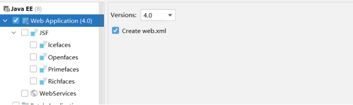
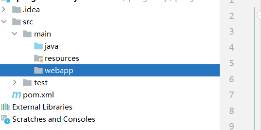
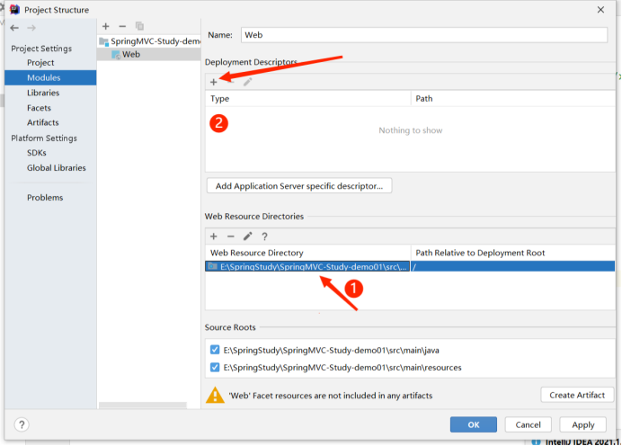
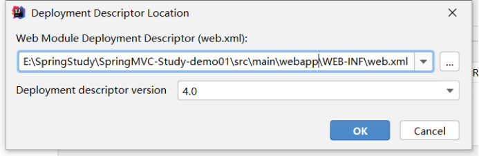
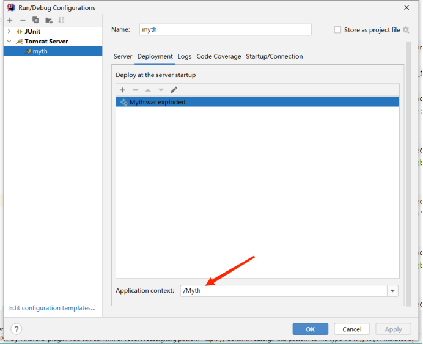

# SpringMVC


使用了ssm框架但是spring的jar包特别多,依赖信息不好找,但是jar包之间有相互依赖,
使用spring和springmvc只用导入一个依赖信息即可:

```xml
   <dependencies>
        <dependency>
            <groupId>org.springframework</groupId>
            <artifactId>spring-webmvc</artifactId>
            <version>3.2.17.RELEASE</version>
        </dependency>
    </dependencies>
```


## 1、创建web项目

方式1:新建maven项目，给项目添加web框架即可



方式2：新建maven项目，在mian下新建一个webapp文件夹



打开项目结构，将标注1的路径修改为 webapp 文件夹的路径



标注2 修改web.xml原来的路径添加到webapp文件夹下，完成后点击Apply



## 2、配置web.xml

```xml
<servlet>
    <servlet-name>springmvc</servlet-name>
    <servlet-class>org.springframework.web.servlet.DispatcherServlet</servlet-class>
    <!--关联一个springmvc的配置文件：【servlet name】-servlet.xml;否则的话springMVC的配置文件不能放在resource文件夹下-->
    <init-param>
       <!--contextConfigLocation为固定值-->
        <param-name>contextConfigLocation</param-name>
        <!--c-->
        <param-value>classpath:springmvc-servlet.xml</param-value>
    </init-param>
     <!--将前端控制器DispatcherServlet的初始化提前到服务器启动时-->
    <load-on-startup>1</load-on-startup>
</servlet>
<servlet-mapping>
    <!--/匹配所有请求：（不包括.jsp）-->
    <!--/*匹配所有请求：（包括.jsp）-->
    <servlet-name>springmvc</servlet-name>
    <url-pattern>/</url-pattern>
</servlet-mapping>
```


## 3、SpringMVC配置文件

```xml
<?xml version="1.0" encoding="UTF-8"?>
<beans xmlns="http://www.springframework.org/schema/beans"
       xmlns:xsi="http://www.w3.org/2001/XMLSchema-instance"
       xmlns:context="http://www.springframework.org/schema/context"
       xmlns:mvc="http://www.springframework.org/schema/mvc"
       xsi:schemaLocation="http://www.springframework.org/schema/beans
        https://www.springframework.org/schema/beans/spring-beans.xsd
        http://www.springframework.org/schema/context
        https://www.springframework.org/schema/context/spring-context.xsd
        http://www.springframework.org/schema/mvc
        https://www.springframework.org/schema/mvc/spring-mvc.xsd">
    <context:component-scan base-package="com.deng.controller"/>
    <context:annotation-config/><!--开启注解支持-->

    <!--让spring不在处理静态资源：html ,js ,css ,mp3 , mp4-->
    <mvc:default-servlet-handler/>

    <!--支持MVC注解驱动-->
    <mvc:annotation-driven/>
    
    <!--添加处视图解析器-->
    <bean class="org.springframework.web.servlet.view.InternalResourceViewResolver" id="internalResourceViewResolver">
        <!--前缀-->
        <property name="prefix" value="/WEB-INF/jsp/"/>
        <!--后缀-->
        <property name="suffix" value=".jsp"/>
    </bean>
</beans>
```


## 4、路径问题

下标注的路径为项目的上下文路径(虚拟目录)（contextPath）



==如果在页面跳转或静态资源中未添加上下文路径，则浏览器会从：localhost：8080/XXX 开始，导致404==

- 浏览器端的请求需要加上虚拟目录；例如
  - a 标签
  - form
  - resq.sendirect("路径")

- 出了转发 req.forward("路径")不加虚拟路径以外，浏览器端的url都要加上虚拟路径
- req.getContextPath( );获取虚拟路径。

# @RequestParam

**@RequestParam 只能解析`?name=老王&age=30` 的字符串格式，不论是get还是post请求**

表单默认为get提交

注解@RequestParam接收的参数是来自==**HTTP请求体或请求url的QueryString中。**==

RequestParam可以接受简单类型的属性，也可以接受对象类型。

@RequestParam有三个配置参数：

- `required` 表示是否必须，默认为 `true`，必须。
- `defaultValue` 可设置请求参数的默认值。
- `value` 为接收url的参数名（相当于key值）。

**@RequestParam用来处理 `Content-Type` 为 `application/x-www-form-urlencoded` 编码的内容，`Content-Type`默认为该属性****。@RequestParam也可用于其它类型的请求，例如：POST、DELETE等请求**。

所以在postman中，要选择body的类型为 `x-www-form-urlencoded`，这样在headers中就自动变为了 `Content-Type` : `application/x-www-form-urlencoded` 编码格式。如下图所示：


但是这样不支持批量插入数据啊，如果改用 `json` 字符串来传值的话，类型设置为 `application/json`，点击发送的话，会报错，后台接收不到值，为 `null`。

# @RequestBody


注解@RequestBody接收的参数是**来自requestBody**中，即**请求体**。一般用于处理非 `Content-Type: application/x-www-form-urlencoded`编码格式的数据，比如：`application/json`、`application/xml`等类型的数据。

就`application/json`类型的数据而言，会以json的形式传递给后端，使用注解@RequestBody可以将body里面所有的json数据传到后端，后端再进行解析。

GET请求中，因为没有HttpEntity，所以@RequestBody并不适用。

POST请求中，通过HttpEntity传递的参数，必须要在请求头中声明数据的类型Content-Type，SpringMVC通过使用

HandlerAdapter 配置的HttpMessageConverters来解析HttpEntity中的数据，然后绑定到相应的bean上。

 

**向表中批量插入数据**

举个批量插入数据的例子，Controller层的写法如下图所示：


由于@RequestBody可用来处理 `Content-Type` 为 `application/json` 编码的内容，所以在postman中，选择body的类型为`row` -> `JSON(application/json)`，这样在 `Headers` 中也会自动变为 `Content-Type` : `application/json` 编码格式。body内的数据如下图所示：


批量向表中插入两条数据，这里的 `saveBatchNovel()`方法已经封装了 `JPA`的 `saveAll()` 方法。`body` 里面的 `json` 语句的 `key` 值要与后端实体类的属性一一对应。

**注意：**前端使用$.ajax的话，一定要指定 `contentType: "application/json;charset=utf-8;"`，默认为 `application/x-www-form-urlencoded`。

## 使用@**RestController** 和 @**ResponseBody** 注解的话要给项添加一下依赖

```xml
<dependency>
    <groupId>com.fasterxml.jackson.core</groupId>
    <artifactId>jackson-core</artifactId>
    <version>2.11.0</version>
</dependency>
<dependency>
    <groupId>com.fasterxml.jackson.core</groupId>
    <artifactId>jackson-databind</artifactId>
    <version>2.11.0</version>
</dependency>
<dependency>
    <groupId>com.fasterxml.jackson.core</groupId>
    <artifactId>jackson-annotations</artifactId>
    <version>2.11.0</version>
</dependency>
```

## 后端参数的接收

- axios的默认数据提交格式为：Content-Type : **`application/json`** 会将数据自动转化为json格式，后端用@**RequestBody**注解接收即可。
- @**RequestParam** 只能解析**`?name=老王&age=30`** 的字符串格式，也就是get方式提交，(表单虽然默认为get提交，但是改为post提交也可以用该注解接收)。
- 如果使用一个自定义对象来接收参数，要写对象的getter和setter,因为spring默认为getter,setter注入，而不是有参构造器注入
- 要是不写自定义类来接收，也可以使用一个**<Object,Object>Map**对象来接受参数。

