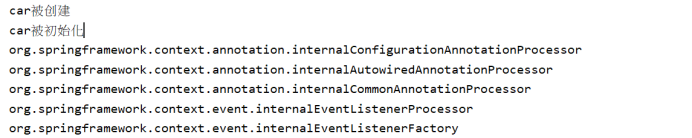
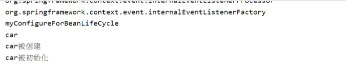
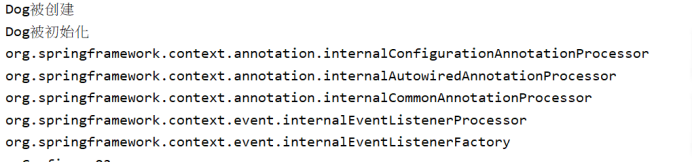
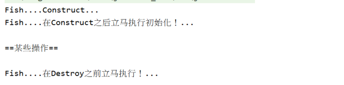
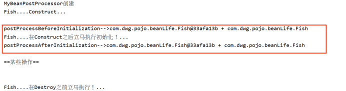
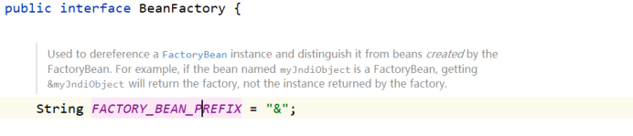
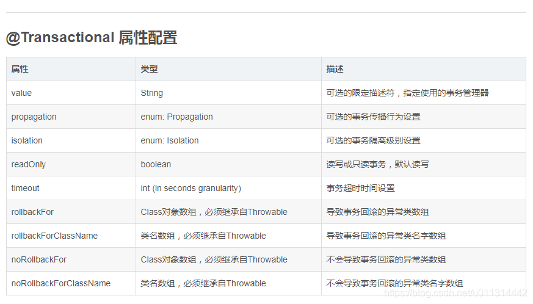

# Spring的注解开发

框架=配置文件+jar包

## bean的生命周期

```java
 AnnotationConfigApplicationContext context =
                new AnnotationConfigApplicationContext(MyConfigure02.class);//拿到配置类

ApplicationContext context =
                new ClassPathXmlApplicationContext("applicationcontext.xml");//拿到xml配置文件
```


### 初始化和销毁

我们可以自定义初始化和销毁的方法；容器在bean进行到当前的生命周期的时候来调用我们**自定义**的初始化方法和销毁方法

**构造**(创建对象)

​				单实例：在容器启动时创建对象

​				多实例：在每次获取时创建对象


**BeanPostProcessor.postProcessBeforeInitialization**

**初始化**：

​				对象创建完成，并赋值好，调用初始化方法

**BeanPostProcessor.postProcessAfterInitialization**


**销毁**：

​				多实例：==容器不会管理这个bean，容器不会调用销毁方法==

### 1 .指定初始化和销毁方法

```java
public class Car {
    private String name;
    private String brand;

    public Car() {
        System.out.println("car被创建");
    }
    public void init(){
        System.out.println("car被初始化");
    }
    public void destroy(){
        System.out.println("car被消毁");
    }
}
```

用@**Bean**指定**initMethod**，**destroyMethod**

```java
@Configuration
public class MyConfigureForBeanLifeCycle {

    @Bean(initMethod="init",destroyMethod = "destroy")
    public Car car(){
        return new Car();
    }

}
```

单例：对象创建完成，并赋值好，调用初始化方法



原型：调用时初始化,只有在获取bean的时候创建。

```java
Object car = context.getBean("car");
```



### 2. 实现**InitializingBean**(初始化), **DisposableBean**(销毁)  接口来实现初始化，销毁方法

```java
@Component
public class Dog implements InitializingBean, DisposableBean {

    public Dog(){
        System.out.println("Dog被创建");
    }

    @Override
    public void destroy() throws Exception {
        System.out.println("Dog被销毁");
    }

    @Override
    public void afterPropertiesSet() throws Exception {
        System.out.println("Dog被初始化");
    }
}
```

默认为单例模式




### 3.使用JSR250;

- **jsr250规范中定义了两个注解**

  - @**PostConstruct**   表示方法在Construct（构建）之后执行

  - @**PreDestroy**   表示方法在Destroy（销毁）前执行

  - ```java
    @Component
    public class Fish {
    
        public Fish(){
            System.out.println("Fish....Construct...");
        }
    
        @PostConstruct
        public void 初始化(){
            System.out.println("Fish....在Construct之后立马执行初始化！...");
        }
    
        @PreDestroy
        public void 销毁(){
            System.out.println("Fish....在Destroy之前立马执行！...");
        }
    
    }
    ```

  - 测试

    ```java
    @Test
    public void myBeanLifeCycleTest03(){
        AnnotationConfigApplicationContext context =
                new AnnotationConfigApplicationContext(MyConfigureForBeanLifeCycle.class); //获取容器
    
        context.getBean(Fish.class);
        System.out.println("\n==某些操作==\n");
        context.close(); //关闭ioc容器
    }
    ```

  - 作用效果如下

    

    

### 4.BeanPostProcessor接口,后置处理器

​     **BeanPostProcessor** 后置处理器是只对bean的初始化前后操作

- **postProcessBeforeInitialization**()    //在初始化之前工作

- **postProcessAfterInitialization**()   //在初始化之后工作

```java
@Component
public class MyBeanPostProcessor implements BeanPostProcessor {

    /*
    * 初始化前后进行工作
    * */
    public MyBeanPostProcessor() {
        System.out.println("MyBeanPostProcessor创建");
    }

    @Override
    /*
      bean :刚创建的bean
      bean :bean在容器中的名字。
    */
    public Object postProcessBeforeInitialization(Object bean, String beanName) throws BeansException {
        System.out.println("postProcessBeforeInitialization-->"+bean+" + "+beanName);
        return BeanPostProcessor.super.postProcessBeforeInitialization(bean, beanName);
    }

    @Override
    public Object postProcessAfterInitialization(Object bean, String beanName) throws BeansException {
        System.out.println("postProcessAfterInitialization-->"+bean+" + "+beanName);
        return BeanPostProcessor.super.postProcessAfterInitialization(bean, beanName);
    }
}

```

- 在容器被创建的时候，所有容器中设置了初始化方法的bean都会执行  上面写的方法，spring容器自带的组件没有初始化方法也会执行。

  

==**BeanPostProcessor** 后置处理器是只对bean的初始化前后操作==


## @Value

```java
    /*
    * 可以写基本类型
    * SpEL;#{ }
    * 可以写${ }取出xxx.properties配置文件的值
    * */
    @Value("#{cat.name}")
    private String name;
    @Value("")
    private Integer age;
    @Value("125.0")
    private double money;
```

- @**Value**还可以用于依赖注入，完成@AutoWired的功能


## FactoryBean 实现注册bean

FactoryBean也是注册bean的一种方式

- 基本结构


- 实现FactoryBean接口

  ```java
  public class MyFactoryBean implements FactoryBean {
      @Override
      public Object getObject() throws Exception {
          return new ManKind();    //返回一个匿名对象
      }
  
      @Override
      public Class<?> getObjectType() {
          return ManKind.class;   //要注入容器的对象的类型
      }
  
      @Override
      public boolean isSingleton() {
          return FactoryBean.super.isSingleton();// 指定是单例模式 还是 多例模式
      }
  }
  ```


- 注入该工厂bean

  ```java
  public class MyConfigure {
  
      @Bean /*利用FactoryBean工厂注入组件*/
      public MyFactoryBean myFactoryBean(){
          return new MyFactoryBean();
      }
  
  }
  ```


- 测试

```java
public class MyTest {

    @Test
    public void Test(){
        /*配置类*/
        ApplicationContext context = new AnnotationConfigApplicationContext(MyConfigure.class);
        String[] names = context.getBeanDefinitionNames();
        for (String name : names) {
            System.out.println(name);
        }

        /*利用FactoryBean工厂注入组件*/
        //获取到的bean是用工厂bean创建的对象：class com.dwg.pojo.ManKind
        //要想获取到工厂bean本身要在id前加一个&
        Object bean = context.getBean("myFactoryBean");
        //Object bean01 = context.getBean("&myFactoryBean");
        System.out.println(bean.getClass());
    }
 }
```

通过ApplicationContext的getBean( )获取该==工厂bean==对象，得到的类型确是该==工厂bean== 想要往容器注入的bean的类型。因为BeanFactory定义了 “&” 标识符来标识是否获取的是工厂bean，使用要想获取真正的 ==工厂bean==  在xxFactoryBean前加 “ & ”

​     ==Object bean01 = context.getBean("**&myFactoryBean**");==



## 自动装配

### @AutoWired

@**AutoWired**除了常用的标注在属性上实现自动注入，还可以标注在方法上

```java
@Autowired
    //标注在方法上，Spring容器创建对象，就会调用方法进行赋值
    //方法使用的自定义参数，会在IOC容器中找
    public void setCar(Car car) {
        this.car = car;
    }
```

IOC容器默认是由==**无参构造**==创建组件

但是一个pojo只有一个参数，并且这个参数是自定义类型如：

```java
@Component
public class Boss {
    //@Autowired
    private Car car;

    public Boss() {
    }

    @Autowired
    public Boss(Car car) {
        this.car = car;
    }

    public Car getCar() {
        return car;
    }

    //@Autowired
    //标注在方法上，Spring容器创建对象，就会调用方法进行赋值
    //方法使用的自定义参数，会在IOC容器中找
    public void setCar(Car car) {
        this.car = car;
    }
}
```

就可以在==**有参构造器**==是添加@**AutoWired**实现注入并会在IOC容器中找组件

- 也可以加在方法的参数上,也是一样的效果

```java
 public Boss(@AutoWired Car car) {
        this.car = car;
    }
```


### @Bean

因为@**Bean**会在容器中创建一个组件，所以用@**Bean**时会自动装配自定义的组件，在参数前加不加@**AutoWired**都可以

```java
@Bean
public Color color(Car car){
   Color color =  new Color();
   color.setCar(car);
   return color;
}
```

- ==@**Bean** 在参数的自动注入时，会先按类型注入，如果有多个相同的类型的bean，再按照形参的名字是否bean的Id一样，再注入，如果都不满足，就要@**Qualifier** 注解指定注入的bean==

### @ReSource:

- 可以和@**AutoWired**一样实现自动装配功能；默认是按照组件名来装配的

### @Inject

- 同理

==但是@**ReSource**和@**Inject**是Java注解；@**AutoWired**是spring注解，离开spring框架无法使用。==

### Aware接口

自定义的组件想要使用Spring的一些组件(ApplicationContext,BeanFactory,....)
*    只需要把自定义组件实现**xxxAware**接口，IOC创建Bean(组件)的时候，回调接口用相关方法注入组件
*    把Spring底层的组件注入Bean中
* 每一个**xxxAware**接口是由**xxxAwareProcessor**实现其功能的
*      ==ApplicationContextAware---->ApplicationContextAwareProcessor==

```java
/*
* 自定义的组件想要使用Spring的一些组件(ApplicationContext,BeanFactory,....)
*    只需要把自定义组件实现xxxAware接口，IOC创建Bean(组件)的时候，回调接口用相关方法注入组件
*    把Spring底层的组件注入Bean中
* 每一个xxxAware接口是由xxxAwareProcessor实现其功能的
*      ApplicationContextAware---->ApplicationContextAwareProcessor
* */
public class Red implements ApplicationContextAware, BeanNameAware, EmbeddedValueResolverAware {
    private ApplicationContext applicationContext;

    public Red() {
        System.out.println("========");
    }

    @Override
    public void setApplicationContext(ApplicationContext applicationContext) throws BeansException {
        System.out.println("获取到的IOC："+applicationContext);
    }

    @Override
    public void setBeanName(String name) {
        System.out.println("Red类在IOC中的名字： "+name);
    }

    @Override/*IOC会自动把值解析器resolver放入方法*/
    public void setEmbeddedValueResolver(StringValueResolver resolver) {
        String s = resolver.resolveStringValue("系统是：${os.name},#{20-10}");
        System.out.println(s);
    }
}

```


## 声明式事务

### @**Transactional**是声明式事务管理 编程中使用的注解

**1 .添加位置**

- 接口实现类或接口实现方法上，而不是接口类中。

- 访问权限：**public 的方法才起作用**。@Transactional 注解应该只被应用到 public 方法上，这是由 Spring AOP 的本质决定的。
  系统设计：将标签放置在需要进行事务管理的方法上，而不是放在所有接口实现类上：只读的接口就不需要事务管理，由于配置了@Transactional就需要**AOP**拦截及事务的处理，可能影响系统性能。

### 在spring中的使用

要使用市面上事务，就要在容器中添加一个**DataSourceTransactionManager** bean

```xml
<!--配置声明式事务-->
<bean id="transaction" class="org.springframework.jdbc.datasource.DataSourceTransactionManager">
    <constructor-arg ref="dataSource"/>
</bean>

 <!--开启事务功能，这样Transactional注解才可以生效-->
 <tx:annotation-driven/>
```

在springMVC中也有==<  tx:annotation-driven/ >就是支持事务注解的（@Transactional）==。

==< mvc:annotation-driven/ >就是支持mvc注解（Controller中可以使用MVC的各种注解,例如：@**RequsetMapping**）。==

> **@Transactional 实现原理：**
>
> 1) 事务开始时，通过AOP机制，生成一个代理connection对象，
>    并将其放入 DataSource 实例的某个与 DataSourceTransactionManager 相关的某处容器中。
>    在接下来的整个事务中，客户代码都应该使用该 connection 连接数据库，
>    执行所有数据库命令。
>    [不使用该 connection 连接数据库执行的数据库命令，在本事务回滚的时候得不到回滚]
>   （物理连接 connection 逻辑上新建一个会话session；
>    DataSource 与 TransactionManager 配置相同的数据源）
>
> 2) 事务结束时，回滚在第1步骤中得到的代理 connection 对象上执行的数据库命令，
>    然后关闭该代理 connection 对象。
>   （事务结束后，回滚操作不会对已执行完毕的SQL操作命令起作用）



使用配置类的方式：

要在配置类上添加@**EnableTransactionManagement**  开启事务，还要手动将 **DataSource**，**DataSourceTransactionManager** 放入容器。

@**EnableTransactionManagement**  功能和xml方式中的 **<  tx:annotation-driven/ >** 相同