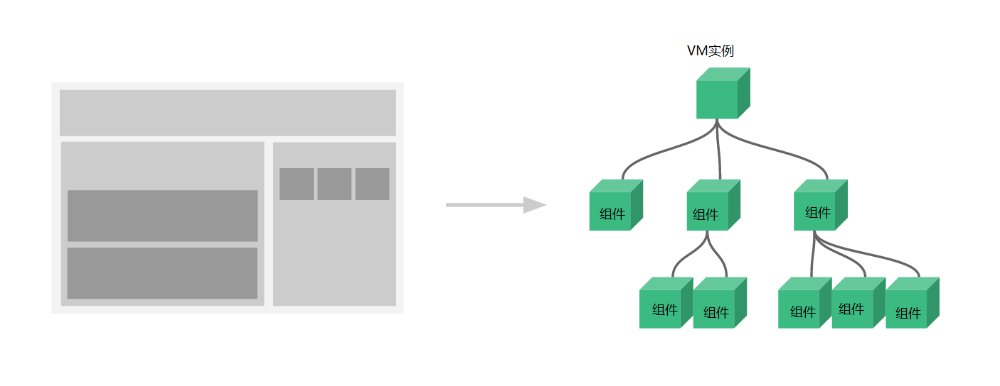

# Vue

win + shift + s截图

## MVVM

**MVVM模型**

1. M：模型(Model)：data中的数据
2. V：视图(View)：模板代码
3. VM：视图模型(ViewModel)：Vue实例

虽然没有完全遵循 [MVVM 模型](https://zh.wikipedia.org/wiki/MVVM)，但是 Vue 的设计也受到了它的启发。因此在文档中经常会使用 `vm` (ViewModel 的缩写) 这个变量名表示 Vue 实例。


## ES6的暴露和模块引入

##### (1)统一暴露

**模块 module1**：`module1.js`

```js
function fun1() {
    console.log('fun1() module1')
}
 
function fun2() {
    console.log('fun2() module1')
}
// 统一暴露
export {foo,bar}
```

##### 2)分别暴露

**模块 module2**：`module2.js`

```js
//多行暴露
export function foo() {
    console,console.log('foo() module2');
}
 
export function bar() {
    console.log('bar() module2')
}

```

**以上两种向外暴露方式在主文件引入时必须使用对象的解构赋值引用（不能使用变量接收的方式来映入）**

##### (3)默认暴露

```js
export default {
    foo() {
        console.log('默认暴露方式')
    },
    bar() {
        console.log('默认暴露')
    }
}
```

**默认暴露的方式只允许有一个: `export default {}`且在主模块引入时可以使用定义变量来接收的方式！**

```js
// 引入模块3
import module3 from '.js/src/module3.js'
 
// 使用模块
module3.foo()
module3.bar()

```

## 数据代理

## 数据计算

### computed

计算属性将被混入到 Vue 实例中。所有 getter 和 setter 的 this 上下文自动地绑定为 Vue 实例。

注意如果你为一个计算属性使用了箭头函数，则 `this` 不会指向这个组件的实例，不过你仍然可以将其实例作为函数的第一个参数来访问。

- **定义**：属性不存在，要通过已有属性计算而来。
- **原理**：底层借助类**Object . defineproperty**方法提供**getter**和**setter**
- **getter**什么时候执行？
  - 初次读取会执行一次。
  - 当依赖的属性发生改变时会被再次调用。

- **计算属性的优势**：与**methons** 实现相比，内部有缓存机制（可以重复使用数据），效率更高，方便调试。
- **备注**：
  - 计算属性最终会出现在vm上，直接读取使用即可。
  - 如果计算属性要被修改，那必须写setter去响应修改。且setter中**引起计算时所依赖的数据发生变化**。


```html
<body>
    <div id="app">
        <label>姓：</label>
        <input type="text" v-model="xing"><br>
        <label >名：</label>
        <input type="text" v-model="ming"><br>
        <label >姓名：</label>
        <span>{{fullName}}</span>
    </div>

    <script>
        new Vue({
            el:"#app",
            data() {   /* 只要data中的数据发生改变，vue就会从新解析模板 */
                return {
                    xing:"张",
                    ming:"三"
                }
            },
            computed:{
                /* 完整写法 */
                /* fullName:{
                    get(){
                        return this.xing + "-"  + this.ming
                    },
                    set(A){
                        let arr = A.split("-")
                        this.xing = arr[0]
                        this.ming = arr[1]
                    }
                } */
                
                /* 如果不需要 setter 方法，可以直接简写 ,默认函数名就是计算属性名，方法体就是getter方法*/
                fullName(){
                    return this.xing + "-"  + this.ming
                }
            }
        })
    </script>
</body>
```

### methons写法

methons写法不会缓存，页面中的数据每改变一次，就要从新加载方法

```html

    <div id="app">
        <label>姓：</label>
        <input type="text" v-model="xing"><br>
        <label >名：</label>
        <input type="text" v-model="ming"><br>
        <label >姓名：</label>
        <span>{{ fullName() }}</span><!-- 插值表达式中的函数执行要加（），因为这不是回调函数 -->
    </div>

    <script>
        new Vue({
            el:"#app",
            data() {   /* 只要data中的数据发生改变，vue就会从新解析模板 */
                return {
                    xing:"张",
                    ming:"三"
                }
            },
            methods: {
                fullName(){
                    return this.xing.substr(0,3) + "-" +this.ming
                }
            },
        })
    </script>
```


## 事件监听

### watch

一个对象，键是需要观察的表达式，值是对应回调函数。值也可以是方法名，或者包含选项的对象。Vue 实例将会在实例化时调用 `$watch()`，遍历 watch 对象的每一个 property。

- 当监视的属性发生改变时，回调函数（**handler**）自动调用，进行相关操作
- 监视属性必须存在，才可以进行监视
- 监视的两种写法
  - new Vue 时写入 watch配置
  - 通过vm.$watch( ”要监视的属性“ ) 监视

- **深度监测**
  - Vue中的watch默认不监测对象属性中的变化（一层）
  - 配置 **deep:true** (默认为false)可以监测对象内部的变化，如下的ssss（多层）
  - Vue本身可以监测对象内部值的变化，但是Vue提供的watch不支持。
  - 使用watch时应该根据数据内部的具体结构，决定是否用深度监视

```html
<div id="app">
        
      <br>
      <input type="button" value="点击切换显示！" @click="toggleImage">
    </div>
    <script>
        new Vue({
            el:"#app",
            data() {
                return {
                    isTrue:false,

                    //测试深度监测
                    ssss:{
                        a:111,
                        b:222
                    }
                }
            },
            methods: {
                toggleImage:function(){
                    this.isTrue = ! this.isTrue
                }
            },
            watch:{
                isTrue:{
                    //immediate: true,  // 该回调将会在侦听开始之后被立即调用
                    handler(newVal,oldVal){
                        console.log(newVal+"isTrue被修改了！"+oldVal)
                    }
                },
                ssss:{
                     deep: true,  // 该回调会在任何被侦听的对象的 property 改变时被调用，不论其被嵌套多深
                     handler(){
                        console.log("ssss有改动了！")
                    },
                    
                },
                //如果不涉及到侦听开始的立即调用和深度侦听，就可以使用简写方式
              /*   
              	ssss(){
					  console.log("ssss有改动了！")
                },      
              */      

                //只监测 ssss对象中的a属性
                'ssss.a':{
                    handler(){
                        console.log("ssss.a有改动了！")
                    }
                }
            }
        })
    </script>
```


## 事件绑定

**事件的基本使用**

1. 使用**v-on:xxx** 或**@xxx**来绑定事件，其中**xxx**是事件名。
2. 事件的回调需要绑定在method对象中，最终会绑定在vm上。
3. method中配置的函数，不要使用箭头函数！否则**this**就不是**vm**了。
4. method中配置的函数，都是被Vue所管理的函数，**this**指向的是**vm**或组件对象。
5. **@click=“demo”**和**@click=“demo($event)**”，效果一样，因为默认会传入$event。

**鼠标事件修饰符**

1. **prevent**:  阻止事件的默认行为，比如a标签的跳转，在JavaScript中的**e.preventDefault()**。
2. **stop**：阻止事件冒泡。在JavaScript中的**event.stopPropagation()**。
3. **once**：事件只触发一次。
4. **capture**：使用事件的捕获模式。
5. **self**：只有e.target是当前元素时，才会触发事件。
6. **passive**：事件的默认行为立即执行，无需等待事件回调执行完成。

**按键别名**

1. Vue中常用的按键别名：

   回车：enter

   删除：deleter

   退出：esc

   空格：space

   换行：tab（特殊，因为tab功能就是切换，所以要配合keydown使用）

   上：up

   下：down

   左：left

   右：right

2. 配合keydown和keyup使用

3. 在JavaScript中可以用e.key 获取按下的按键名，用e.keyCode获取键码

## Vue实例的生命周期


在Vue生命周期中

## 组件

**组件必须要使用在Vue实例对象中，如下图**



1、父组件可以使用 props 把数据传给子组件。
2、子组件可以使用 $emit,让父组件[监听](https://so.csdn.net/so/search?q=监听&spm=1001.2101.3001.7020)到自定义事件 。

vm.$emit( event, arg ) //触发当前实例上的事件

vm.$on( event, fn );//监听event事件后运行 fn； 

### 通过 Prop 向子组件传递数据通过-Prop-向子组件传递数据)

早些时候，我们提到了创建一个博文组件的事情。问题是如果你不能向这个组件传递某一篇博文的标题或内容之类的我们想展示的数据的话，它是没有办法使用的。这也正是 prop 的由来。

Prop 是你可以在组件上注册的一些自定义 attribute。当一个值传递给一个 prop attribute 的时候，它就变成了那个组件实例的一个 property。为了给博文组件传递一个标题，我们可以用一个 `props` 选项将其包含在该组件可接受的 prop 列表中：

```html
Vue.component('blog-post'//组件名, {
 <!-- name: 'blog-post'-->
  props: ['title'],
  template: '<h3>{{ title }}</h3>'
})
```

一个组件默认可以拥有任意数量的 prop，任何值都可以传递给任何 prop。在上述模板中，你会发现我们能够在组件实例中访问这个值，就像访问 `data` 中的值一样。

一个 prop 被注册之后，你就可以像这样把数据作为一个自定义 attribute 传递进来：

```html
<blog-post title="My journey with Vue"></blog-post>
<blog-post title="Blogging with Vue"></blog-post>
<blog-post title="Why Vue is so fun"></blog-post>
```

My journey with Vue

Blogging with Vue

Why Vue is so fun


## WebStorage

### webstorage

webstorage是本地存储，存储在客户端，包括localStorage和sessionStorage。大小一般为5M左右，不同浏览器个有区别。

### localStorage

> localStorage==生命周期是永久==，这意味着除非用户显示在浏览器提供的UI上清除localStorage信息，否则这些信息将永远存在。存放数据大小为一般为5MB,而且它仅在客户端（即浏览器）中保存，不参与和服务器的通信。=

### sessionStorage

> sessionStorage仅在当前会话下有效，==关闭页面或浏览器后被清除==。存放数据大小为一般为5MB,而且它仅在客户端（即浏览器）中保存，不参与和服务器的通信。源生接口可以接受，亦可再次封装来对Object和Array有更好的支持。

localStorage和sessionStorage使用时使用==相同的API==：

```javascript
localStorage.setItem("key","value");//以“key”为名称存储一个值“value”

localStorage.getItem("key");//获取名称为“key”的值

localStorage.removeItem("key");//删除名称为“key”的信息。

localStorage.clear();//清空localStorage中所有信息
```
**作用域不同**

不同浏览器无法共享localStorage或sessionStorage中的信息。相同浏览器的不同页面间可以共享相同的 localStorage（页面属于相同域名和端口），但是不同页面或标签页间无法共享sessionStorage的信息。这里需要注意的是，页面及标 签页仅指顶级窗口，如果一个标签页包含多个iframe标签且他们属于同源页面，那么他们之间是可以共享sessionStorage的。

Cookiecookie的优点：具有极高的扩展性和可用性

```pgsql
1.通过良好的编程，控制保存在cookie中的session对象的大小。
2.通过加密和安全传输技术，减少cookie被破解的可能性。
3.只有在cookie中存放不敏感的数据，即使被盗取也不会有很大的损失。
4.控制cookie的生命期，使之不会永远有效。这样的话偷盗者很可能拿到的就   是一个过期的cookie。
```

localStorage、sessionStorage、Cookie共同点：都是保存在浏览器端，且同源的。

##  $nextTick  

用法于原理：

在Vue 中更新DOM 是异步的， nextTick的主要应用的场景及原因。

在Vue生命周期的created()钩子函数进行的DOM操作一定要放在Vue.nextTick()的回调函数中

在 Vue生命周期函数中 created钩子函数中： DOM 并没有进行任何渲染， 而此时进行DOM 操作无异于是徒劳的， 所以此处一定将DOM 操作的js 代码放进Vue.nextTick 回调函数中， 与之对应的就是mounted() 

 钩子函数， 因为该钩子函数执行时所有的DOM 挂载和渲染都已经完成， 此时在该钩子函数中进行任何操作都不会有问题。

在数据变化后要执行某个回调函数，而这个操作需要使用随数据改变而改变的DOM结构的时候， 这个操作都应该放进Vue.nextTick () 回调函数中。

**什么时候用**：当数据改变后，要基于新数据生成新的DOM进行操作时，要在**nextTick**  指定的回调函数中执行。

```javascript
Vue.component('example', {
  template: '<span>{{ message }}</span>',
  data: function () {
    return {
      message: '未更新'
    }
  },
  methods: {
    updateMessage: function () {
      this.message = '已更新'
      console.log(this.$el.textContent) // => '未更新'
      this.$nextTick(function () {
        console.log(this.$el.textContent) // => '已更新'
      })
    }
  }
})
```

 **Vue的官方文档中详细解释：**

 vue 执行dom 更新是异步的， 只要是观察到数据变化， vue  将会开启一个队列， 并缓冲在同一事件循环中发生的所有数据改变。 如果同一个watcher 被多次触发，只会被推如到队列中一次。 在这种缓冲时去除重复数据对于避免不必要的计算， 和DOM 操作非常重要。 然后下一个事件循环 “tick”中， vue 刷新队列执行实际（去重）工作。 在Vue 内部尝试对异步队列使用原生的promise.then 和 MessageChange, 如果**执行环境不支持， 会采用   setTime（（）=> {} , 0）代替。**


#### 收集表单数据

- 若：<input type="text"> ,则v-model收集的是value值，用户输入的就是value值。

- 若：<input type="redio"> ,则v-model收集的是value值，且要给标签设置value值。

- 若：<input type="checkbox">

  1. 没有配置input的value属性，那么收集的就是checked(勾选 or 未勾选，是布尔值)

  2. 配置input的value属性：

     (1)v-model的初始值是非数组，那么收集的就是value组成的数组

- 备注：v-model的三个修饰符:

  ​       lazy：失去焦点再收集数据

  ​       number：输入字符串转为有效数字

  ​       trim：输入首位空格过滤

## Porps

### porp的注意事项

#### [单向数据流](https://cn.vuejs.org/v2/guide/components-props.html#单向数据流)

所有的 prop 都使得其父子 prop 之间形成了一个**单向下行绑定**：**父级 prop 的更新会向下流动到子组件中，但是反过来则不行**。这样会防止从子组件意外变更父级组件的状态，从而导致你的应用的数据流向难以理解。

额外的，每次父级组件发生变更时，子组件中所有的 prop 都将会刷新为最新的值。这意味着你**不**应该在一个子组件内部改变 prop。如果你这样做了，Vue 会在浏览器的控制台中发出警告。

这里有两种常见的试图变更一个 prop 的情形：

1. **这个 prop 用来传递一个初始值；这个子组件接下来希望将其作为一个本地的 prop 数据来使用。**在这种情况下，最好定义一个本地的 data property 并将这个 prop 用作其初始值：

   ```javascript
   props: ['initialCounter'],
   data: function () {
     return {
       counter: this.initialCounter
     }
   }
   ```

2. **这个 prop 以一种原始的值传入且需要进行转换。**在这种情况下，最好使用这个 prop 的值来定义一个计算属性：

   ```javascript
   props: ['size'],
   computed: {
     normalizedSize: function () {
       return this.size.trim().toLowerCase()
     }
   }
   ```

优先级由高到低：

>  **props ==> methods ==> data ==> computed ==> watch**

这是其源码中体现的

## 插件

功能：用于增强vue

本质：包含install方法的一个对象，install( )的第一个参数是vue，第二个和之后的参数是插件使用者传递的参数。

定义插件：最好写在一个js文件夹中。


或者


使用插件：vue.user(‘插件名’)

## 数组更新检测

### 变更方法

Vue 将被侦听的数组的变更方法进行了包裹(包装)，所以它们也将会触发视图更新。这些被包裹(包装)过的方法包括：

- `push()`
- `pop()`
- `shift()`
- `unshift()`
- `splice()`
- `sort()`
- `reverse()`

​		因为Vue的数组监测不是通过setter方法，所以想用通过数组索引来改变数组不会被Vue监测到,并且重新渲染视图，只有通过Vue重新包装的上面7种方法修改数组，才会被监测，或者使用Vue.set( ) 和 vm.$set( ) 来改变数组元素。

你可以打开控制台，然后对前面例子的 `items` 数组尝试调用变更方法。比如 `example1.items.push({ message: 'Baz' })`。

## vue中this.$set的用法

#### **this.$set实现什么功能，为什么要用它？**

**当你发现你给对象加了一个属性，在控制台能打印出来，但是却没有更新到视图上时，也许这个时候就需要用到this.$set（）这个方法了，简单来说this.$set的功能就是解决这个问题的啦。官方解释：向响应式对象中添加一个属性，并确保这个新属性同样是响应式的，且触发视图更新。它必须用于向响应式对象上添加新属性，因为 Vue 无法探测普通的新增属性 (比如 this.myObject.newProperty = 'hi')，你会发现vue官网是vue.set，[vue.set的用法](https://links.jianshu.com/go?to=https%3A%2F%2Fcn.vuejs.org%2Fv2%2Fapi%2F%23Vue-set)** 

vm.$set( ) 和 Vue.set( ) 的用法几乎一样

### Vue.set( target, propertyName/index, value )

- **参数**：

  - `{Object | Array} target`
  - `{string | number} propertyName/index`
  - `{any} value`

- **返回值**：设置的值。

- **用法**：

  向响应式对象中添加一个 property，并确保这个新 property 同样是响应式的，且触发视图更新。**它必须用于向响应式对象上添加新 property，因为 Vue 无法探测普通的新增 property** (比如 `this.myObject.newProperty = 'hi'`)

  **注意对象不能是 vm，或者vm._data。**

**this.$set(你要改变的数组/对象，你要改变的位置/key，你要改成什么value)**

```javascript
   this.$set(this.arr, 0, "OBKoro1"); // 改变数组
   this.$set(this.obj, "c", "OBKoro1"); // 改变对象
```

## Vue监视数据对象的原理


## vue 当中的 @click.native

.native--侦听组件根元素上的原生事件

作用： 给组件绑定原生事件

@click是我们在vue开发中经常用到的事件绑定，而@实际上是 v-on 的简写，而 v-on 则是对 vue 的事件体系封装之后的 API接口

也就是说，在处理DOM原生事件的场合中需要添加额外的标识符

比如：如果使用router-link标签，加上@click事件，绑定的事件会无效，因为router-link的作用是单纯的路由跳转，会阻止click事件，如果不加 .native, 事件是不会触发的，因此需要加上 .native 才会触发事件


当你给一个vue组件绑定事件的时候，要加上native，如果是普通的html元素，就不需要

```html
<template>
    <div id="app">
        <Button @click.native = 'goToNext'>点击跳转</Button>
    </div>
</template>
<script>
import Button from '../components/Button'
export default{
    components:{
        Button
    },
    data(){
        return{
        
        }
    }
    methods:{
        goToNext(){
            alert('hello--world')
        }
    }    
}
</script>
 
```


## Vuex

在vue2中只能使用vuex3

在vue3中只能使用vuex4

在脚手架中如果import只引入到文件夹，默认将文件夹下的**index.js**引入


### 概念

```txt
	在Vue中实现集中式状态(数据)管理的一个Vue插件，对vue应用中多个组件的共享状态进行集中式管理(读/写)，也是一种组件间通信的方式，且适用于任意组件间通信。
```

### 使用

```txt
	多个组件需要共享数据时
```

