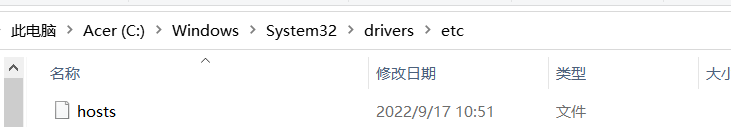
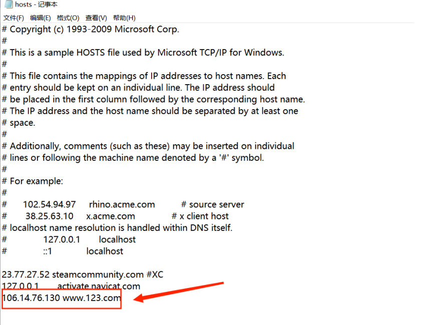

# 遇到问题

SpringData 中,在Entity中新增了字段，使用mapper，转换为Dto,新增字段无法赋值，就Rebuild一下项目 

SpringData 中@**Modifying**查询语句中能用于void/int/Integer 返回类型

## lombok的一些问题

Lombok对于第一个字母小写，第二个字母大写的属性生成的get-set方法和Mybatis以及idea或者说是Java官方认可的get-set方法生成的不一样:

```java
@Data
public class NMetaVerify {
    private Long id;
    private NMetaType nMetaType;
    private Date createTime;
    
    public void lombokFound(){
        NMetaVerify nMetaVerify = new NMetaVerify();
        nMetaVerify.setNMetaType(NMetaType.TWO); //注意：nMetaType的set方法为setNMetaType，第一个n字母大写了，
        nMetaVerify.getNMetaType();              //getxxxx方法也是大写
    }
}
```

idea，Mybatis，Java官方默认的行为为：

```java
public class NMetaVerify {
    private Long id;
    private NMetaType nMetaType;
    private Date createTime;

    public Long getId() {
        return id;
    }

    public void setId(Long id) {
        this.id = id;
    }

    public NMetaType getnMetaType() {//注意：nMetaType属性的第一个字母小写
        return nMetaType;
    }

    public void setnMetaType(NMetaType nMetaType) {//注意：nMetaType属性的第一个字母小写
        this.nMetaType = nMetaType;
    }

    public Date getCreateTime() {
        return createTime;
    }

    public void setCreateTime(Date createTime) {
        this.createTime = createTime;
    }
}
```

### **解决方案**

1. 修改属性名字，让**第二个字母小写，或者说是规定所有的属性的前两个字母必须小写**
2. 如果数据库已经设计好，并且前后端接口对接好了，不想修改，那就专门为这种特殊的属性使用idea生成get-set方法复制代码

## 关于java日期存入数据库

Mysql中经常用来存储日期的数据类型有三种：

Date、Datetime、Timestamp。


**Date数据类型**：用来存储没有时间的日期。Mysql获取和显示这个类型的格式为“YYYY-MM-DD”。支持的时间范围为“1000-00-00”到“9999-12-31”。

**Datetime类型**：存储既有日期又有时间的数据。存储和显示的格式为 “YYYY-MM-DD HH:MM:SS”。支持的时间范围是“1000-00-00 00:00:00”到“9999-12-31 23:59:59”。

**Timestamp类型**：也是存储既有日期又有时间的数据。存储和显示的格式跟Datetime一样。支持的时间范围是“1970-01-01 00:00:01”到“2038-01-19 03:14:07”。所有不符合上面所述格式的数据都会被转换为相应类型的0值。（0000-00-00或者0000-00-00 00:00:00）

方法1： 

```java
Timestamp t = new Timestamp(System.currentTimeMillis()); 
preparedStatement.setTimestamp(1,t);
```

方法2： 

```java
Date date = new Date();       
Timestamp t= new Timestamp(date.getTime());
preparedStatement.setTimestamp(1,t);
```

首先解释一下，数据库中的时间类型分为很多种，这里只是简单介绍date与datetime

主要的区别就是：

>  ①date：MySQL 以 'YYYY-MM-DD' 格式检索与显示date值；
>
> ②datetime:MySQL 以 'YYYY-MM-DD HH:mm:ss'格式检索与显示 DATETIME 类型。

那么我们怎么向数据库中存储呢？如果你只是想简单的存储日期那就选择date

如果要插入准确的时间（包括时分秒），需要用Datetime或者TimeStamp类型。

### 向mysql数据库插入datetime类型的两种方法，数据库类型为(datatime)

**方法一：使用java.sql.Timestamp这个类来进行转换(推荐)**

java.util.Date date = new Date();//获得当前时间
Timestamp t = new Timestamp(date.getTime());//将时间转换成Timestamp类型，这样便可以存入到Mysql数据库中

```java
java.util.Date date = new Date();//获得当前时间
Timestamp t = new Timestamp(date.getTime());//将时间转换成Timestamp类型，这样便可以存入到Mysql数据库中

```

**方法二：将Date时间转换成特定格式的字符串String，这样也能存入数据库**

```java
DateFormat df = new SimpleDateFormat("yyyy-MM-dd HH:mm:ss");//util包下的,注意月和小时的格式为两个大写字母
java.util.Date date = new Date();//获得当前时间
String birthday = df.format(date);//将当前时间转换成特定格式的时间字符串，这样便可以插入到数据库中
```

**虽然数据库中类型字段为datetime，但是可以直接插入此String类型的Date。**

### 可以直接写Java代码，数据库类型为(datatime)

```java
new java.sql.Date((new java.util.Date()).getTime())//
```

### 或者直接存入**String**类型，数据库类型设置为(**varchar**)

这种方法可以用在时间不想要秒，分秒的情况

```java
Date date=new Date();   //这里的时util包下的                          
SimpleDateFormat temp1=new SimpleDateFormat("yyyy-MM-dd HH:mm");  //不要秒
SimpleDateFormat temp2=new SimpleDateFormat("yyyy-MM-dd HH");  //不要分秒
SimpleDateFormat temp3=new SimpleDateFormat("yyyy-MM-dd");    //不要时分秒
String Date=temp.format(date); 
```

### java里面的post请求接受参数的一点总结

post的headers 的Content-Type有很多，这里着重区分两种第一种
application/application/x-www-form-urlencoded

#### 第一种

application/application/x-www-form-urlencoded

这一种也就是俗称的表单提交方式

参数的提交形式是类似于url拼接的，也就是post的请求体body里面的存放的内容形如：

a="123"&b=520&c=true&d="你好" 这种

 

#### 第二种

**application/json**

这种也就是所谓的json提交，post的请求体body里面的存放的内容形如：

{

    "a":"",
    
    "b":"",
    
    "c":"",
    
    "d":""

}

### 从数据库查询出想要的对象并封装传到前端的两种方法

> 要是查询的数据在多个不同的表中，可以创建以专门传输该数据的对象，不过要是系统中有多个数据都是这样的情况的话，就要创建多给对象，也会变得麻烦，第二种方法，就是直接用map来存放想要的对象的数据，，不过这种方法因为没有对象的setter,getter方法，所以，字段是不会改变，还是和数据库一模一样的字段。(数据库字段是 ：**user_avatar**，map中 key就是 **user_avatar**)


# SpringMVC接收数组的三种方式

## 1. 第一种方式

页面正常通过Key-Value的形式传值，[数组](https://so.csdn.net/so/search?q=数组&spm=1001.2101.3001.7020)保持原格式，后端使用`@RequestParam`注解标注接值的入参，注意`@RequestParam`里的`value`一定要带上中括号：

controller:

```java
@RequestMapping("/test.htm")
@ResponseBody
public AjaxResp test(@RequestParam("dataList[]") List<String> dataList, String name){
    //do something
}

```

## 计算机访问域名

> 计算机访问域名会先本地的host文件中的域名映射，如果找到就跳转，找不到就会到网上找DNS域名解析
>
> 位置：
>
> 
>
> 文件内容：
>
> 