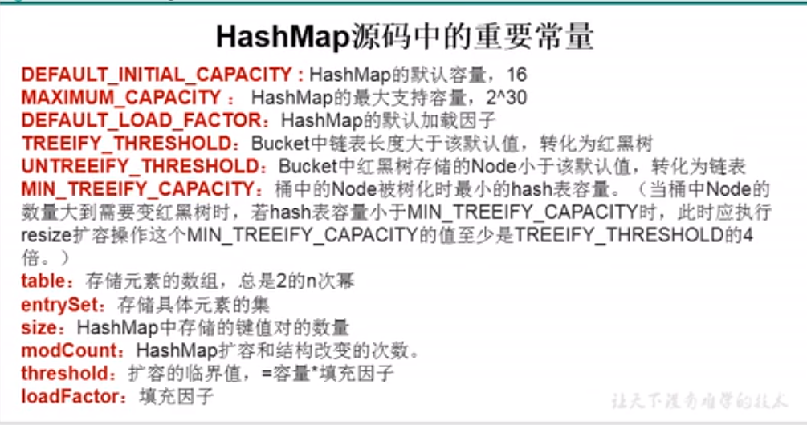

## 面试题

# 网络

### 在浏览器中输入url，按下回车后发生了什么

1. 解析url地址
2. DNS解析
3. TCP链接
4. 发送http请求
5. 服务器接收请求
6. 服务器响应
7. TCP链接断开
8. 浏览器解析资源

### **HTTP和HTTPS的基本概念**

　　HTTP：是互联网上应用最为广泛的一种网络协议，是一个客户端和服务器端请求和应答的标准（TCP），用于从WWW服务器传输超文本到本地浏览器的传输协议，它可以使浏览器更加高效，使网络传输减少。

　　HTTPS：是以安全为目标的HTTP通道，简单讲是HTTP的安全版，即HTTP下加入SSL层，HTTPS的安全基础是SSL，因此加密的详细内容就需要SSL。

　　HTTPS协议的主要作用可以分为两种：一种是建立一个信息安全通道，来保证数据传输的安全；另一种就是确认网站的真实性。

### **HTTP与HTTPS有什么区别？**

　　HTTP协议传输的数据都是未加密的，也就是明文的，因此使用HTTP协议传输隐私信息非常不安全，为了保证这些隐私数据能加密传输，于是网景公司设计了SSL（Secure Sockets Layer）协议用于对HTTP协议传输的数据进行加密，从而就诞生了HTTPS。简单来说，HTTPS协议是由SSL+HTTP协议构建的可进行加密传输、身份认证的网络协议，要比http协议安全。

　　HTTPS和HTTP的区别主要如下：

　　1、https协议需要到ca申请证书，一般免费证书较少，因而需要一定费用。

　　2、http是超文本传输协议，信息是明文传输，https则是具有安全性的ssl加密传输协议。

　　3、http和https使用的是完全不同的连接方式，用的端口也不一样，前者是80，后者是443。

　　4、http的连接很简单，是无状态的；HTTPS协议是由SSL+HTTP协议构建的可进行加密传输、身份认证的网络协议，比http协议安全。

### Post和Get的区别

1. Get是不安全的，因为在传输过程，数据被放在请求的URL中；Post的所有操作对用户来说都是不可见的，Post放在Request body中。    
2. Get传送的数据量较小，这主要是因为受URL长度限制；Post传送的数据量较大，一般被默认为不受限制。    
3.  Get限制Form表单的数据集的值必须为ASCII字符；而Post支持整个ISO10646字符集。    
4. Get执行效率却比Post方法好。Get是form提交的默认方法。

# java基础

## 接口（Interface）与抽象类（Abstract Class）的区别？

> **相同点：**
>  1、都不能被实例化。
>  2、接口的实现类和抽象类的子类只有全部实现了接口或者抽象类中的方法后才可以被实例化。
>  **不同点：**
>  1、接口只能定义抽象方法不能实现方法，**抽象类既可以定义抽象方法，也可以实现方法。**
>  2、单继承，多实现。接口可以实现多个，只能继承一个抽象类。
>  3、接口强调的是功能，抽象类强调的是所属关系。
>  4、接口中的所有成员变量 为**public static final， 静态不可修改**，当然必须初始化。接口中的所有方法都是public abstract 公开抽象的。而且不能有构造方法。抽象类就比较自由了，和普通的类差不多，可以有抽象方法也可以没有，可以有正常的方法，也可以没有。


## 1.什么是类加载

　　通过javac将.java文件编译成.class字节码文件后，则需要将.class加载到 JVM 中运行，哪么是谁将.class加载到JVM的呢？那就是类加载器啦。

## 2.类加载器类型

- **Bootstrap ClassLoader（启动类加载器）：**该类加载器由C++实现的。负责加载Java基础类，对应加载的文件是%JRE_HOME/lib/ 目录下的rt.jar、resources.jar、charsets.jar和class等。
- **Extension ClassLoader（标准扩展类加载器）：**继承URLClassLoader。对应加载的文件是%JRE_HOME/lib/ext 目录下的jar和class等。
- **App ClassLoader（系统类加载器）：**继承URLClassLoader。对应加载的应用程序classpath目录下的所有jar和class等。
- **CustomClassLoader（用户自定义类加载器）：**由Java实现。我们可以自定义类加载器，并可以加载指定路径下的class文件。

## 3.什么是双亲委派机制

　　双亲委派机制是当类加载器需要加载某一个.class字节码文件时，则首先会把这个任务委托给他的上级类加载器，递归这个操作，如果上级没有加载该.class文件，自己才会去加载这个.class。

## 4.为什么叫双亲委派机制

　　**双：**代表是两两的意思。**亲：**代表两者之间有着千丝万缕的关系。**委派：**则是我们个人办不到的事情，委托别人去帮我们完成。总体来说，就是当子类加载器无法完成这件事时，则会委托父加载器去完成，当父加载器说这不是我做的事情时，则该任务又会落回到子类加载器，此时，子类加载器只能自己去完成该事情。通过上面的阐述，我们则可以明白为什么叫双亲委派机制了，两两之间相互委托对方。（以上纯属个人理解，如有错误之处，请指出）

## 5.双亲委派的作用

　　①**防止加载同一个.class。**通过委托去询问上级是否已经加载过该.class，如果加载过了，则不需要重新加载。保证了数据安全。

　　②**保证核心.class不被篡改。**通过委托的方式，保证核心.class不被篡改，即使被篡改也不会被加载，即使被加载也不会是同一个class对象，因为不同的加载器加载同一个.class也不是同一个Class对象。这样则保证了Class的执行安全。


## String、StringBuffer和StringBuilder的异同？

相同点：底层都是通过char数组实现的
不同点：

String对象一旦创建，其值是不能修改的，如果要修改，会重新开辟内存空间来存储修改之后的对象；而StringBuffer和StringBuilder对象的值是可以被修改的；
StringBuffer几乎所有的方法都使用synchronized实现了同步，线程比较安全，在多线程系统中可以保证数据同步，但是效率比较低；而StringBuilder 没有实现同步，线程不安全，在多线程系统中不能使用 StringBuilder，但是效率比较高。
如果我们在实际开发过程中需要对字符串进行频繁的修改，不要使用String，否则会造成内存空间的浪费；当需要考虑线程安全的场景下使用 StringBuffer，如果不需要考虑线程安全，追求效率的场景下可以使用 StringBuilder。

### 深入理解StringBuffer和StringBuilder

StringBuffer、StringBuilder和String类似，底层也是用一个数组来存储字符串的值，并且数组的默认长度为16，即一个空的StringBuffer对象数组长度为16。实例化一个StringBuffer对象即创建了一个大小为16个字符的字符串缓冲区。但是当我们调用有参构造函数创建一个StringBuffer对象时，数组长度就不再是16了，而是根据当前对象的值来决定数组的长度，数组的长度为“当前对象的值的长+16”。所以一个 StringBuffer 创建完成之后，有16个字符的空间可以对其值进行修改。如果修改的值范围超出了16个字符，会先检查StringBuffer对象的原char数组的容量能不能装下新的字符串，如果装不下则会对 char 数组进行扩容。

那StringBuffer是怎样进行扩容的呢？
扩容的逻辑就是创建一个新的 char 数组，将现有容量扩大一倍再加上2，如果还是不够大则直接等于需要的容量大小。扩容完成之后，将原数组的内容复制到新数组，最后将指针指向新的 char 数组。

## List

**List—是一个==有序==的集合，可以包含重复的元素，提供了按索引访问的方式，它继承Collection。**

**List有两个重要的实现类：ArrayList和LinkedList**

List是一个接口，不可以实例化, 不能写成如下：

```java
List<Integer> list = new List<Integer>();//错误
```

- 类继承关系


## ArrayList

**ArrayList: 可以看作是能够自动增长容量的数组** 底层是一个数组

**在jdk7中**

- ArrayList list =  new ArrayList( );底层创建了长度是==10的 Object[ ]数组elementData==,当添加到超过数组长度时，会自动扩容到原来的1.5倍,类似饿汉模式，调用前就有了。

**在jdk8中**

- ArrayList list =  new ArrayList( );底层创建了{ }一个空数组，当第一次调用**add( )**时才会创建一个长度为==10的Object[ ]数组elementData==，当添加到超过数组长度时，会自动扩容到原来的1.5倍，类似懒汉模式，调用时才会创建。

**因为底层是数组，在内存中是一块连续的内存，所以查询速度块，删除，添加速度慢**

**ArrayList的toArray方法返回一个数组**

**ArrayList的asList方法返回一个列表**

ArrayList底层的实现是Array, 数组扩容实现


- 新增数据空间判断

  新增数据的时候需要判断当前是否有空闲空间存储

- 扩容需要申请新的连续空间

- 把老的数组复制过去

- 新加的内容

- 回收老的数组空间

##  LinkList

**LinkList是一个双链表,在添加和删除元素时具有比ArrayList更好的性能.但在get与set方面弱于ArrayList.当然,这些对比都是指数据量很大或者操作很频繁。**


链表不需要连续的空间, 大小不确定

## 6. 对比

- 时间复杂度

|   操作   | 数组 | 链表 |
| :------: | :--: | :--: |
| 随机访问 | O(1) | O(N) |
| 头部插入 | O(N) | O(1) |
| 头部删除 | O(N) | O(1) |
| 尾部插入 | O(1) | O(1) |
| 尾部删除 | O(1) | O(1) |

**小结**

- 同样查找, 时间复杂度都是O(N), 但是数组要比链表快

  因为数组的**连续内存,** 会有一部分或者全部数据一起进入到CPU缓存, 而链表还需要在去内存中根据上下游标查找, CPU缓存比内存块太多

- 数据大小固定, 不适合动态存储, 动态添加, 内存为一连续的地址, 可随机访问, 查询速度快

- 链表代销可变, 扩展性强, 只能顺着指针的方向查询, 速度较慢

  

## ==和equals()和hashCode()的区别

**“==”：**

　　==是运算符，用来比较两个值、两个对象的内存地址是否相等；

**“equals()”：**

　　equals是Object类的方法，默认情况下比较两个对象是否是同一个对象，内部实现是通过“==”来实现的。

如果想比较两个对象的其他内容，则可以通过重写equals方法，

例如：String类就重写了equals方法，改成了对象的内容是否相等。

具体实现可以参考：https://www.cnblogs.com/hujinshui/p/10038044.html

**“hashCode()”：**

　　hashCoed也是Object类里面的方法，返回值是一个对象的哈希码，同一个对象哈希码一定相等，但不同对象哈希码也有可能相等。

==默认情况下表示是对象的存储地址。==通过散列码，可以提高检索的效率，主要用于在散列存储结构中快速确定对象的存储地址，如Hashtable、hashMap中。

如果两个对象通过equals方法比较相等，那么他的hashCode一定相等；

如果两个对象通过equals方法比较不相等，那么他的hashCode有可能相等；

例如以下程序：

```java
class Untitled {
    public static void main(String[] args) {
        System.out.println("AaAa".hashCode());//2031744
        System.out.println("BBBB".hashCode());//2031744
    }
}
```

## HashMap的底层实现原理



DEFAULT_INITIAL_CAPACITY ：HashMap默认容量为16；

DEFAULT_LOAD_FACTOR ：HashMap加载因子默认为0.75；

threshold ：扩容临界值 等于 容量 * 加载因子 16 * 0.75 = 12；到达12时开始扩容。

TREEIFY_THRESHOLD ：bucket中链表长度大于该默认值8，链表转化为红黑数

MIN_TREEIFY_CAPACITY ：Node被树化的数组的最小容量 64

## HashMap和Hashtable的异同

1. hashtable是继承自陈旧的Dictionary类的，而hashmap继承自AbstractMap类的同时对Java1.2引进的Map接口进行了实现。

2. hashtable线程安全但是效率低，hashmap线程不安全，效率高。

3. hashtable的key 和value都不可以为null,而hashmap可以。HashTable中不允许Null值。HashMap中需要Null键，只有一个，允许Null值，可以由一个或多个键对应Null值。

## 解决hash冲突的方法

， 开放定址法： 
所谓的开放定址法就是一旦发生了冲突，就去寻找下一个空的散列地址，只要散列表足够大，空的散列地址总能找到，并将记录存入 
公式为：fi(key) = (f(key)+di) MOD m (di=1,2,3,……,m-1) 
※ 用开放定址法解决冲突的做法是：当冲突发生时，使用某种探测技术在散列表中形成一个探测序列。沿此序列逐个单元地查找，直到找到给定的关键字，或者 
碰到一个开放的地址（即该地址单元为空）为止（若要插入，在探查到开放的地址，则可将待插入的新结点存人该地址单元）。查找时探测到开放的地址则表明表 
中无待查的关键字，即查找失败。 
比如说，我们的关键字集合为{12,67,56,16,25,37,22,29,15,47,48,34},表长为12。 我们用散列函数f(key) = key mod l2 
当计算前S个数{12,67,56,16,25}时，都是没有冲突的散列地址，直接存入： 

 
计算key = 37时，发现f(37) = 1，此时就与25所在的位置冲突。 
于是我们应用上面的公式f(37) = (f(37)+1) mod 12 = 2。于是将37存入下标为2的位置： 


2， 再哈希法： 
再哈希法又叫双哈希法，有多个不同的Hash函数，当发生冲突时，使用第二个，第三个，….，等哈希函数
计算地址，直到无冲突。虽然不易发生聚集，但是增加了计算时间。

3， 链地址法： 
链地址法的基本思想是：每个哈希表节点都有一个next指针，多个哈希表节点可以用next指针构成一个单向链表，被分配到同一个索引上的多个节点可以用这个单向 
链表连接起来，如： 
键值对k2, v2与键值对k1, v1通过计算后的索引值都为2，这时及产生冲突，但是可以通道next指针将k2, k1所在的节点连接起来，这样就解决了哈希的冲突问题 

4， 建立公共溢出区： 
这种方法的基本思想是：将哈希表分为基本表和溢出表两部分，凡是和基本表发生冲突的元素，一律填入溢出表

 

## sleep() 和 wait() 有什么区别？

sleep() 是 Thread 类的静态本地方法；wait() 是Object类的成员本地方法
sleep() 方法可以在任何地方使用；wait() 方法则只能在同步方法或同步代码块中使用，否则抛出异常Exception in thread "Thread-0" java.lang.IllegalMonitorStateException
sleep() 会休眠当前线程指定时间，释放 CPU 资源，不释放对象锁，休眠时间到自动苏醒继续执行；wait() 方法放弃持有的对象锁，进入等待队列，当该对象被调用 notify() / notifyAll() 方法后才有机会竞争获取对象锁，进入运行状态
JDK1.8 sleep() wait() 均需要捕获 InterruptedException 异常


## synchronized与Lock的区别

两者区别：

1.首先synchronized是java内置关键字，在jvm层面，Lock是个java类；

2.synchronized无法判断是否获取锁的状态，Lock可以判断是否获取到锁；

3.synchronized会自动释放锁(a 线程执行完同步代码会释放锁 ；b 线程执行过程中发生异常会释放锁)，Lock需在finally中手工释放锁（unlock()方法释放锁），否则容易造成线程死锁；

4.用synchronized关键字的两个线程1和线程2，如果当前线程1获得锁，线程2线程等待。如果线程1阻塞，线程2则会一直等待下去，而Lock锁就不一定会等待下去，如果尝试获取不到锁，线程可以不用一直等待就结束了；

5.synchronized的锁可重入、不可中断、非公平，而Lock锁可重入、可判断、可公平（两者皆可）

6.Lock锁适合大量同步的代码的同步问题，synchronized锁适合代码少量的同步问题。


## 事务的 四个特征（ACID）

事务具有四个特征：原子性（ Atomicity ）、一致性（ Consistency ）、隔离性（ Isolation ）和持续性（ Durability ）。这四个特性简称为 ACID 特性。

1 、原子性。事务是数据库的逻辑工作单位，事务中包含的各操作要么都做，要么都不做

2 、一致性。事 务执行的结果必须是使数据库从一个一致性状态变到另一个一致性状态。因此当数据库只包含成功事务提交的结果时，就说数据库处于一致性状态。如果数据库系统 运行中发生故障，有些事务尚未完成就被迫中断，这些未完成事务对数据库所做的修改有一部分已写入物理数据库，这时数据库就处于一种不正确的状态，或者说是 不一致的状态。

3 、隔离性。一个事务的执行不能其它事务干扰。即一个事务内部的操作及使用的数据对其它并发事务是隔离的，并发执行的各个事务之间不能互相干扰。

4 、持续性。也称永久性，指一个事务一旦提交，它对数据库中的数据的改变就应该是永久性的。接下来的其它操作或故障不应该对其执行结果有任何影响。


# MySQL

## 数据库引擎InnoDB和MyISAM的区别


**三大区别：事务、外键、行级锁**


## MySQL的隔离级别有哪些？

SQL标准定义了4类隔离级别，包括了一些具体规则，用来限定事务内外的哪些改变是可见的，哪些是不可见的。低级别的隔离级一般支持更高的并发处理，并拥有更低的系统开销。

**Read Uncommitted（读取未提交内容）**

在该隔离级别，所有事务都可以看到其他未提交事务的执行结果。本隔离级别很少用于实际应用，因为它的性能也不比其他级别好多少。读取未提交的数据，也被称之为脏读（Dirty Read）。

 

**Read Committed（读取提交内容）**

这是大多数数据库系统的默认隔离级别（但不是MySQL默认的）。它满足了隔离的简单定义：一个事务只能看见已经提交事务所做的改变。这种隔离级别 也支持所谓的不可重复读（Nonrepeatable Read），因为同一事务的其他实例在该实例处理其间可能会有新的commit，所以同一select可能返回不同结果。

 

**Repeatable Read（可重读）**

这是MySQL的默认事务隔离级别，它确保同一事务的多个实例在并发读取数据时，会看到同样的数据行。不过理论上，这会导致另一个棘手的问题：幻读 （Phantom Read）。简单的说，幻读指当用户读取某一范围的数据行时，另一个事务又在该范围内插入了新行，当用户再读取该范围的数据行时，会发现有新的“幻影” 行。InnoDB和Falcon存储引擎通过多版本并发控制（MVCC，Multiversion Concurrency Control）机制解决了该问题。

 

**Serializable（可串行化）**

这是最高的隔离级别，它通过强制事务排序，使之不可能相互冲突，从而解决幻读问题。简言之，它是在每个读的数据行上加上共享锁。在这个级别，可能导致大量的超时现象和锁竞争。


**出现问题**

这四种隔离级别采取不同的锁类型来实现，若读取的是同一个数据的话，就容易发生问题。例如：

脏读(Drity Read)：某个事务已更新一份数据，另一个事务在此时读取了同一份数据，由于某些原因，前一个RollBack了操作，则后一个事务所读取的数据就会是不正确的。

 

不可重复读(Non-repeatable read):在一个事务的两次查询之中数据不一致，这可能是两次查询过程中间插入了一个事务更新的原有的数据。

 

幻读(Phantom Read):在一个事务的两次查询中数据笔数不一致，例如有一个事务查询了几列(Row)数据，而另一个事务却在此时插入了新的几列数据，先前的事务在接下来的查询中，就会发现有几列数据是它先前所没有的。

 

在MySQL中，实现了这四种隔离级别，分别有可能产生问题如下所示：


# 

# Mybatis

# Spring

## spring的优点

1.降低了组件之间的耦合性 ，实现了软件各层之间的解耦

  2.可以使用容易提供的众多服务，如事务管理，消息服务等 

3.容器提供单例模式支持

 4.容器提供了AOP技术，利用它很容易实现如权限拦截，运行期监控等功能 

 5.容器提供了众多的辅助类，能加快应用的开发  

6.spring对于主流的应用框架提供了集成支持，如hibernate，JPA，Struts等  

7.spring属于低侵入式设计，代码的污染极低  

8.独立于各种应用服务器 

9.spring的DI机制降低了业务对象替换的复杂性 

 10.Spring的高度开放性，并不强制应用完全依赖于Spring，开发者可以自由选择spring的部分或全部 

## 


## spring和springMvc：

1. spring是一个一站式的轻量级的java开发框架，核心是控制反转（IOC）和面向切面（AOP），针对于开发的WEB层(springMvc)、业务层(Ioc)、持久层(jdbcTemplate)等都提供了多种配置解决方案；

2. springMvc是spring基础之上的一个MVC框架，主要处理web开发的路径映射和视图渲染，属于spring框架中WEB层开发的一部分；

## springMvc和springBoot：

1. springMvc属于一个企业WEB开发的MVC框架，涵盖面包括前端视图开发、文件配置、后台接口逻辑开发等，XML、config等配置相对比较繁琐复杂；

2. springBoot框架相对于springMvc框架来说，更专注于开发微服务后台接口，不开发前端视图，同时遵循默认优于配置，简化了插件配置流程，不需要配置xml，相对springmvc，大大简化了配置流程；

## springBoot和springCloud：

1. spring boot使用了默认大于配置的理念，集成了快速开发的spring多个插件，同时自动过滤不需要配置的多余的插件，简化了项目的开发配置流程，一定程度上取消xml配置，是一套快速配置开发的脚手架，能快速开发单个微服务；

2. spring cloud大部分的功能插件都是基于springBoot去实现的，springCloud关注于全局的微服务整合和管理，将多个springBoot单体微服务进行整合以及管理；  springCloud依赖于springBoot开发，而springBoot可以独立开发；

## 总结：

1. Spring 框架就像一个家族，有众多衍生产品例如 boot、security、jpa等等。但他们的基础都是Spring的ioc、aop等. ioc 提供了依赖注入的容器， aop解决了面向横切面编程，然后在此两者的基础上实现了其他延伸产品的高级功能；

2. springMvc主要解决WEB开发的问题，是基于Servlet 的一个MVC框架，通过XML配置，统一开发前端视图和后端逻辑；

3. 由于Spring的配置非常复杂，各种XML、JavaConfig、servlet处理起来比较繁琐，为了简化开发者的使用，从而创造性地推出了springBoot框架，默认优于配置，简化了springMvc的配置流程；但区别于springMvc的是，springBoot专注于单体微服务接口开发，和前端解耦，虽然springBoot也可以做成springMvc前后台一起开发，但是这就有点不符合springBoot框架的初衷了；

4. 对于springCloud框架来说，它和springBoot一样，注重的是微服务的开发，但是springCloud更关注的是全局微服务接口的整合和管理，相当于管理多个springBoot框架的单体微服务；


# 什么是AOP

任何一个系统都是由不同的组件构成的，每个组件负责一块特定的功能，当然就会存在很多组件是和业务无关的，例如日志、事务、权限等核心服务组件，这些组件经常融入到具体的业务逻辑中，如果我们为每一个业务逻辑都添加这样的组件，就会让代码冗余太多，因此我们需要将这些公共代码逻辑抽取出来变成一个切面，然后注入到具体目标对象中，AOP正是基于这样一个思路实现。同过动态代理的方式，将需要注入切面的对象动态代理，在调用业务的时候，将公共的逻辑直接添加进去，而不需要修改原来的代码。spring实现动态代理的方式由JDK动态代理和CGLIB代理


# 什么是IOC

什么是DI机制？  依赖注入（Dependecy Injection）和控制反转（Inversion of Control）是同一个概念，具体的讲：当某个角色需要另外一个角色协助的时候，在传统的程序设计过程中，通常由调用者来创建被调用者的实例。但在spring中创建被调用者的工作不再由调用者来完成，因此称为控制反转。创建被调用者的工作由spring来完成，然后注入调用者 

因此也称为依赖注入。  spring以动态灵活的方式来管理对象 ， 注入的两种方式，设置注入和构造注入。 

# SpringMVC

# Springboot

## AQS为什么要从后往前遍历节点

```java
private Node enq(final Node node) {
    for (;;) {
        Node t = tail;
        if (t == null) { // Must initialize
            if (compareAndSetHead(new Node()))
                tail = head;
        } else {
            node.prev = t;
            if (compareAndSetTail(t, node)) {
                // 假设线程1执行到这里被挂起，此时 next 指针还没有关联到，后新来的线程 n 可能已经被排列到后面去了，所以当 t 被需要时，它的 next 指针还没有设置或者重置；故需要从后到前寻找，而如果找寻下一个，而这个可能被遗漏了；
                t.next = node;
                return t;
            }
        }
    }
}
```

假设线程A正在正在让node1执行 t.next = node 时被挂起 ，线程B 执行 node2入队完成后被线程C挂起，线程C执行唤醒操作，如果是从头向后寻找节点唤醒执行到node1就会发现node1的next为null , 就无法继续向下寻找。

**其最根本的原因在于：**

node.prev = t;先于CAS执行，也就是说，你在将当前节点置为尾部之前就已经把前驱节点赋值了，自然不会出现prev=null的情况